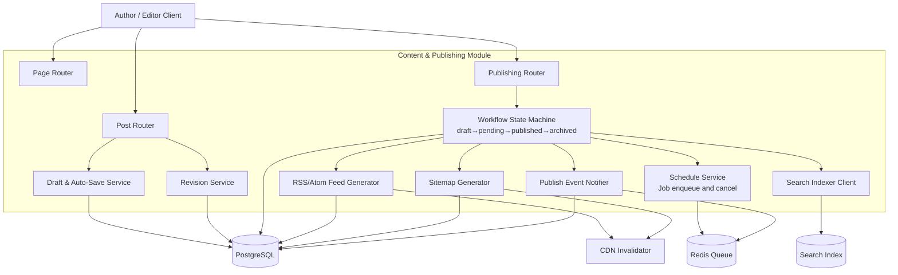
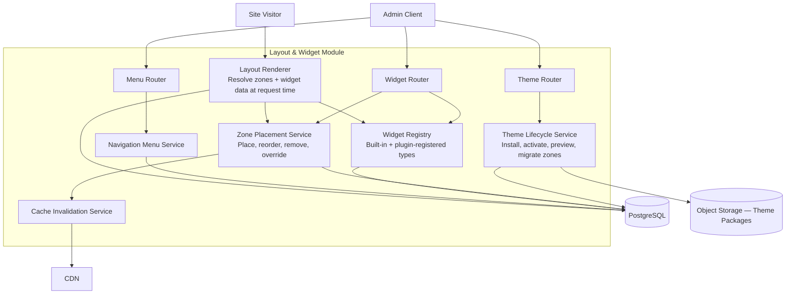
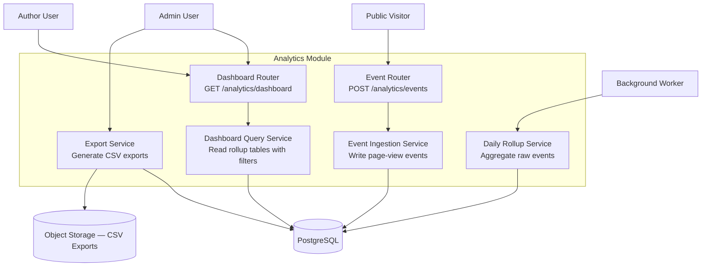

# C4 Component Diagram

## Overview
This document provides the C4 Level 3 component diagrams for the major functional subsystems of the CMS backend.

---

## Component Diagram — IAM & Auth Subsystem

```mermaid
graph TB
    Client[Authenticated Client / Public Browser]

    subgraph "IAM & Auth Module"
        AuthRouter[Auth Router<br>POST /auth/login, /register, /refresh]
        UserRouter[User Router<br>GET/PATCH /users/{id}]
        JWTService[JWT Service<br>Issue, validate, refresh tokens]
        OAuthService[OAuth2 Service<br>Google / GitHub flow]
        TwoFAService[2FA Service<br>TOTP setup and verify]
        PermService[Permission Guard<br>Role enforcement per endpoint]
        InvitationService[Invitation Service<br>Send, validate, accept invites]
    end

    DB[(PostgreSQL)]
    Redis[(Redis — Token Store)]
    OAuthProvider[OAuth2 Provider]
    EmailSvc[Email Provider]

    Client --> AuthRouter
    Client --> UserRouter
    AuthRouter --> JWTService
    AuthRouter --> OAuthService
    AuthRouter --> TwoFAService
    OAuthService --> OAuthProvider
    AuthRouter --> InvitationService
    InvitationService --> EmailSvc
    JWTService --> Redis
    AuthRouter --> DB
    UserRouter --> DB
    PermService --> DB
```

---

## Component Diagram — Content & Publishing Subsystem



---

## Component Diagram — Layout & Widget Subsystem



---

## Component Diagram — Comment & Moderation Subsystem

```mermaid
graph TB
    Reader[Reader / Guest]
    Moderator[Editor / Admin]

    subgraph "Comment Module"
        CommentRouter[Comment Router<br>POST /posts/{id}/comments]
        ModRouter[Moderation Router<br>GET /moderation/comments]

        CommentSvc[Comment Service<br>Submit, thread, approve, reject]
        SpamClient[Spam Filter Client]
        ModerationSvc[Moderation Service<br>Queue management, bulk actions]
        CommentNotify[Comment Notification Service]
    end

    DB[(PostgreSQL)]
    Queue[(Redis Queue)]
    SpamAPI[Spam Filter API]
    EmailSvc[Email Provider]

    Reader --> CommentRouter
    Moderator --> ModRouter

    CommentRouter --> CommentSvc
    CommentSvc --> SpamClient
    SpamClient --> SpamAPI
    CommentSvc --> ModerationSvc
    CommentSvc --> CommentNotify
    ModerationSvc --> DB
    CommentSvc --> DB
    CommentNotify --> Queue
    Queue --> EmailSvc
    ModRouter --> ModerationSvc
```

---

## Component Diagram — Analytics Subsystem


