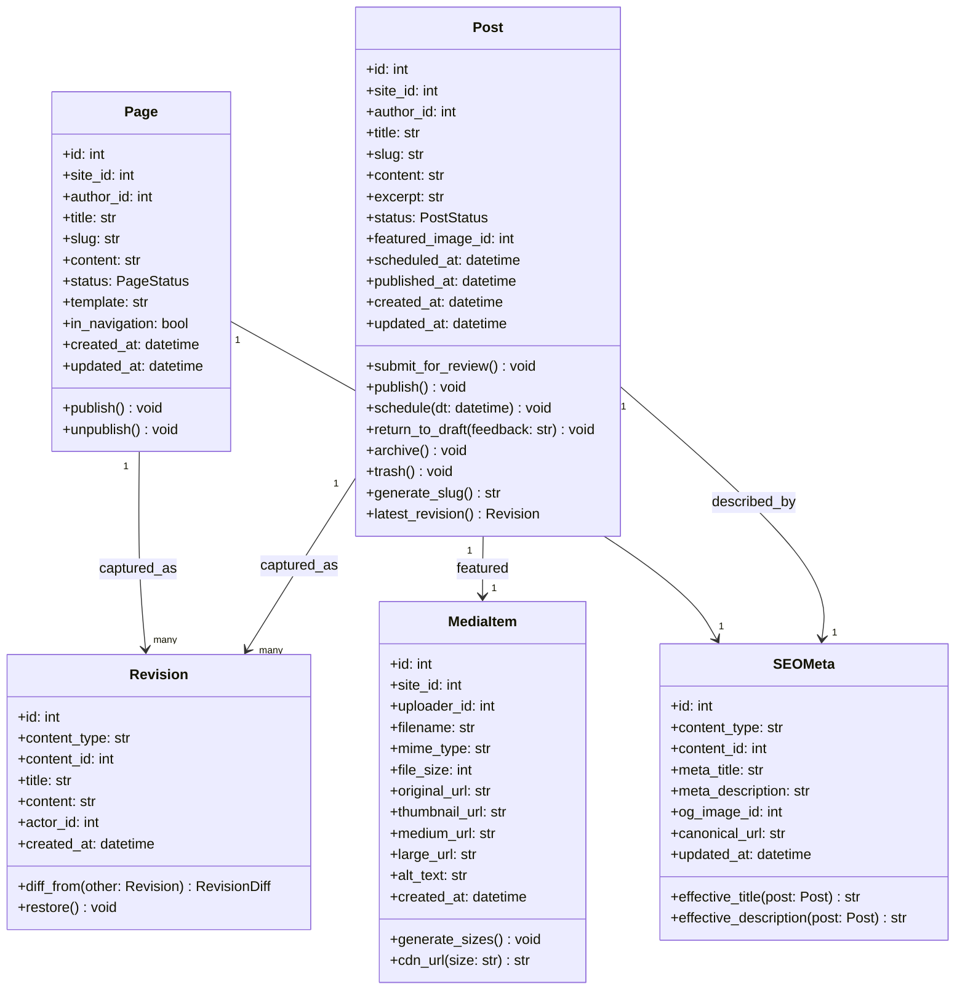
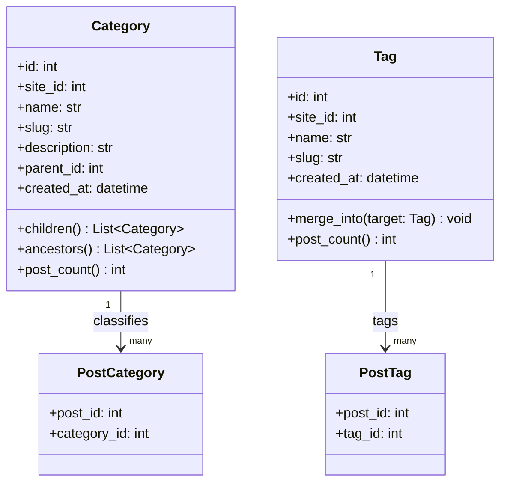
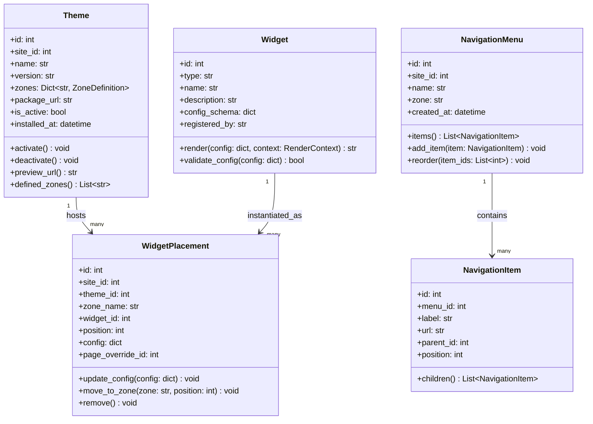
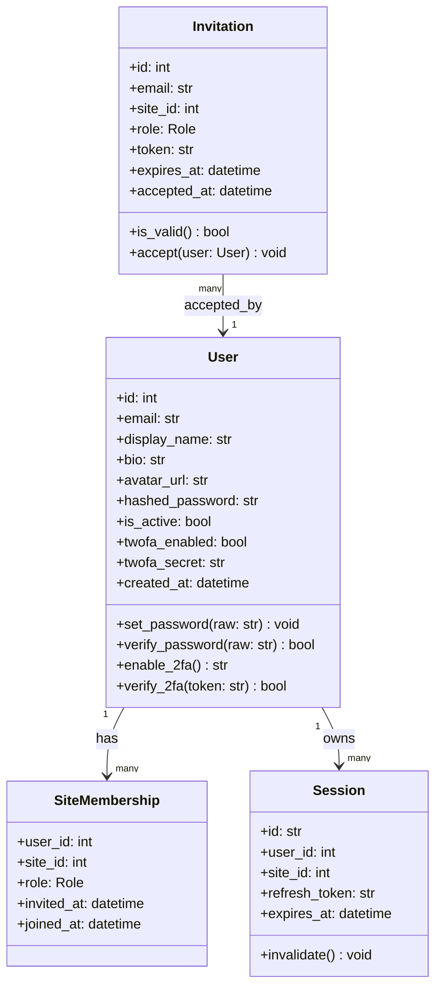
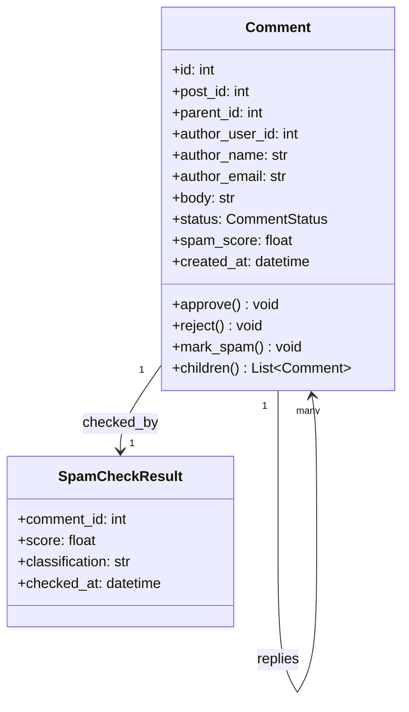

# Class Diagrams

## Overview
Class diagrams model the detailed internal structure of the CMS domain objects, their attributes, methods, and relationships.

---

## Content Domain Classes

---

## Taxonomy Domain Classes

---

## Layout & Widget Domain Classes

---

## User & Auth Domain Classes

---

## Comment Domain Classes

