# Component Diagrams

## Overview
Component diagrams show the software modules within the CMS and how they interact with each other and external systems.

---

## Backend Module Components

```mermaid
graph TB
    subgraph "CMS API Server"
        subgraph "IAM Module"
            AuthRouter[Auth Router]
            JWTService[JWT Service]
            OAuthService[OAuth2 Service]
            TwoFAService[2FA Service]
            PermService[Permission Service]
        end

        subgraph "Content Module"
            PostRouter[Post Router]
            PageRouter[Page Router]
            RevisionService[Revision Service]
            DraftService[Draft & Auto-Save Service]
            PostRepo[Post Repository]
            PageRepo[Page Repository]
        end

        subgraph "Publishing Module"
            PublishRouter[Publishing Router]
            WorkflowEngine[Workflow State Machine]
            SchedulerService[Schedule Service]
            FeedGenerator[RSS/Atom Feed Generator]
            SitemapBuilder[Sitemap Builder]
        end

        subgraph "Taxonomy Module"
            TaxonomyRouter[Taxonomy Router]
            CategoryService[Category Service]
            TagService[Tag & Merge Service]
        end

        subgraph "Media Module"
            MediaRouter[Media Router]
            UploadService[Upload Service]
            ImageProcessor[Image Resize Processor]
            MediaLibraryService[Media Library Service]
        end

        subgraph "Layout Module"
            ThemeRouter[Theme Router]
            WidgetRouter[Widget Router]
            MenuRouter[Menu Router]
            ThemeService[Theme Lifecycle Service]
            WidgetRegistry[Widget Registry]
            ZonePlacementService[Zone Placement Service]
            LayoutRenderer[Layout Renderer]
            MenuService[Menu Service]
        end

        subgraph "Comment Module"
            CommentRouter[Comment Router]
            CommentService[Comment Service]
            ModerationService[Moderation Service]
            SpamClient[Spam Filter Client]
        end

        subgraph "SEO Module"
            SEORouter[SEO Router]
            MetaService[Meta Service]
            RedirectService[Redirect Rule Service]
        end

        subgraph "Analytics Module"
            AnalyticsRouter[Analytics Router]
            EventIngestionService[Event Ingestion Service]
            RollupService[Daily Rollup Service]
            DashboardQueryService[Dashboard Query Service]
        end

        subgraph "Notification Module"
            NotifyService[Notification Dispatcher]
            InAppStore[In-App Notification Store]
            EmailDispatcher[Email Dispatcher]
        end

        subgraph "Plugin Module"
            PluginRouter[Plugin Router]
            PluginRegistry[Plugin Registry]
            HookEngine[Hook & Extension Engine]
        end

        subgraph "Multi-Site Module"
            SiteRouter[Site Router]
            TenantProvisioner[Tenant Provisioner]
            NetworkAnalytics[Network Analytics Aggregator]
        end
    end

    subgraph "Background Worker"
        ScheduledPublishJob[Scheduled Publish Job]
        NewsletterJob[Newsletter Dispatch Job]
        MediaProcessingJob[Media Processing Job]
        SearchSyncJob[Search Index Sync Job]
        CacheInvalidationJob[Cache Invalidation Job]
        RollupJob[Analytics Rollup Job]
    end

    subgraph "Persistence"
        DB[(PostgreSQL)]
        Redis[(Redis)]
        Storage[(Object Storage)]
        SearchIdx[(Search Index)]
    end

    subgraph "External"
        EmailSvc[Email Provider]
        SpamSvc[Spam Filter API]
        OAuthProvider[OAuth2 Provider]
        CDN[CDN]
    end

    PostRouter --> DraftService
    PostRouter --> RevisionService
    PostRouter --> PostRepo
    PublishRouter --> WorkflowEngine
    WorkflowEngine --> FeedGenerator
    WorkflowEngine --> SitemapBuilder
    WorkflowEngine --> NotifyService
    WorkflowEngine --> SchedulerService

    MediaRouter --> UploadService
    UploadService --> Storage
    UploadService --> MediaProcessingJob
    MediaProcessingJob --> ImageProcessor
    ImageProcessor --> Storage

    WidgetRouter --> WidgetRegistry
    WidgetRouter --> ZonePlacementService
    ZonePlacementService --> CacheInvalidationJob
    CacheInvalidationJob --> CDN

    CommentRouter --> CommentService
    CommentService --> SpamClient
    SpamClient --> SpamSvc
    CommentService --> ModerationService
    CommentService --> NotifyService

    NotifyService --> InAppStore
    NotifyService --> EmailDispatcher
    EmailDispatcher --> EmailSvc

    PluginRouter --> PluginRegistry
    PluginRegistry --> HookEngine
    HookEngine --> WidgetRegistry

    AuthRouter --> JWTService
    AuthRouter --> OAuthService
    OAuthService --> OAuthProvider
    AuthRouter --> TwoFAService

    ScheduledPublishJob --> WorkflowEngine
    NewsletterJob --> EmailSvc
    SearchSyncJob --> SearchIdx
    RollupJob --> DB
```

---

## Frontend Component Architecture

```mermaid
graph TB
    subgraph "Public Frontend (SSR)"
        HomePage[Home Page<br>Latest posts, featured widget zone]
        PostPage[Post Page<br>Content, sidebar, comments]
        CategoryPage[Category / Tag Page<br>Filtered post list]
        AuthorPage[Author Profile Page]
        SearchPage[Search Results Page]
        StaticPage[Static Page<br>Custom template with layout zones]
        FeedEndpoint[RSS/Atom Feed Endpoint]
        SitemapEndpoint[sitemap.xml Endpoint]
    end

    subgraph "Author Dashboard (SPA)"
        PostEditor[Post Editor<br>WYSIWYG / Markdown, auto-save]
        MediaUploader[Media Uploader<br>Drop zone, library browser]
        RevisionPanel[Revision History Panel]
        SEOPanel[SEO Metadata Panel]
        AuthorAnalytics[My Posts Analytics]
    end

    subgraph "Admin & Editor SPA"
        ReviewQueue[Submission Review Queue]
        TaxonomyManager[Taxonomy Manager]
        WidgetManager[Widget Manager<br>Drag-and-drop zone builder]
        ThemeManager[Theme Manager<br>Install, activate, preview]
        MenuBuilder[Navigation Menu Builder]
        CommentQueue[Comment Moderation Queue]
        UserManager[User & Role Manager]
        PluginManager[Plugin Manager]
        SiteSettings[Site Settings]
        AdminAnalytics[Site Analytics Dashboard]
    end

    PostEditor --> PostPage
    WidgetManager --> PostPage
    WidgetManager --> HomePage
    WidgetManager --> StaticPage
    ThemeManager --> HomePage
```

