# ERD / Database Schema

## Overview
This ERD reflects the full persistence model for the CMS. Public API identifiers are slug-based or hashid-encoded; the schema below shows internal relational entities.

---

## Full CMS ERD

```mermaid
erDiagram
    sites {
        int id PK
        varchar name
        varchar slug
        varchar domain
        varchar timezone
        int active_theme_id FK
        boolean is_active
        datetime created_at
        datetime updated_at
    }

    users {
        int id PK
        varchar email
        varchar display_name
        text bio
        varchar avatar_url
        varchar hashed_password
        boolean is_active
        boolean twofa_enabled
        varchar twofa_secret
        datetime created_at
        datetime updated_at
    }

    site_memberships {
        int id PK
        int user_id FK
        int site_id FK
        varchar role
        datetime invited_at
        datetime joined_at
    }

    invitations {
        int id PK
        varchar email
        int site_id FK
        varchar role
        varchar token
        datetime expires_at
        datetime accepted_at
    }

    posts {
        int id PK
        int site_id FK
        int author_id FK
        varchar title
        varchar slug
        text content
        text excerpt
        varchar status
        int featured_image_id FK
        datetime scheduled_at
        datetime published_at
        datetime created_at
        datetime updated_at
    }

    pages {
        int id PK
        int site_id FK
        int author_id FK
        varchar title
        varchar slug
        text content
        varchar status
        varchar template
        boolean in_navigation
        datetime created_at
        datetime updated_at
    }

    revisions {
        int id PK
        varchar content_type
        int content_id
        varchar title
        text content
        int actor_id FK
        datetime created_at
    }

    categories {
        int id PK
        int site_id FK
        varchar name
        varchar slug
        text description
        int parent_id FK
        datetime created_at
    }

    tags {
        int id PK
        int site_id FK
        varchar name
        varchar slug
        datetime created_at
    }

    post_categories {
        int post_id FK
        int category_id FK
    }

    post_tags {
        int post_id FK
        int tag_id FK
    }

    media_items {
        int id PK
        int site_id FK
        int uploader_id FK
        varchar filename
        varchar mime_type
        int file_size
        varchar original_url
        varchar thumbnail_url
        varchar medium_url
        varchar large_url
        varchar alt_text
        datetime created_at
    }

    seo_metas {
        int id PK
        varchar content_type
        int content_id
        varchar meta_title
        text meta_description
        int og_image_id FK
        varchar canonical_url
        datetime updated_at
    }

    comments {
        int id PK
        int post_id FK
        int parent_id FK
        int author_user_id FK
        varchar author_name
        varchar author_email
        text body
        varchar status
        float spam_score
        datetime created_at
    }

    themes {
        int id PK
        int site_id FK
        varchar name
        varchar version
        json zones_json
        varchar package_url
        boolean is_active
        datetime installed_at
    }

    widgets {
        int id PK
        varchar type
        varchar name
        text description
        json config_schema
        varchar registered_by
    }

    widget_placements {
        int id PK
        int site_id FK
        int theme_id FK
        varchar zone_name
        int widget_id FK
        int position
        json config
        int page_override_id FK
        datetime updated_at
    }

    navigation_menus {
        int id PK
        int site_id FK
        varchar name
        varchar zone
        datetime created_at
        datetime updated_at
    }

    navigation_items {
        int id PK
        int menu_id FK
        varchar label
        varchar url
        int parent_id FK
        int position
    }

    redirect_rules {
        int id PK
        int site_id FK
        varchar source_path
        varchar destination_url
        int redirect_type
        boolean is_active
        datetime created_at
    }

    subscriptions {
        int id PK
        int site_id FK
        varchar email
        boolean is_confirmed
        varchar frequency
        datetime confirmed_at
        datetime created_at
    }

    plugins {
        int id PK
        int site_id FK
        varchar name
        varchar version
        boolean is_active
        json config
        datetime installed_at
        datetime activated_at
    }

    notifications {
        int id PK
        int user_id FK
        int site_id FK
        varchar event_type
        varchar title
        text body
        boolean is_read
        json payload_json
        datetime created_at
    }

    analytics_events {
        int id PK
        int site_id FK
        int post_id FK
        varchar url_path
        varchar referrer
        varchar utm_source
        varchar utm_medium
        varchar utm_campaign
        varchar device_type
        datetime occurred_at
    }

    analytics_daily_rollups {
        int id PK
        int site_id FK
        int post_id FK
        date date
        int page_views
        int unique_visitors
        int avg_time_on_page_seconds
        datetime computed_at
    }

    sites ||--o{ site_memberships : has
    sites ||--o{ invitations : sends
    sites ||--o{ posts : contains
    sites ||--o{ pages : contains
    sites ||--o{ categories : owns
    sites ||--o{ tags : owns
    sites ||--o{ media_items : stores
    sites ||--o{ themes : installs
    sites ||--o{ widget_placements : configures
    sites ||--o{ navigation_menus : defines
    sites ||--o{ redirect_rules : manages
    sites ||--o{ subscriptions : collects
    sites ||--o{ plugins : runs
    sites ||--o{ analytics_events : tracks
    sites ||--o{ analytics_daily_rollups : aggregates

    users ||--o{ site_memberships : belongs_to
    users ||--o{ posts : authors
    users ||--o{ pages : authors
    users ||--o{ revisions : creates
    users ||--o{ media_items : uploads
    users ||--o{ comments : writes
    users ||--o{ notifications : receives

    posts ||--o{ revisions : versioned_by
    posts ||--o{ post_categories : classified_by
    posts ||--o{ post_tags : tagged_by
    posts ||--o{ comments : receives
    posts ||--o{ seo_metas : described_by
    posts ||--o{ analytics_events : tracked_by
    posts ||--o{ analytics_daily_rollups : rolled_up_by

    pages ||--o{ revisions : versioned_by
    pages ||--o{ seo_metas : described_by

    categories ||--o{ post_categories : used_in
    tags ||--o{ post_tags : used_in

    themes ||--o{ widget_placements : anchors
    widgets ||--o{ widget_placements : placed_as

    navigation_menus ||--o{ navigation_items : contains
    comments ||--o{ comments : replied_by
```

---

## Schema Design Notes

### Multi-Site Tenancy
All content tables carry a `site_id` foreign key. Row-level isolation is enforced at the application layer on every query. Future scale option: schema-per-tenant in PostgreSQL.

### Revision Strategy
Revisions are stored for both posts and pages using a polymorphic `content_type` + `content_id` pattern. The full content is stored per revision to enable simple diff and restore operations.

### Widget Placement and Per-Page Overrides
`widget_placements.page_override_id` allows a specific page (or post) to carry its own zone configuration independent of the site-wide default. A `NULL` value means the placement applies site-wide.

### Analytics
Raw `analytics_events` are ingested by the background worker and rolled up nightly into `analytics_daily_rollups` for fast dashboard queries. Raw events are retained for 90 days; rollups are retained indefinitely.

### Notifications
`notifications` stores in-app bell notifications. Email delivery is managed by the background worker via the email provider and is not stored in the CMS database beyond a delivery log reference.

| Area | Design Choice |
|------|--------------|
| Public IDs | Slug-based for posts/pages; hashid for media, placements, and users |
| Search | Content indexed in Meilisearch on publish/update/unpublish |
| Media sizes | Generated asynchronously by worker after initial upload |
| Feed caching | RSS/Atom cached in CDN; invalidated on every publish event |
| Spam list | Stored in `comments` status field; repeated IPs/emails tracked separately |
