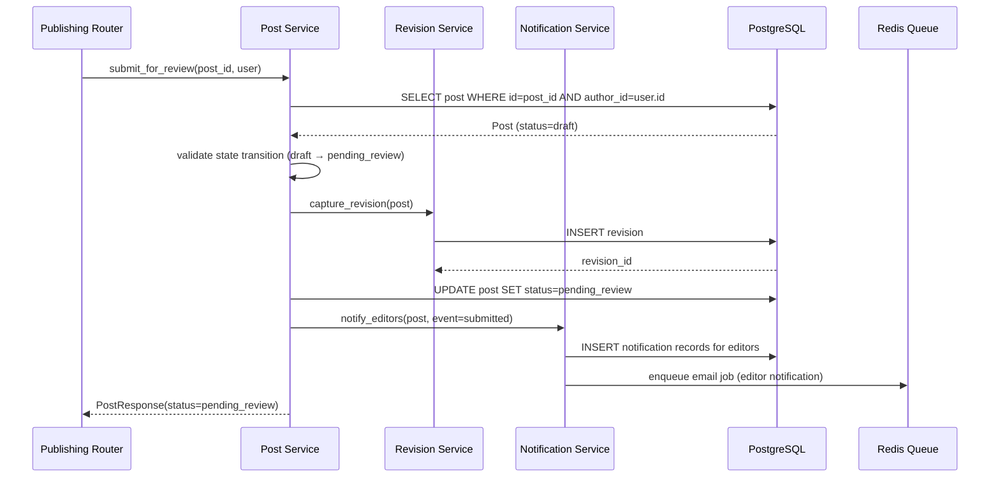
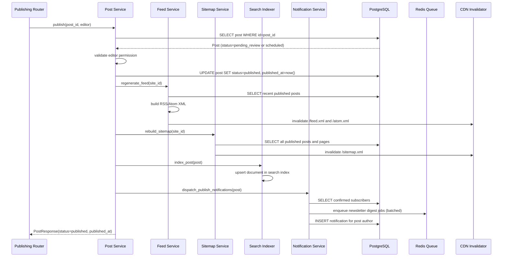
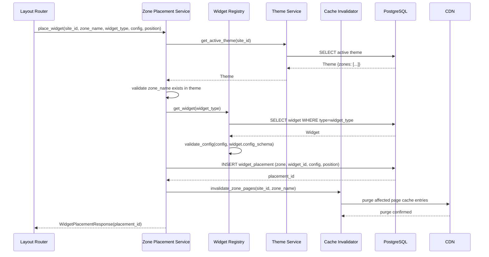
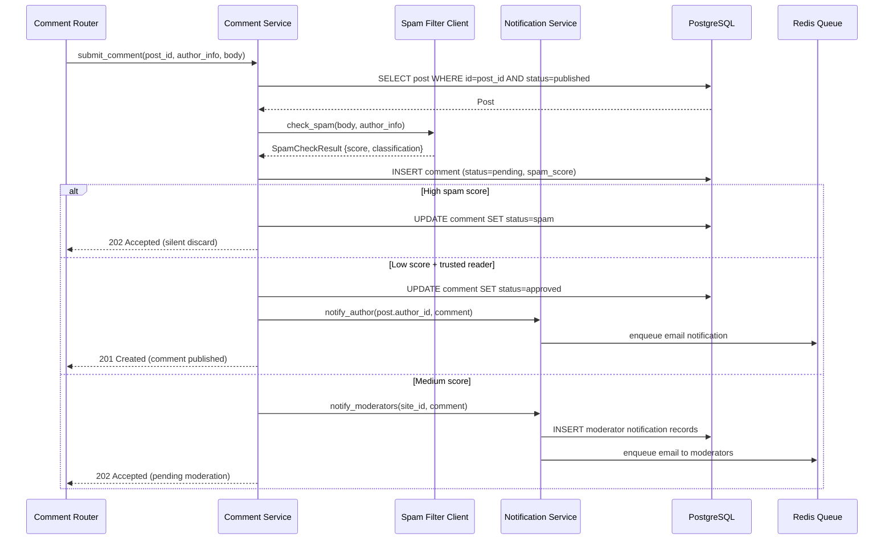
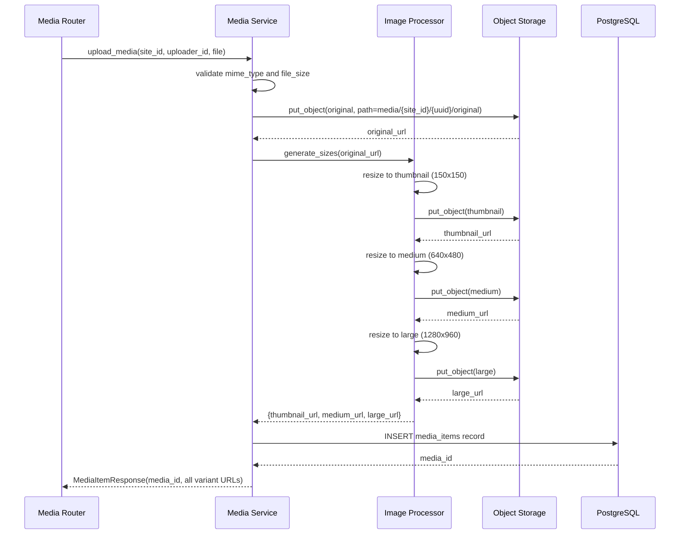
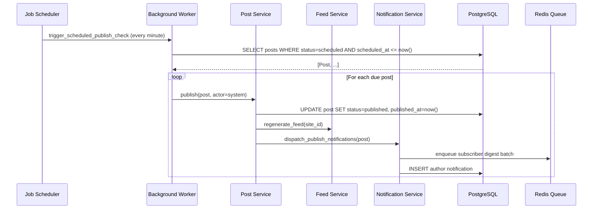

# Sequence Diagrams

## Overview
Internal sequence diagrams show the interactions between objects and services inside the CMS for key scenarios.

---

## 1. Author Submits Post for Review

---

## 2. Editor Publishes a Post

---

## 3. Admin Places Widget in Zone

---

## 4. Comment Submitted and Moderated

---

## 5. Media Upload and Processing

---

## 6. Scheduled Post Auto-Published by Worker

