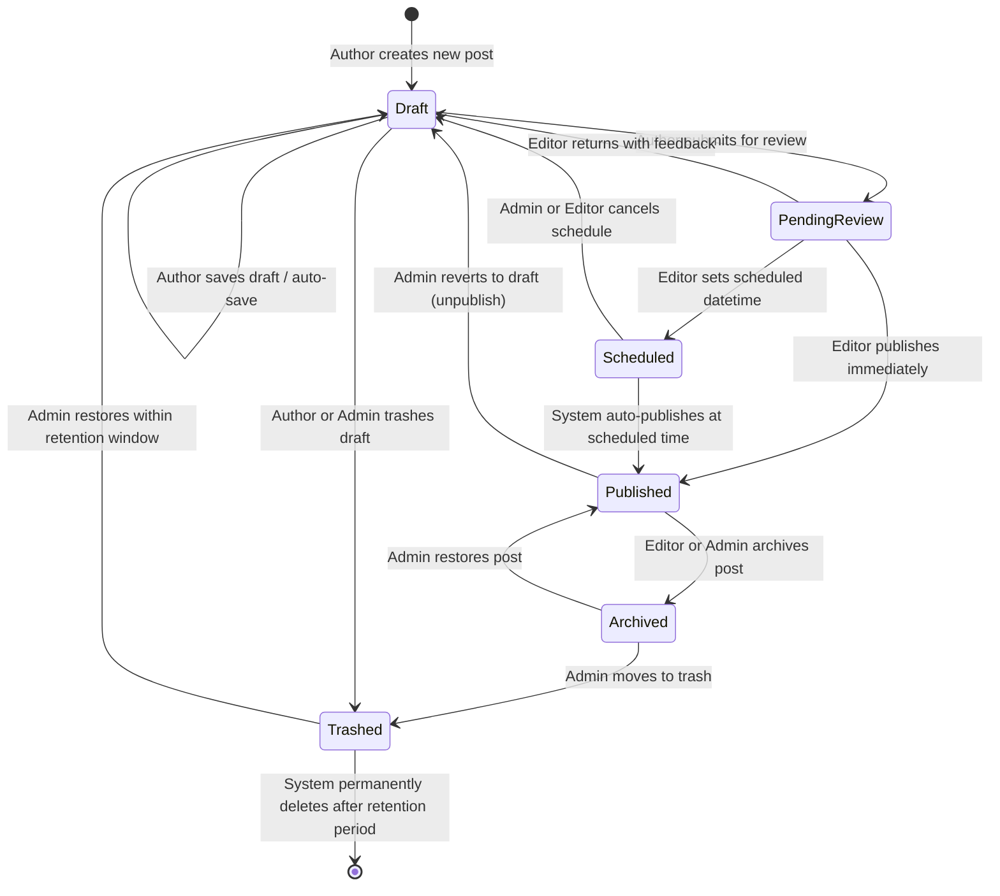
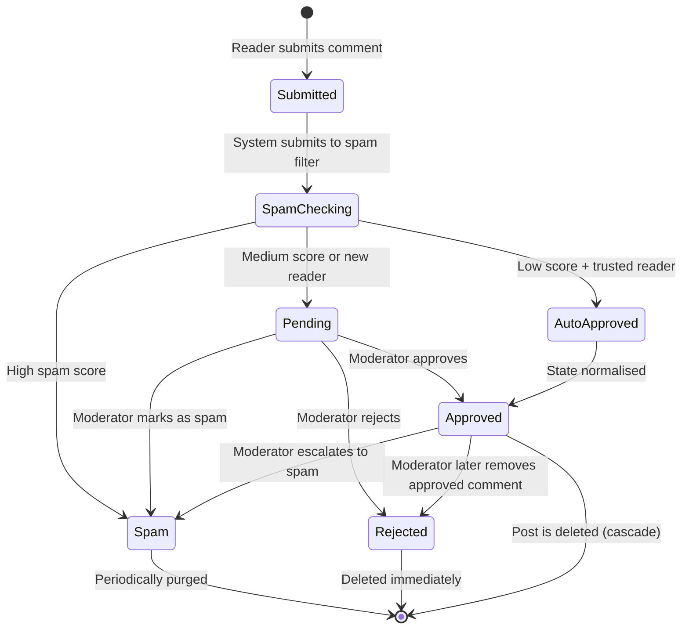
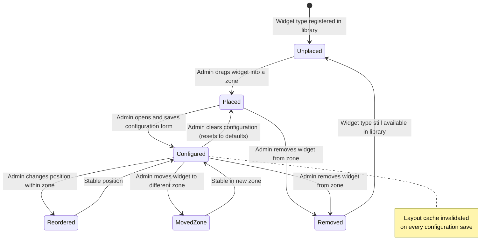
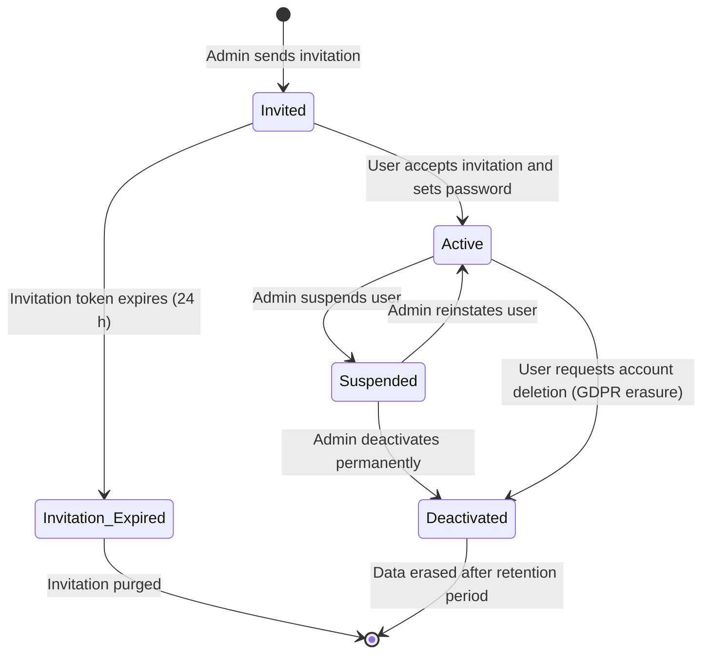
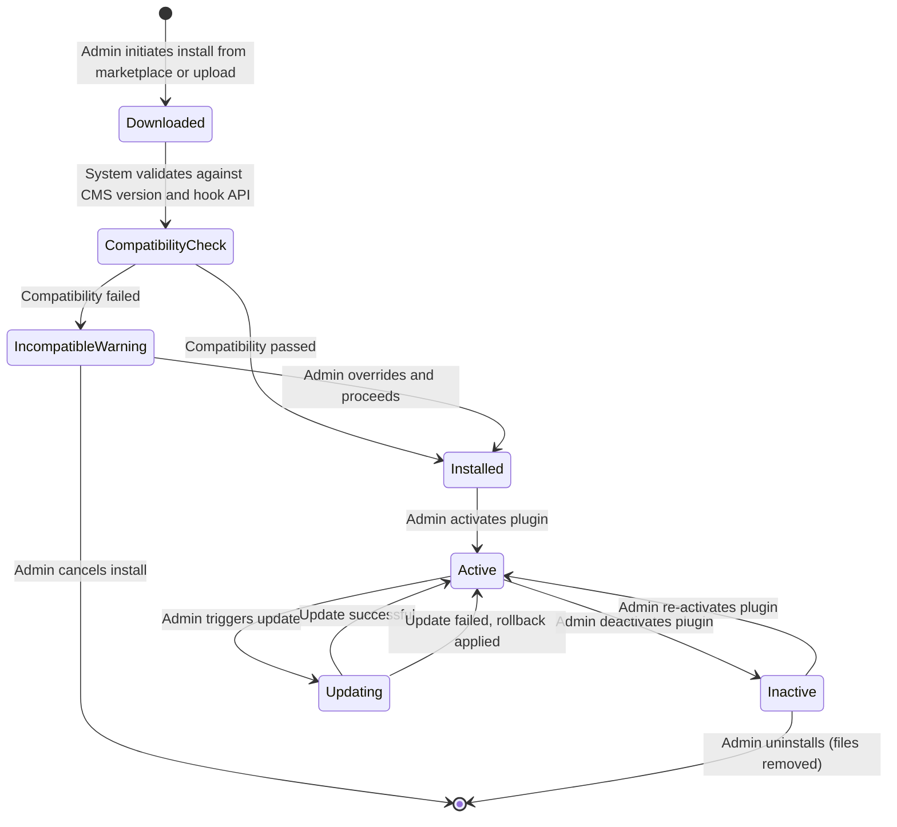

# State Machine Diagrams

## Overview
State machine diagrams model the lifecycle and valid state transitions for key entities in the CMS.

---

## 1. Post Lifecycle

---

## 2. Comment Lifecycle

---

## 3. Widget Placement Lifecycle

---

## 4. Theme Lifecycle

```mermaid
stateDiagram-v2
    [*] --> Installed : Admin installs from marketplace or upload

    Installed --> Previewing : Admin triggers live preview
    Previewing --> Installed : Admin cancels preview
    Previewing --> Activating : Admin confirms activation

    Installed --> Activating : Admin activates directly (skipping preview)

    Activating --> Active : Widget zones migrated; cache invalidated
    Active --> Deactivated : Admin activates a different theme

    Deactivated --> Activating : Admin re-activates this theme
    Deactivated --> [*] : Admin uninstalls theme

    Active --> [*] : Cannot uninstall the active theme directly
```

---

## 5. User / Site Membership Lifecycle

---

## 6. Plugin Lifecycle

