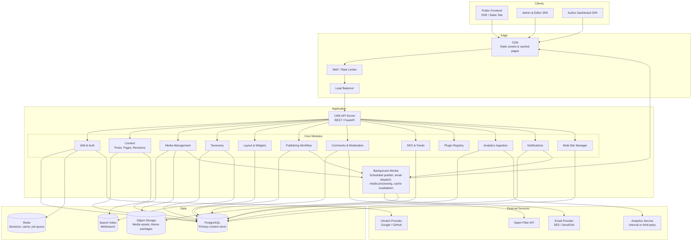
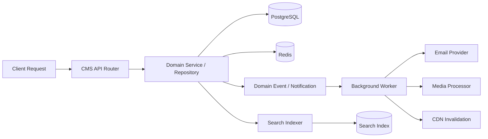

# High-Level Architecture Diagram

## Overview
The CMS is designed as a modular monolith with clear domain boundaries. The backend provides a REST API consumed by the Admin SPA, Author/Editor dashboard, and public-facing frontend. A background worker handles scheduled publishing, newsletter dispatch, media processing, and cache invalidation.

---

## System Architecture Overview

---

## Runtime Interaction Model

---

## Key Backend Module Responsibilities

| Module | Main Responsibilities |
|--------|----------------------|
| IAM | JWT auth, refresh tokens, OAuth2, 2FA (TOTP/OTP), role/permission enforcement |
| Content | Post/page CRUD, auto-save, revision snapshots, diff computation, draft/publish states |
| Media | File upload, image resizing, media library, storage abstraction, CDN URL generation |
| Taxonomy | Category and tag CRUD, custom taxonomy definitions, term merging |
| Layout | Theme registry, widget library, zone-based placement, per-page overrides, menu builder |
| Publishing | Workflow state machine, scheduled-publish job scheduling, notification dispatch |
| Comments | Comment submission, threading, moderation queue, spam filter integration |
| SEO | Meta field management, sitemap generation, canonical URL enforcement, redirect rules |
| Plugins | Plugin registry, lifecycle management, hook and extension point invocation |
| Analytics | Page-view event ingestion, aggregation, dashboard query API |
| Notifications | In-app notification store, email notification dispatch, preference management |
| Multi-Site | Tenant provisioning, cross-site user management, network analytics aggregation |
