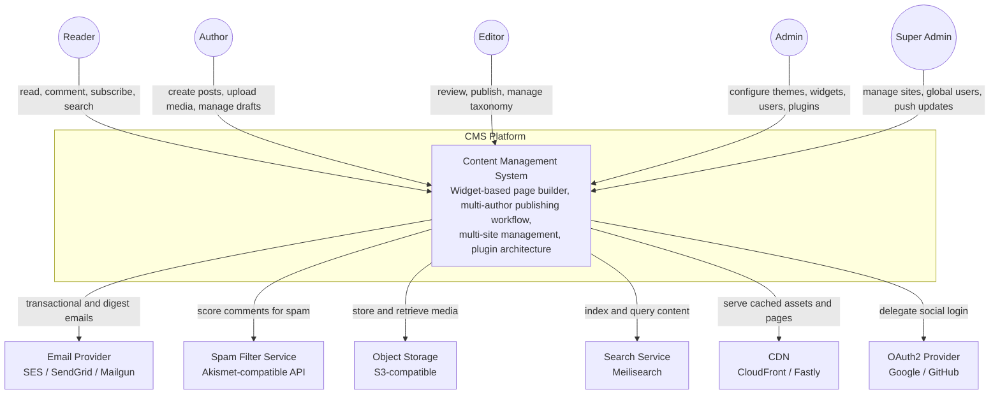
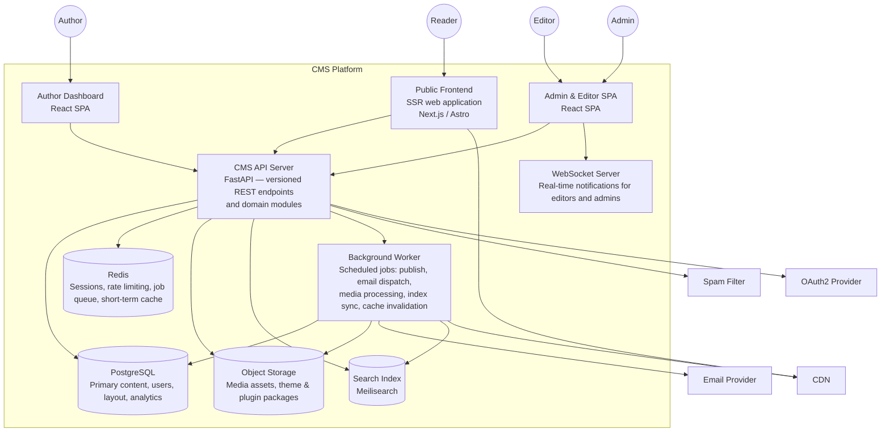
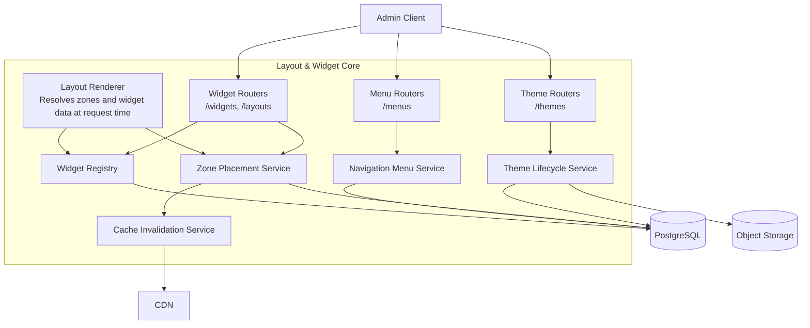

# C4 Diagrams

## Overview
C4 diagrams describe the CMS architecture at four levels of zoom: System Context, Container, Component, and Code.

---

## Level 1: System Context Diagram



---

## Level 2: Container Diagram



---

## Level 3: Component Diagram — Content & Publishing Core

```mermaid
graph TB
    AuthorClient[Author / Editor Client]

    subgraph "Content & Publishing Core"
        ContentAPI[Content Routers<br>POST /posts, /pages, /revisions]
        TaxonomyAPI[Taxonomy Routers<br>/categories, /tags]
        MediaAPI[Media Routers<br>/media]
        PublishingAPI[Publishing Routers<br>/posts/{id}/submit|publish|schedule|return]

        DraftService[Draft & Auto-Save Service]
        RevisionService[Revision Snapshot Service]
        PublishService[Publish / Schedule Service]
        FeedService[RSS/Atom Feed Generator]
        SitemapService[Sitemap Builder]
        NotifyService[Publishing Event Notifier]
    end

    DB[(PostgreSQL)]
    Redis[(Redis Queue)]
    SearchIdx[(Search Index)]
    Worker[Background Worker]

    AuthorClient --> ContentAPI
    AuthorClient --> TaxonomyAPI
    AuthorClient --> MediaAPI
    AuthorClient --> PublishingAPI

    ContentAPI --> DraftService
    ContentAPI --> RevisionService
    PublishingAPI --> PublishService
    PublishService --> FeedService
    PublishService --> SitemapService
    PublishService --> NotifyService

    DraftService --> DB
    RevisionService --> DB
    PublishService --> DB
    PublishService --> Worker
    FeedService --> DB
    SitemapService --> DB
    NotifyService --> DB
    NotifyService --> Redis
    ContentAPI --> SearchIdx
```

---

## Level 3: Component Diagram — Layout & Widget Core



---

## Current-Future Boundary

| Area | Current Design |
|------|---------------|
| Architecture | Modular monolith (FastAPI) |
| Search | Meilisearch for full-text; filtered DB queries as fallback |
| Real-time notifications | WebSocket for admin/editor panel; email for authors and readers |
| Plugin hooks | In-process hook invocation; external webhook plugins are a future option |
| Multi-site | Schema-per-tenant PostgreSQL; shared application layer |
| Recommendation | Tag/category affinity for related-posts widget; ML-based ranking is a future option |
