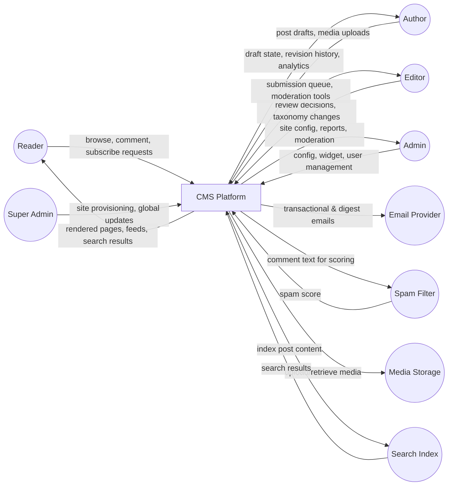
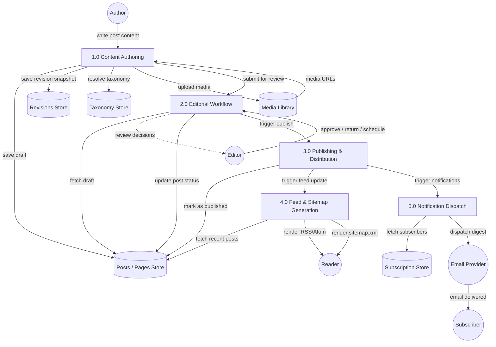
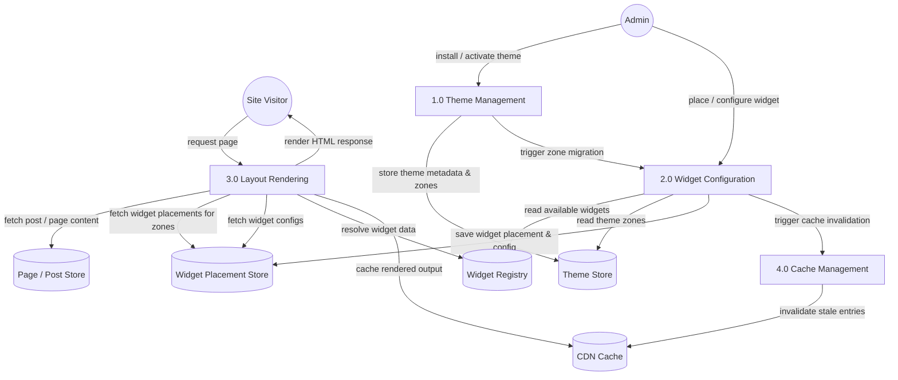
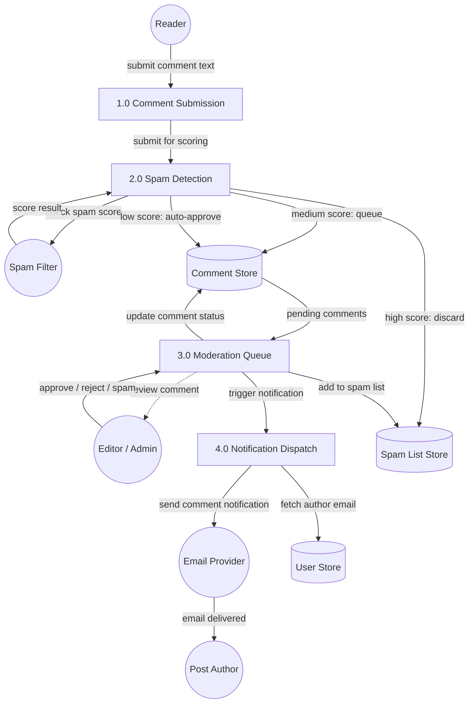

# Data Flow Diagrams

## Overview
Data flow diagrams show how data moves through the CMS platform from external actors through the system processes to data stores.

---

## Level 0: Context DFD

---

## Level 1: Content Publishing DFD

---

## Level 1: Layout & Widget DFD

---

## Level 1: Comment Moderation DFD

