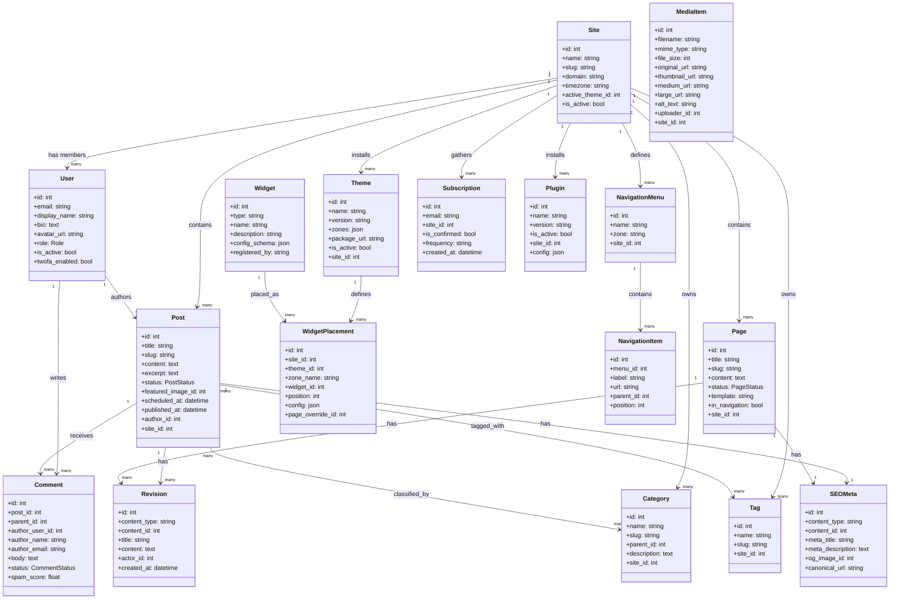

# Domain Model

## Overview
The domain model shows the key business entities in the CMS, their attributes, and the relationships between them.

---

## Core Domain Model



---

## Domain Enumerations

### PostStatus
```
Draft → PendingReview → Scheduled → Published → Archived → Trashed
```

### CommentStatus
```
Pending → Approved
Pending → Rejected
Pending → Spam
```

### Role
```
Reader < Author < Editor < Administrator < SuperAdmin
```
