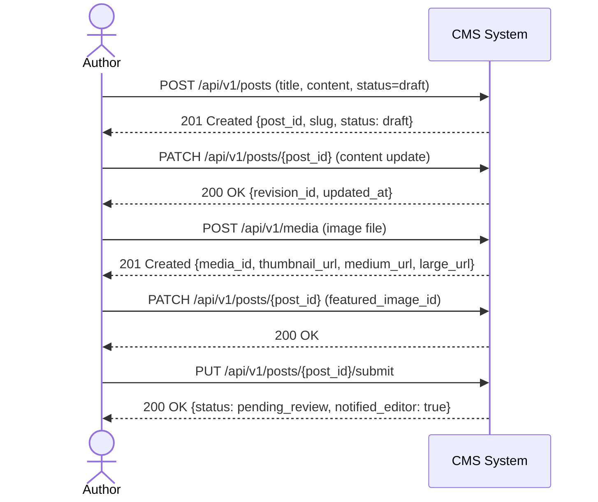
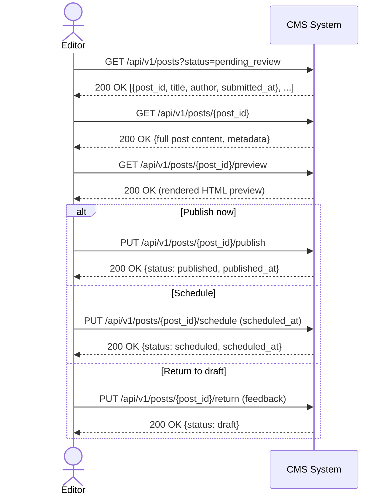
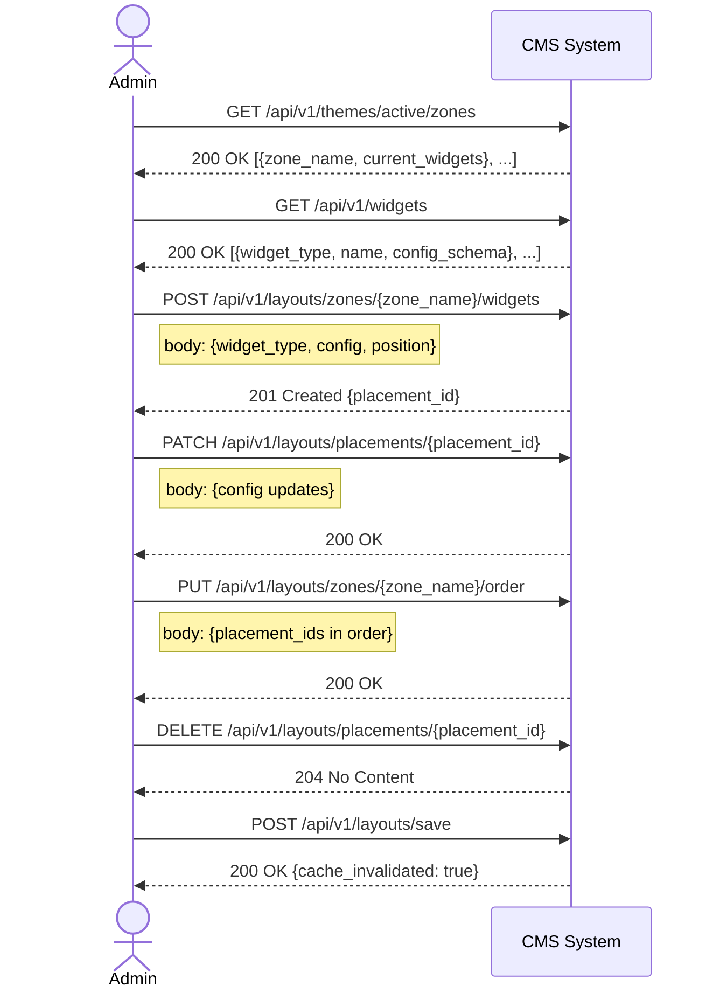
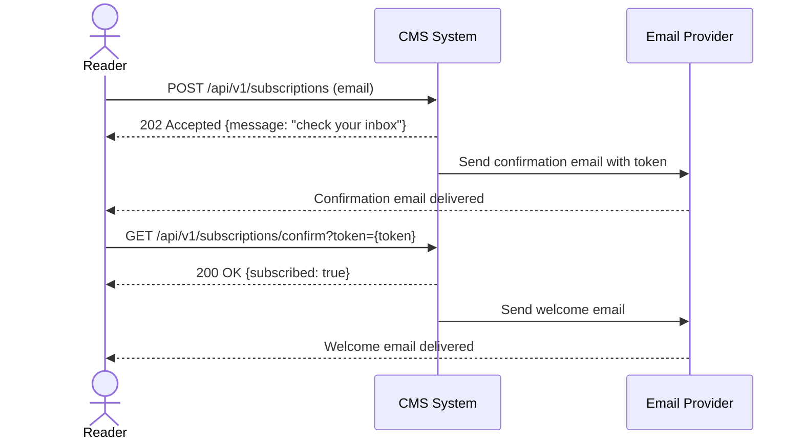
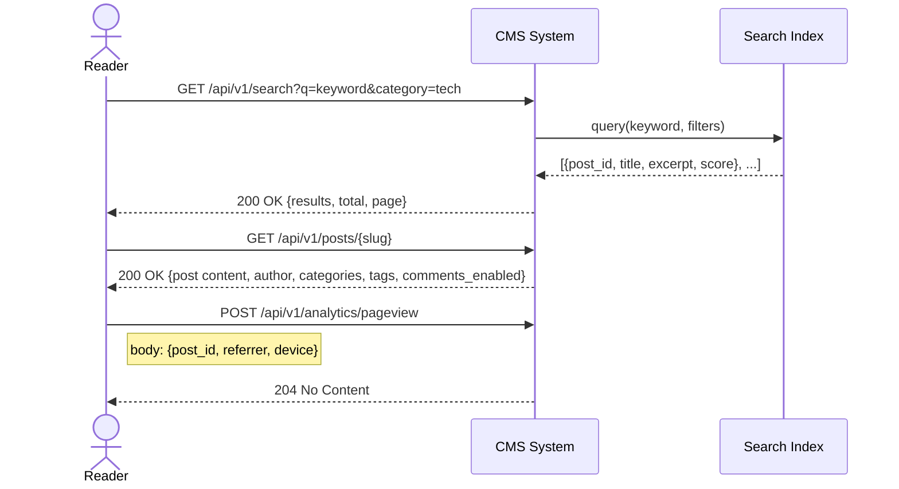
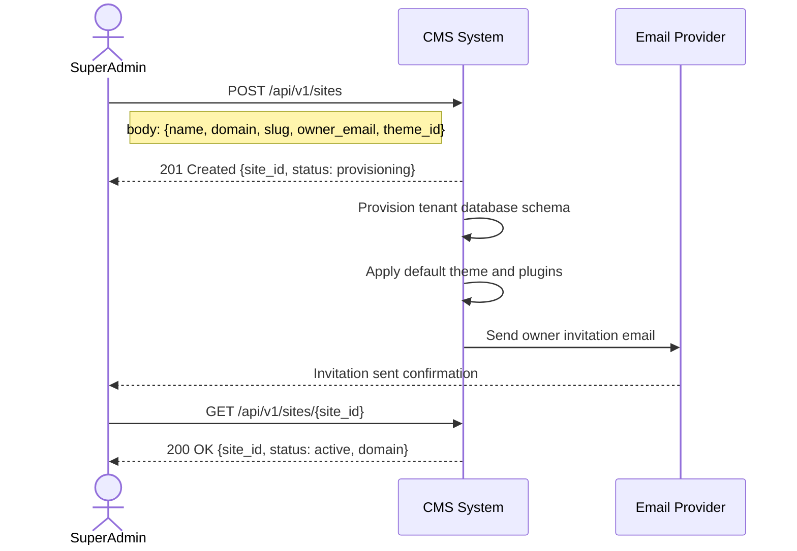

# System Sequence Diagrams

## Overview
System sequence diagrams model the interactions between external actors and the CMS as a black box, focusing on the messages exchanged at the system boundary.

---

## 1. Author Creates and Submits a Post

---

## 2. Editor Reviews and Publishes

---

## 3. Admin Configures Widget Layout

---

## 4. Reader Subscribes to Newsletter

---

## 5. Reader Searches and Reads a Post

---

## 6. Super Admin Creates a New Site

