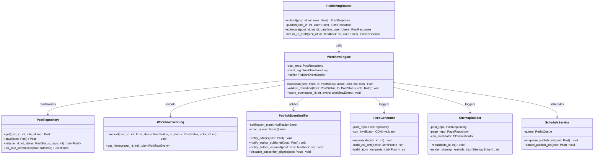
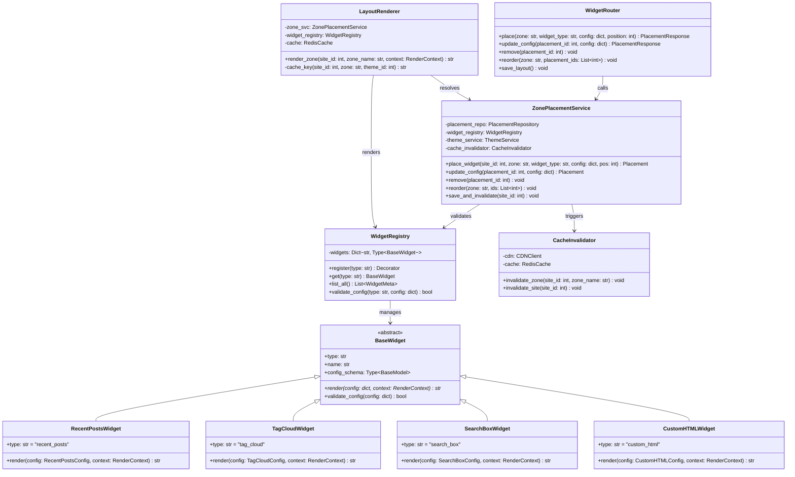
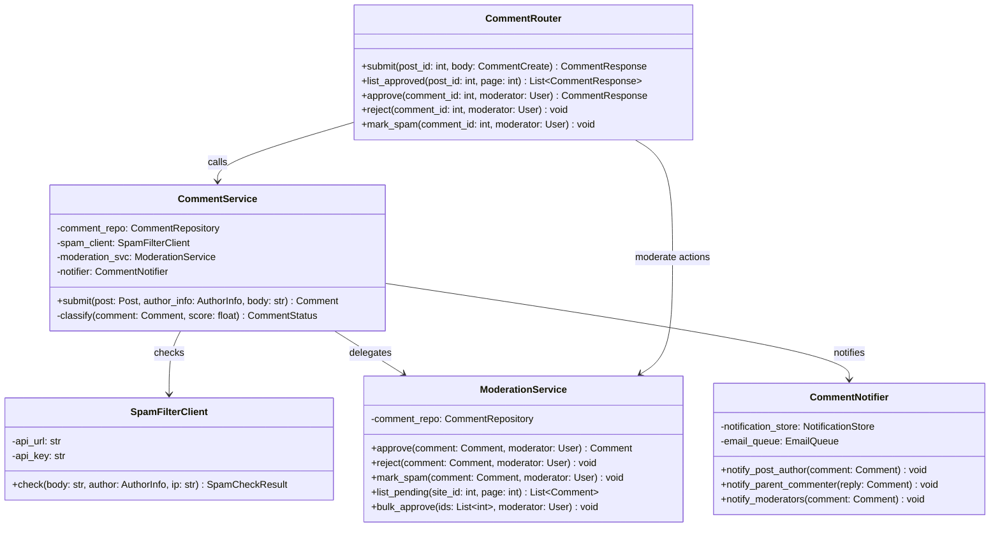

# C4 Code Diagram

## Overview
C4 Level 4 code diagrams illustrate the internal class-level structure of the most complex CMS subsystems.

---

## Publishing Workflow — Code Level

---

## Widget Layout — Code Level

---

## Comment Moderation — Code Level

