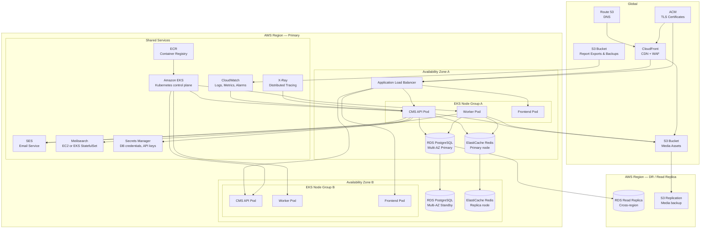

# Cloud Architecture Diagram

## Overview
This document describes the cloud architecture for the CMS platform deployed on AWS. The design is cloud-provider-agnostic and maps directly to equivalent GCP and Azure services.

---

## AWS Cloud Architecture

---

## Cloud Service Mapping

| Function | AWS | GCP | Azure |
|----------|-----|-----|-------|
| DNS | Route 53 | Cloud DNS | Azure DNS |
| CDN + WAF | CloudFront + AWS WAF | Cloud CDN + Cloud Armor | Azure Front Door |
| Load Balancer | ALB | Cloud Load Balancing | Azure App Gateway |
| Kubernetes | EKS | GKE | AKS |
| Container Registry | ECR | Artifact Registry | ACR |
| PostgreSQL | RDS PostgreSQL | Cloud SQL | Azure Database for PostgreSQL |
| Redis | ElastiCache | Memorystore | Azure Cache for Redis |
| Object Storage | S3 | Cloud Storage | Azure Blob Storage |
| Email | SES | — (use SendGrid) | Azure Communication Services |
| TLS Certificates | ACM | Google-managed SSL | App Service Managed Cert |
| Secrets | Secrets Manager | Secret Manager | Azure Key Vault |
| Logging | CloudWatch Logs | Cloud Logging | Azure Monitor Logs |
| Tracing | X-Ray | Cloud Trace | Azure Application Insights |
| CI/CD | CodePipeline / GitHub Actions | Cloud Build | Azure DevOps |

---

## Backup and Disaster Recovery

| Asset | Backup Method | RPO | RTO |
|-------|---------------|-----|-----|
| PostgreSQL | RDS automated snapshots (daily) + continuous WAL archiving | 1 h | 1 h |
| Redis | ElastiCache daily snapshot to S3 | 24 h | 30 min |
| Media (S3) | S3 versioning + cross-region replication | 1 h | 15 min |
| Search Index | Rebuilt from PostgreSQL on recovery | N/A | 2 h |
| Container Images | Immutable tags in ECR; multi-region replication | N/A | 5 min |

---

## Auto-Scaling Configuration

| Component | Metric | Min | Max |
|-----------|--------|-----|-----|
| CMS API Pods | CPU > 60% | 2 | 10 |
| Worker Pods | Redis queue depth > 100 | 2 | 8 |
| Frontend Pods | CPU > 70% | 2 | 6 |
| RDS | — | 1 primary | 1 primary + 1 replica |
| ElastiCache | — | 1 primary | 1 primary + 2 replicas |

---

## Cost Optimisation

| Strategy | Implementation |
|----------|---------------|
| CDN caching | Cache public posts, feeds, and sitemap at CDN for 5 min; media for 365 days |
| Spot / Preemptible nodes | Use spot instances for worker pods; on-demand for API pods |
| Read replicas | Route all public GET queries to RDS read replica |
| S3 lifecycle | Move exports older than 90 days to S3 Glacier |
| Reserved instances | Reserve 1-year term for RDS and ElastiCache primary nodes |
