# Deployment Diagram

## Overview
The deployment diagram maps CMS software components to the infrastructure nodes they run on.

---

## Container-Based Deployment (Kubernetes)

```mermaid
graph TB
    subgraph "User Devices"
        Browser[Browser / PWA]
        MobileApp[Mobile Browser]
    end

    subgraph "Edge Layer"
        CDN[CDN<br>CloudFront / Fastly<br>Static assets, cached pages, feeds]
        WAF[WAF / DDoS Protection<br>AWS Shield / Cloudflare]
    end

    subgraph "Kubernetes Cluster"
        subgraph "Ingress"
            Ingress[Nginx Ingress Controller<br>TLS termination, routing]
        end

        subgraph "Application Pods"
            APIPod1[CMS API Pod 1<br>FastAPI<br>container: cms-api:latest]
            APIPod2[CMS API Pod 2<br>FastAPI<br>container: cms-api:latest]
            APIPodN[CMS API Pod N<br>HPA auto-scaled]
            WorkerPod1[Background Worker Pod 1<br>Celery / ARQ<br>container: cms-worker:latest]
            WorkerPod2[Background Worker Pod 2]
            WSPod[WebSocket Pod<br>Async ASGI<br>container: cms-ws:latest]
        end

        subgraph "Frontend Pods"
            FrontendPod[Public Frontend Pod<br>Next.js SSR<br>container: cms-frontend:latest]
            AdminPod[Admin SPA Pod<br>Nginx serving static build<br>container: cms-admin:latest]
        end
    end

    subgraph "Managed Data Services"
        PGPrimary[(PostgreSQL Primary<br>RDS / Cloud SQL)]
        PGReplica[(PostgreSQL Read Replica<br>Scale read-heavy queries)]
        RedisCluster[(Redis Cluster<br>ElastiCache / Memorystore<br>Sessions, queue, cache)]
        SearchNode[(Meilisearch<br>Self-hosted or managed<br>Search index)]
    end

    subgraph "Storage"
        S3[(Object Storage<br>S3 / GCS<br>Media, themes, exports)]
    end

    subgraph "External Services"
        EmailSvc[Email Provider<br>SES / SendGrid]
        SpamSvc[Spam Filter API]
        OAuthProvider[OAuth2 Provider]
    end

    Browser --> CDN
    MobileApp --> CDN
    CDN --> WAF
    WAF --> Ingress

    Ingress --> APIPod1
    Ingress --> APIPod2
    Ingress --> APIPodN
    Ingress --> FrontendPod
    Ingress --> AdminPod
    Ingress --> WSPod

    APIPod1 --> PGPrimary
    APIPod1 --> PGReplica
    APIPod1 --> RedisCluster
    APIPod1 --> SearchNode
    APIPod1 --> S3

    WorkerPod1 --> PGPrimary
    WorkerPod1 --> RedisCluster
    WorkerPod1 --> S3
    WorkerPod1 --> EmailSvc
    WorkerPod1 --> CDN

    APIPod1 --> SpamSvc
    APIPod1 --> OAuthProvider

    FrontendPod --> APIPod1
    FrontendPod --> CDN
```

---

## Deployment Node Specifications

| Component | Node Type | Replicas | Notes |
|-----------|-----------|----------|-------|
| CMS API | Kubernetes Deployment | 2–10 (HPA) | CPU/memory-based autoscaling |
| Background Worker | Kubernetes Deployment | 2–5 (HPA) | Queue-length-based autoscaling |
| WebSocket Server | Kubernetes Deployment | 1–3 | Sticky sessions via ingress annotation |
| Public Frontend | Kubernetes Deployment | 2–4 | SSR pods; most pages CDN-cached |
| Admin SPA | Kubernetes Deployment | 1–2 | Static files served by Nginx |
| PostgreSQL | Managed RDS / Cloud SQL | 1 primary + 1 replica | Multi-AZ failover |
| Redis | Managed ElastiCache | 3-node cluster | Cluster mode for queue and sessions |
| Meilisearch | Self-hosted StatefulSet | 1–2 | Persistent volume for index |
| Object Storage | S3 / GCS | — | Managed service; CDN-fronted |

---

## CI/CD Pipeline

```mermaid
graph LR
    Dev[Developer Push] --> GH[GitHub Repository]
    GH --> CI[CI Pipeline<br>GitHub Actions]
    CI --> Lint[Lint & Type Check]
    Lint --> Test[Unit & Integration Tests]
    Test --> Build[Docker Image Build]
    Build --> Push[Push to Container Registry]
    Push --> StagingDeploy[Deploy to Staging<br>Helm upgrade]
    StagingDeploy --> SmokeTest[Smoke Tests]
    SmokeTest --> ProdApproval[Manual Approval]
    ProdApproval --> ProdDeploy[Deploy to Production<br>Rolling update]
    ProdDeploy --> Monitor[Health Check & Rollback Gate]
```


