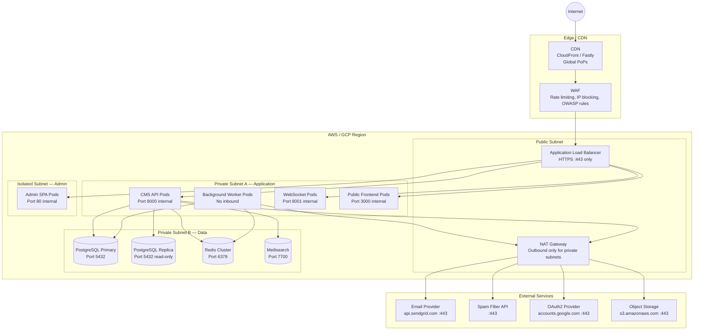
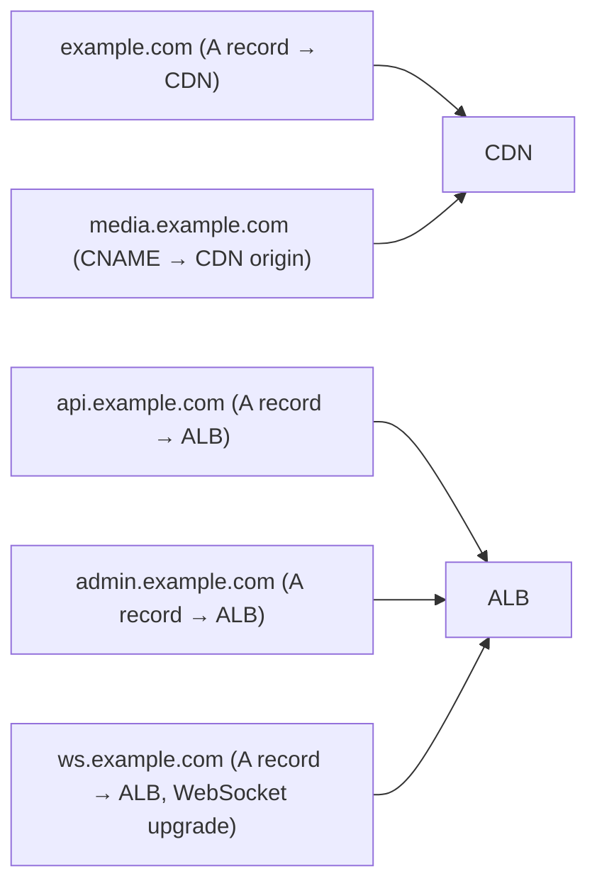

# Network Infrastructure Diagram

## Overview
This document describes the network topology and security boundaries for the CMS platform deployment.

---

## Network Topology

---

## Security Groups / Firewall Rules

| Resource | Inbound | Outbound |
|----------|---------|----------|
| ALB | 443 from internet | 8000, 3000, 8001, 80 to private subnet |
| CMS API Pods | 8000 from ALB only | 5432 to PG, 6379 to Redis, 7700 to Meilisearch, 443 via NAT |
| Worker Pods | None | 5432 to PG, 6379 to Redis, 443 via NAT |
| WebSocket Pods | 8001 from ALB only | 5432 to PG, 6379 to Redis |
| Frontend Pods | 3000 from ALB only | 8000 to API Pods |
| PostgreSQL | 5432 from API/Worker pods only | None |
| Redis | 6379 from API/Worker pods only | None |
| Meilisearch | 7700 from API pods only | None |

---

## DNS Configuration

---

## TLS / Certificate Strategy

| Domain | Certificate | Renewal |
|--------|-------------|---------|
| `example.com` | ACM / Let's Encrypt wildcard | Auto-renew |
| `api.example.com` | ACM / Let's Encrypt | Auto-renew |
| `admin.example.com` | ACM / Let's Encrypt | Auto-renew |
| `media.example.com` | CDN-managed | Auto-renew |
| All | TLS 1.2 minimum, TLS 1.3 preferred | — |

---

## Network Monitoring

| Tool | Purpose |
|------|---------|
| VPC Flow Logs | Capture all traffic for security audit |
| CloudWatch / Cloud Monitoring | Metrics for ALB, API pods, DB connections |
| WAF Logs | Log blocked requests; alert on anomalies |
| Uptime Checks | Synthetic monitoring every 60 s from multiple regions |
| PagerDuty | Alerting for P1 availability and security incidents |
