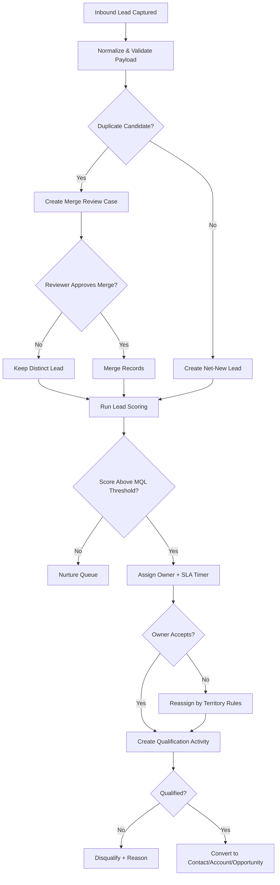
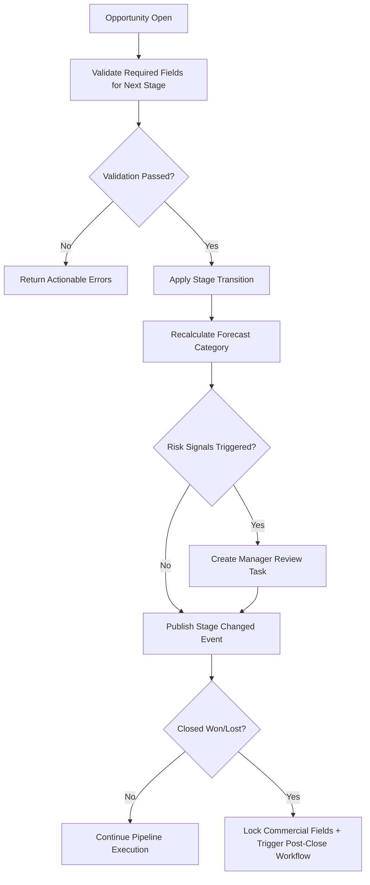
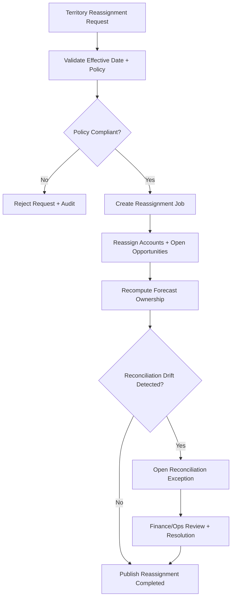

# Activity Diagrams

This document captures high-value CRM workflow activities with alternate/error handling.

## Lead Capture, Qualification, and Conversion

## Opportunity Stage Progression

## Territory Reassignment and Forecast Reconciliation

