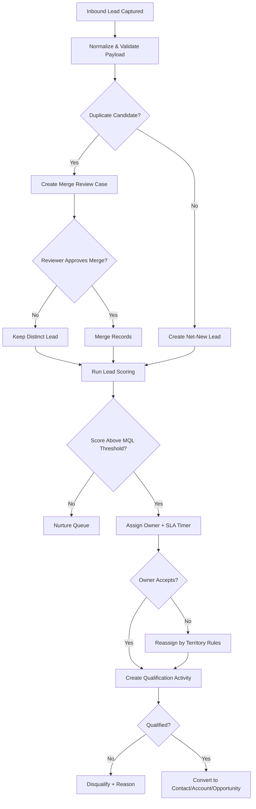
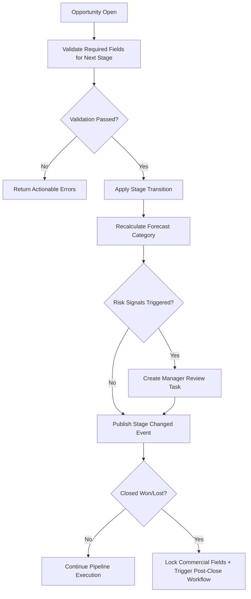
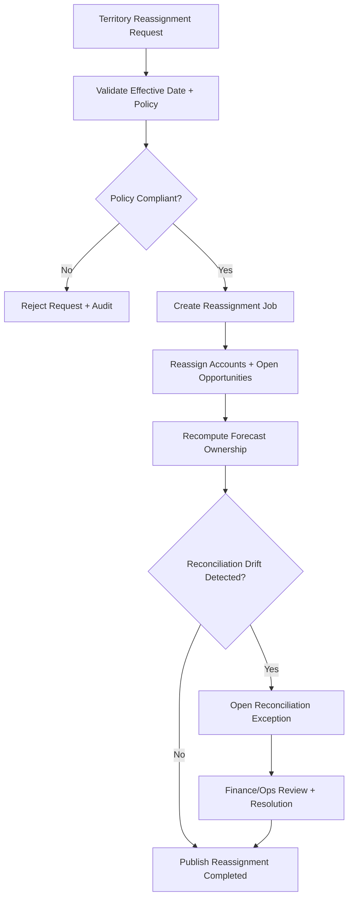
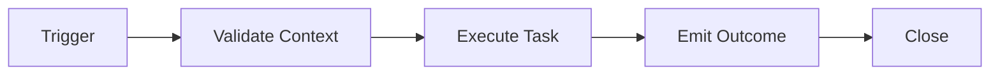

# Activity Diagrams

This document captures high-value CRM workflow activities with alternate/error handling.

## Lead Capture, Qualification, and Conversion

## Opportunity Stage Progression

## Territory Reassignment and Forecast Reconciliation

## Domain Glossary
- **Activity Path**: File-specific term used to anchor decisions in **Activity Diagrams**.
- **Lead**: Prospect record entering qualification and ownership workflows.
- **Opportunity**: Revenue record tracked through pipeline stages and forecast rollups.
- **Correlation ID**: Trace identifier propagated across APIs, queues, and audits for this workflow.

## Entity Lifecycles
- Lifecycle for this document: `Trigger -> Validate Context -> Execute Task -> Emit Outcome -> Close`.
- Each transition must capture actor, timestamp, source state, target state, and justification note.

## Integration Boundaries
- Swimlane actors include sales rep, workflow engine, and policy service.
- Data ownership and write authority must be explicit at each handoff boundary.
- Interface changes require schema/version review and downstream impact acknowledgement.

## Error and Retry Behavior
- Task retries allowed only for technical errors; policy denials halt flow.
- Retries must preserve idempotency token and correlation ID context.
- Exhausted retries route to an operational queue with triage metadata.

## Measurable Acceptance Criteria
- Every activity diagram includes alternate path, timeout path, and compensating action.
- Observability must publish latency, success rate, and failure-class metrics for this document's scope.
- Quarterly review confirms definitions and diagrams still match production behavior.
