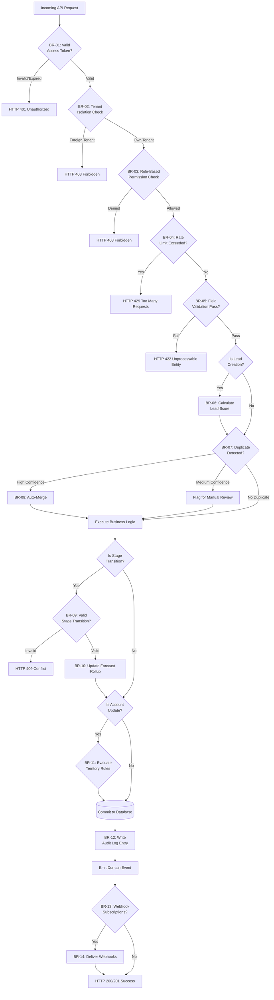

# Business Rules — Customer Relationship Management Platform

**Version:** 1.0  
**Status:** Approved  
**Last Updated:** 2025-07-15

---

## Table of Contents

1. [Overview](#1-overview)
2. [Rule Evaluation Pipeline](#2-rule-evaluation-pipeline)
3. [Business Rules](#3-business-rules)
4. [Traceability Table](#4-traceability-table)

---

## 1. Overview

This document defines the enforceable business rules governing the CRM Platform's behavior. These rules are platform-level invariants that apply across all tenants and control critical workflows including lead lifecycle transitions, opportunity stage progression, territory assignments, forecast submissions, data deduplication, and compliance obligations. Rules are evaluated at specific pipeline stages (request validation, pre-commit check, post-commit event) and are enforced by designated services or database constraints.

**Rule Categories:**
- **Lead Management** — Rules governing lead capture, scoring, assignment, and conversion
- **Opportunity Management** — Rules governing deal stage transitions, probability calculations, and forecast inclusion
- **Territory Management** — Rules governing account assignment and territory rebalancing
- **Forecasting** — Rules governing forecast submission, approval, and rollup calculations
- **Data Quality** — Rules governing duplicate detection, merge operations, and data validation
- **Compliance** — Rules governing GDPR data handling, CAN-SPAM email requirements, and audit logging
- **Security** — Rules governing authentication, authorization, and tenant isolation
- **Integration** — Rules governing email sync, calendar sync, and webhook delivery

**Enforcement Points:**
- **API Gateway** — Token validation, rate limiting, tenant isolation checks
- **Application Service Layer** — Business logic validation, state transition checks, permission enforcement
- **Database Layer** — Constraints, triggers, foreign key validation
- **Background Jobs** — Asynchronous rule evaluation, cleanup, and reconciliation
- **Event Handlers** — Post-commit event processing, notification triggers

---

## 2. Rule Evaluation Pipeline

The following diagram illustrates how business rules are evaluated in sequence during API request processing:



---

## 3. Business Rules

## Enforceable Rules

---

### BR-01 — Access Token Validation

**Category:** Security  
**Enforcer:** API Gateway, Auth Service  

Every API request MUST present a valid OAuth 2.0 access token (JWT) or API key in the `Authorization` header. The token MUST be unexpired, properly signed, and scoped to the requested resource and operation. JWT tokens have a maximum TTL of 1 hour; API keys are long-lived but can be revoked by admins.

**Rule Logic:**
```
ALLOW if:
  token.signature_valid == true
  AND token.exp > current_time
  AND token.scope includes requested_operation
  AND token.tenant_id == target_resource.tenant_id
DENY with HTTP 401 otherwise
```

**Exceptions:** None. All API requests require authentication.

---

### BR-02 — Tenant Isolation Enforcement

**Category:** Security  
**Enforcer:** All Services  

No API response or database query MUST include resources belonging to a different Tenant than the authenticated user's Tenant. All database queries include a mandatory `WHERE tenant_id = :authenticated_tenant_id` clause. Cross-tenant access attempts are logged as security events and trigger account review.

**Rule Logic:**
```
All database queries MUST filter by:
  WHERE tenant_id = :authenticated_user.tenant_id
All API responses MUST exclude foreign tenant resources
```

**Violation Response:** HTTP 403 Forbidden  
**Audit:** Any cross-tenant access attempt is logged with user ID, IP address, and requested resource ID.

---

### BR-03 — Role-Based Access Control (RBAC)

**Category:** Security  
**Enforcer:** Application Service Layer  

Users MUST be assigned to one or more Roles, and Roles define permissions for each entity type (Lead, Contact, Account, Deal, Activity, Campaign) and operation (Create, Read, Update, Delete, Export). Object-level scoping controls whether users can access All, Team, or Own records only.

**Permission Levels:**
| Level | Description |
|---|---|
| View All | User can view all records in the tenant |
| View Team | User can view records owned by self or direct reports |
| View Own | User can view only records owned by self |

**Rule Logic:**
```
ALLOW operation if:
  user.role.permissions[entity_type] includes operation
  AND (
    permission_level == "All"
    OR (permission_level == "Team" AND resource.owner IN user.team_members)
    OR (permission_level == "Own" AND resource.owner == user.id)
  )
DENY with HTTP 403 otherwise
```

**Exceptions:** System Admins have "View All" and "Modify All" permissions across all entity types.

---

### BR-04 — API Rate Limiting

**Category:** Security, Performance  
**Enforcer:** API Gateway  

API requests are rate-limited to prevent abuse and ensure fair resource allocation. Rate limits are enforced per user and per tenant using a token bucket algorithm with refill rates defined by subscription tier.

**Rate Limits:**
| Tier | Requests per Minute (per user) | Requests per Minute (per tenant) |
|---|---|---|
| Free | 60 | 300 |
| Professional | 120 | 1,000 |
| Enterprise | 300 | 5,000 |

**Rule Logic:**
```
IF request_count_in_last_60_seconds(user_id) > rate_limit_per_user:
  REJECT with HTTP 429
IF request_count_in_last_60_seconds(tenant_id) > rate_limit_per_tenant:
  REJECT with HTTP 429
ELSE:
  INCREMENT counter and ALLOW
```

**Response Headers:**
```
X-RateLimit-Limit: 120
X-RateLimit-Remaining: 45
X-RateLimit-Reset: 1627891200 (Unix timestamp)
```

---

### BR-05 — Field Validation and Schema Enforcement

**Category:** Data Quality  
**Enforcer:** Application Service Layer, Database Layer  

All API write operations MUST validate input fields against schema definitions, including data type, length, format, and required constraints. Invalid payloads are rejected with HTTP 422 and field-level error details.

**Validation Rules:**
| Field | Validation |
|---|---|
| Email | RFC 5321 format, max 320 characters |
| Phone | E.164 international format or tenant-specific regex |
| URL | Valid HTTP/HTTPS URL, max 2048 characters |
| Currency | ISO 4217 code (USD, EUR, GBP, etc.) |
| Date | ISO 8601 format (YYYY-MM-DD) |
| Custom Picklist | Value MUST be in configured option set |

**Rule Logic:**
```
FOR each field in request_payload:
  IF field.required AND field.value is NULL:
    ADD error: "Field is required"
  IF field.value NOT matches field.type_format:
    ADD error: "Invalid format"
  IF field.value.length > field.max_length:
    ADD error: "Value exceeds maximum length"
IF errors.count > 0:
  REJECT with HTTP 422 and error details
```

---

### BR-06 — Lead Scoring Calculation

**Category:** Lead Management  
**Enforcer:** Lead Scoring Engine (Background Service)  

Every Lead MUST be assigned a score (0-100) upon creation and the score MUST be recalculated whenever scoring-relevant attributes change (company size, industry, lead source, page visits, email engagement). Scoring rules are evaluated in descending priority order, and the final score is the sum of all matching rules (capped at 100).

**Default Scoring Rules:**
| Rule | Condition | Points |
|---|---|---|
| Enterprise Company Size | employee_count > 1000 | +20 |
| Target Industry Match | industry IN ["Technology", "Financial Services"] | +15 |
| Email Domain Match | email_domain IN tenant.target_domains | +10 |
| High Engagement | page_visit_count >= 5 | +10 |
| Referral Source | lead_source = "Referral" | +10 |
| Form Completion | form_submitted = true | +5 |
| Email Opened | email_opened_count > 0 | +5 |

**Rule Logic:**
```
score = 0
FOR each rule in scoring_rules (ordered by priority):
  IF rule.condition evaluates to TRUE for lead:
    score += rule.points
score = MIN(score, 100)  // Cap at 100
lead.score = score
EMIT LeadScoreUpdated event
```

**Extensibility:** Tenants can configure custom scoring rules via Settings → Lead Scoring.

---

### BR-07 — Duplicate Detection and Flagging

**Category:** Data Quality  
**Enforcer:** Duplicate Detection Engine (Background Service)  

When a Contact or Lead is created or updated, the system MUST evaluate fuzzy matching algorithms on name, email, phone, and company domain to detect potential duplicates. Duplicate pairs are assigned a confidence score (0-100%). Pairs with confidence >= 90% are flagged for auto-merge (if enabled), pairs with confidence 50-89% are flagged for manual review, and pairs < 50% are ignored.

**Matching Algorithms:**
| Field | Algorithm | Weight |
|---|---|---|
| Email (exact) | Case-insensitive exact match | 100% confidence |
| Phone (exact) | Normalize and exact match | 90% confidence |
| Name + Company | Levenshtein distance < 3 | 70% confidence |
| Domain (exact) | Extract domain from email, exact match | 60% confidence |

**Rule Logic:**
```
FOR each existing_contact in contacts WHERE tenant_id = new_contact.tenant_id:
  confidence = 0
  IF new_contact.email == existing_contact.email:
    confidence = MAX(confidence, 100)
  IF normalize_phone(new_contact.phone) == normalize_phone(existing_contact.phone):
    confidence = MAX(confidence, 90)
  IF levenshtein_distance(new_contact.name, existing_contact.name) < 3 
     AND new_contact.company == existing_contact.company:
    confidence = MAX(confidence, 70)
  
  IF confidence >= 90 AND tenant.auto_merge_enabled:
    ENQUEUE auto_merge_job(new_contact, existing_contact)
  ELSE IF confidence >= 50:
    CREATE duplicate_pair(new_contact, existing_contact, confidence)
```

---

## Exception and Override Handling

### BR-08 — Automatic Merge for High-Confidence Duplicates

**Category:** Data Quality  
**Enforcer:** Merge Processor (Background Service)  

If duplicate detection identifies a pair with confidence >= 95% (typically exact email match) AND the tenant has enabled auto-merge, the system MUST automatically merge the newer record into the older record without manual review. The merge operation is atomic: all related activities, deals, and custom field values are transferred to the surviving record, and the merged record is soft-deleted.

**Rule Logic:**
```
IF duplicate_pair.confidence >= 95 AND tenant.auto_merge_enabled:
  surviving_record = older_record  // Keep older record as primary
  merged_record = newer_record
  
  // Transfer relationships
  UPDATE activities SET related_contact_id = surviving_record.id 
    WHERE related_contact_id = merged_record.id
  UPDATE deals SET primary_contact_id = surviving_record.id 
    WHERE primary_contact_id = merged_record.id
  
  // Merge custom fields (newer values win on conflict)
  FOR each custom_field in merged_record.custom_fields:
    IF surviving_record.custom_fields[field] is NULL:
      surviving_record.custom_fields[field] = merged_record.custom_fields[field]
  
  // Soft delete merged record
  merged_record.deleted_at = current_time
  merged_record.merged_into_id = surviving_record.id
  
  CREATE merge_history(surviving_record, merged_record, auto=true)
  EMIT ContactMerged event
```

**Audit:** All auto-merges are logged in the audit trail with reason = "Auto-merge: High-confidence duplicate".

---

### BR-09 — Deal Stage Transition Validation

**Category:** Opportunity Management  
**Enforcer:** Deal Service  

When a Deal's stage is changed, the system MUST validate that the transition is allowed based on stage configuration. Transitions to "Closed Won" require amount > 0 and close_date <= today. Transitions to "Closed Lost" require a loss_reason to be specified.

**Rule Logic:**
```
IF new_stage.is_closed_won:
  IF deal.amount == 0 OR deal.amount is NULL:
    REJECT with "Cannot close deal as won: amount must be greater than 0"
  IF deal.close_date > today:
    REJECT with "Cannot close deal as won: close date must be today or earlier"

IF new_stage.is_closed_lost:
  IF deal.loss_reason is NULL:
    REJECT with "Cannot close deal as lost: loss reason is required"

deal.stage_id = new_stage.id
deal.probability = new_stage.probability_percent
deal.stage_changed_at = current_time
CREATE deal_stage_history(deal, old_stage, new_stage, changed_by=current_user)
EMIT DealStageChanged event
```

**Side Effects:**
- Probability is automatically updated to match the new stage's default probability (can be manually overridden afterward)
- Deal is included/excluded from forecast based on stage criteria

---

### BR-10 — Forecast Rollup Recalculation

**Category:** Forecasting  
**Enforcer:** Forecast Aggregation Service (Background Job)  

Whenever a Deal is created, updated, or moves to a different stage, the system MUST recalculate the forecast rollup for the deal owner's manager hierarchy. Forecast categories (Committed, Best Case, Pipeline) are recalculated based on deal probability and close date within the forecast period.

**Forecast Categories:**
| Category | Inclusion Criteria |
|---|---|
| Committed | close_date in period AND probability >= 80% AND stage NOT closed_lost |
| Best Case | close_date in period AND probability >= 50% AND stage NOT closed_lost |
| Pipeline | close_date in period AND probability > 0% AND stage NOT closed_lost |

**Rule Logic:**
```
period = forecast_period  // e.g., Q4 2025
rep = deal.owner

committed_total = SUM(deal.amount * (deal.probability / 100)) 
  WHERE deal.owner = rep 
  AND deal.close_date BETWEEN period.start AND period.end
  AND deal.probability >= 80
  AND deal.stage.is_closed_lost = false

best_case_total = SUM(deal.amount * (deal.probability / 100)) 
  WHERE deal.owner = rep 
  AND deal.close_date BETWEEN period.start AND period.end
  AND deal.probability >= 50
  AND deal.stage.is_closed_lost = false

pipeline_total = SUM(deal.amount * (deal.probability / 100)) 
  WHERE deal.owner = rep 
  AND deal.close_date BETWEEN period.start AND period.end
  AND deal.probability > 0
  AND deal.stage.is_closed_lost = false

UPDATE forecast_rollup SET 
  committed = committed_total,
  best_case = best_case_total,
  pipeline = pipeline_total,
  updated_at = current_time
WHERE rep_id = rep.id AND period = forecast_period

// Recursively roll up to manager
IF rep.manager_id is NOT NULL:
  TRIGGER forecast_rollup_recalculation(rep.manager_id)
```

**Performance:** Rollup is computed asynchronously (within 5 seconds of deal update) to avoid blocking API requests.

---

### BR-11 — Territory Auto-Assignment on Account Update

**Category:** Territory Management  
**Enforcer:** Territory Assignment Service  

When an Account is created or updated, the system MUST evaluate territory assignment rules in priority order to determine the correct territory and owner. If multiple rules match, the highest-priority rule wins. If no rules match, the account is assigned to a default territory (if configured) or left unassigned.

**Rule Logic:**
```
rules = territory_assignment_rules ORDER BY priority ASC

FOR each rule in rules:
  IF evaluate_rule_conditions(rule, account):
    account.territory_id = rule.territory_id
    account.owner_id = rule.territory.owner_id
    CREATE territory_assignment_history(account, rule, assigned_at=current_time)
    EMIT AccountAssigned event
    RETURN  // Stop after first match

// No rules matched
IF default_territory is configured:
  account.territory_id = default_territory.id
  account.owner_id = NULL  // Unassigned queue
ELSE:
  account.territory_id = NULL
  account.owner_id = NULL
```

**Example Rule:**
```
Rule Priority: 1
Rule Name: "West Coast Enterprise"
Conditions: account.billing_state IN ['CA', 'WA', 'OR'] AND account.employee_count > 1000
Territory: "West Coast Enterprise"
Owner: John Smith
```

**Reassignment:** If an account's attributes change such that it no longer matches its current territory rule, the system re-evaluates and may reassign the account to a different territory. Reassignment creates a territory history record and notifies both the old and new owners.

---

### BR-12 — Audit Log Immutability

**Category:** Compliance  
**Enforcer:** Audit Service  

All create, update, delete, and export operations on core entities MUST be logged to an append-only audit log. Audit log entries MUST capture: event type, entity type, entity ID, user ID, timestamp, IP address, old values (JSON), new values (JSON). Audit logs MUST NOT be editable or deletable by any user, including System Admins.

**Rule Logic:**
```
AFTER each write operation:
  CREATE audit_log_entry(
    event_type = 'CREATE' | 'UPDATE' | 'DELETE' | 'EXPORT',
    entity_type = entity class name,
    entity_id = entity.id,
    user_id = current_user.id,
    timestamp = current_time,
    ip_address = request.ip,
    user_agent = request.user_agent,
    old_values = JSON(entity.previous_state),  // NULL for CREATE
    new_values = JSON(entity.current_state)    // NULL for DELETE
  )
```

**Database Constraints:**
```sql
CREATE TABLE audit_logs (
  id UUID PRIMARY KEY,
  tenant_id UUID NOT NULL,
  event_type VARCHAR(20) NOT NULL,
  entity_type VARCHAR(50) NOT NULL,
  entity_id UUID NOT NULL,
  user_id UUID NOT NULL,
  timestamp TIMESTAMPTZ NOT NULL,
  ip_address INET,
  old_values JSONB,
  new_values JSONB,
  created_at TIMESTAMPTZ NOT NULL DEFAULT NOW()
);

-- Grant only INSERT and SELECT permissions (no UPDATE or DELETE)
GRANT SELECT, INSERT ON audit_logs TO app_role;
REVOKE UPDATE, DELETE ON audit_logs FROM app_role;
```

**Retention:** Audit logs are retained for a minimum of 1 year (configurable up to 7 years for compliance).

---

### BR-13 — Webhook Subscription Validation

**Category:** Integration  
**Enforcer:** Webhook Service  

When a user creates a webhook subscription, the system MUST validate the target URL by sending a test payload with event_type = "webhook.test". The target URL MUST respond with HTTP 2xx within 10 seconds. If the validation fails, the subscription is rejected.

**Rule Logic:**
```
ON webhook_subscription CREATE:
  test_payload = {
    "event": "webhook.test",
    "webhook_id": subscription.id,
    "timestamp": current_time
  }
  
  signature = HMAC_SHA256(test_payload, subscription.secret)
  
  TRY:
    response = HTTP_POST(
      url = subscription.url,
      body = JSON(test_payload),
      headers = {
        "Content-Type": "application/json",
        "X-CRM-Signature": signature,
        "X-CRM-Event": "webhook.test"
      },
      timeout = 10 seconds
    )
    
    IF response.status_code NOT IN [200, 201, 202, 204]:
      REJECT subscription with "Webhook validation failed: received HTTP {status_code}"
    
    subscription.status = "active"
    subscription.last_validated_at = current_time
    
  CATCH timeout_error:
    REJECT subscription with "Webhook validation failed: request timed out after 10 seconds"
  CATCH connection_error:
    REJECT subscription with "Webhook validation failed: could not connect to URL"
```

---

### BR-14 — Webhook Delivery and Retry Policy

**Category:** Integration  
**Enforcer:** Webhook Delivery Service  

When a domain event occurs that matches a webhook subscription, the system MUST deliver the event payload to the subscribed URL. Delivery follows a strict retry policy: initial attempt within 10 seconds of event, followed by up to 5 retry attempts with exponential backoff (10s, 1m, 5m, 30m, 2h). After 5 consecutive failures, the subscription is marked "suspended" and no further deliveries are attempted until manually re-enabled.

**Rule Logic:**
```
retry_schedule = [10 seconds, 1 minute, 5 minutes, 30 minutes, 2 hours]
max_attempts = 6  // 1 initial + 5 retries

FOR attempt in 1 to max_attempts:
  signature = HMAC_SHA256(event_payload, subscription.secret)
  
  TRY:
    response = HTTP_POST(
      url = subscription.url,
      body = JSON(event_payload),
      headers = {
        "Content-Type": "application/json",
        "X-CRM-Signature": signature,
        "X-CRM-Event": event.type,
        "X-CRM-Delivery-Attempt": attempt
      },
      timeout = 30 seconds
    )
    
    IF response.status_code IN [200, 201, 202, 204]:
      LOG webhook_delivery(subscription, event, attempt, status="success")
      RETURN  // Success, stop retrying
    ELSE:
      LOG webhook_delivery(subscription, event, attempt, status="failed", http_status=response.status_code)
  
  CATCH timeout_error OR connection_error:
    LOG webhook_delivery(subscription, event, attempt, status="failed", error="timeout")
  
  IF attempt < max_attempts:
    SLEEP retry_schedule[attempt - 1]

// All attempts failed
subscription.status = "suspended"
subscription.suspended_at = current_time
subscription.failure_count += 1
SEND notification to subscription.owner: "Webhook suspended after 5 failed delivery attempts"
```

**Manual Retry:** Users can manually retry failed webhook deliveries from the UI (Webhooks → Failed Deliveries → Retry).

---

### BR-15 — GDPR Data Erasure Workflow

**Category:** Compliance  
**Enforcer:** Data Erasure Service  

When a GDPR data erasure request is submitted for a Contact, the system MUST permanently delete all personal data associated with that Contact within 30 days. Erasure includes: Contact record, related Activities (emails, calls, meetings, notes), email engagement history, campaign interaction history. Deal records are retained for financial audit purposes but the contact association is removed and contact-identifying fields are anonymized.

**Rule Logic:**
```
ON erasure_request CREATE:
  contact = Contact.find(erasure_request.contact_id)
  
  // Validate no blocking conditions
  IF contact.has_open_deals_with_amount_over_threshold:
    REQUIRE admin_confirmation
  
  // Delete personal data
  DELETE FROM activities WHERE related_contact_id = contact.id
  DELETE FROM email_threads WHERE contact_id = contact.id
  DELETE FROM campaign_sends WHERE contact_id = contact.id
  
  // Anonymize Deal associations
  UPDATE deals SET 
    primary_contact_id = NULL,
    contact_name = 'REDACTED',
    contact_email = 'REDACTED'
  WHERE primary_contact_id = contact.id
  
  // Anonymize Audit Log entries
  UPDATE audit_logs SET 
    old_values = jsonb_set(old_values, '{email}', '"REDACTED"'),
    new_values = jsonb_set(new_values, '{email}', '"REDACTED"')
  WHERE entity_type = 'Contact' AND entity_id = contact.id
  
  // Soft delete Contact
  contact.deleted_at = current_time
  contact.erased_at = current_time
  contact.first_name = 'REDACTED'
  contact.last_name = 'REDACTED'
  contact.email = 'REDACTED'
  contact.phone = 'REDACTED'
  
  erasure_request.status = 'completed'
  erasure_request.completed_at = current_time
  
  SEND confirmation email to erasure_request.requester
  LOG security_event(type='gdpr_erasure', contact_id=contact.id)
```

**Retention Exceptions:** Financial records (closed deals, invoices) are retained for 7 years per accounting regulations, but contact-identifying information is anonymized.

---

### BR-16 — Email Campaign CAN-SPAM Compliance

**Category:** Compliance  
**Enforcer:** Campaign Service  

All marketing emails sent via the CRM MUST include: (1) a visible "Unsubscribe" link in the email footer, (2) the sending organization's physical mailing address, (3) a truthful "From" name and email address. The unsubscribe mechanism MUST be functional, and unsubscribe requests MUST be honored within 10 business days (system processes immediately).

**Rule Logic:**
```
ON campaign_email_send:
  email_body = campaign.template.body
  
  // Validate required elements
  IF NOT email_body.contains("{{unsubscribe_link}}"):
    REJECT campaign with "Email template must include {{unsubscribe_link}} merge field"
  
  IF NOT email_body.contains("{{organization_address}}"):
    REJECT campaign with "Email template must include {{organization_address}} merge field"
  
  // Render email with required elements
  email_body = email_body.replace("{{unsubscribe_link}}", generate_unsubscribe_url(contact))
  email_body = email_body.replace("{{organization_address}}", tenant.mailing_address)
  
  // Check opt-out status
  IF contact.email_opt_out == true:
    LOG "Skipped send: contact has opted out"
    campaign_send.status = "skipped_opted_out"
    RETURN
  
  SEND email(to=contact.email, subject=campaign.subject, body=email_body)
  campaign_send.status = "sent"
```

**Unsubscribe Handling:**
```
ON unsubscribe_link_clicked:
  contact.email_opt_out = true
  contact.email_opt_out_date = current_time
  contact.email_opt_out_source = "Campaign: {campaign.name}"
  
  CREATE activity(type="Unsubscribed", contact_id=contact.id)
  EMIT ContactUnsubscribed event
  
  DISPLAY confirmation page: "You have been unsubscribed from future emails."
```

---

### BR-17 — Lead Conversion Atomicity

**Category:** Lead Management  
**Enforcer:** Lead Conversion Service  

Lead conversion MUST be atomic: if any step fails (Contact creation, Account creation, Opportunity creation), the entire transaction MUST be rolled back. The Lead status MUST NOT change to "Converted" unless all related records are successfully created.

**Rule Logic:**
```
BEGIN TRANSACTION:
  // Step 1: Create or link Account
  IF conversion.create_new_account:
    account = CREATE account(name=lead.company, ...)
    IF account.create_failed:
      ROLLBACK and RETURN error
  ELSE:
    account = Account.find(conversion.existing_account_id)
  
  // Step 2: Create Contact
  contact = CREATE contact(
    first_name=lead.first_name,
    last_name=lead.last_name,
    email=lead.email,
    account_id=account.id,
    owner_id=lead.owner_id,
    ...
  )
  IF contact.create_failed:
    ROLLBACK and RETURN error
  
  // Step 3: Create Opportunity (if requested)
  IF conversion.create_opportunity:
    opportunity = CREATE opportunity(
      name=conversion.opportunity_name,
      amount=conversion.opportunity_amount,
      close_date=conversion.opportunity_close_date,
      account_id=account.id,
      primary_contact_id=contact.id,
      owner_id=lead.owner_id,
      ...
    )
    IF opportunity.create_failed:
      ROLLBACK and RETURN error
  
  // Step 4: Update Lead status
  lead.status = "Converted"
  lead.converted_at = current_time
  lead.converted_contact_id = contact.id
  lead.converted_account_id = account.id
  lead.converted_opportunity_id = opportunity.id  // NULL if not created
  
  COMMIT TRANSACTION
  
  EMIT LeadConverted event(lead, contact, account, opportunity)
```

---

### BR-18 — Territory Reassignment Effective Date

**Category:** Territory Management  
**Enforcer:** Territory Reassignment Service  

Territory reassignments (e.g., annual rebalancing) MUST support a future effective date. Accounts are not reassigned until the effective date arrives. Between the reassignment plan creation and the effective date, the current territory assignment remains active. On the effective date, a background job executes all pending reassignments atomically.

**Rule Logic:**
```
ON territory_reassignment_plan CREATE:
  plan.status = "scheduled"
  plan.effective_date = future_date  // e.g., 2026-01-01
  
  FOR each account in plan.affected_accounts:
    CREATE territory_reassignment_record(
      account_id = account.id,
      old_territory_id = account.territory_id,
      new_territory_id = plan.new_territory_mapping[account.id],
      effective_date = plan.effective_date,
      status = "pending"
    )

ON effective_date REACHED:
  reassignments = TerritoryReassignment.where(effective_date <= current_date, status="pending")
  
  BEGIN TRANSACTION:
    FOR each reassignment in reassignments:
      account = Account.find(reassignment.account_id)
      account.territory_id = reassignment.new_territory_id
      account.owner_id = reassignment.new_territory.owner_id
      account.save()
      
      reassignment.status = "completed"
      reassignment.executed_at = current_time
      
      CREATE audit_log_entry(
        event_type = "UPDATE",
        entity_type = "Account",
        entity_id = account.id,
        old_values = {"territory_id": reassignment.old_territory_id},
        new_values = {"territory_id": reassignment.new_territory_id}
      )
      
      SEND email_notification to old_owner and new_owner
    
    COMMIT TRANSACTION
```

---

### BR-19 — Forecast Lock After Submission

**Category:** Forecasting  
**Enforcer:** Forecast Service  

Once a Sales Rep submits their forecast for a period, the forecast MUST be locked from further edits by the rep. Only a Manager can request a revision (which unlocks the forecast) or approve the forecast (which permanently locks it). This prevents reps from changing their commit after submission and ensures forecast integrity.

**Rule Logic:**
```
ON forecast_submission.submit():
  forecast.status = "submitted"
  forecast.submitted_at = current_time
  forecast.editable_by_rep = false
  
  SEND notification to forecast.rep.manager: "Forecast submitted by {rep.name} for {period}"

ON forecast_submission.request_revision():
  IF current_user != forecast.rep.manager:
    REJECT with HTTP 403 "Only the manager can request a revision"
  
  forecast.status = "revision_requested"
  forecast.editable_by_rep = true
  
  SEND notification to forecast.rep: "Revision requested by {manager.name}"

ON forecast_submission.approve():
  IF current_user != forecast.rep.manager:
    REJECT with HTTP 403 "Only the manager can approve the forecast"
  
  forecast.status = "approved"
  forecast.approved_at = current_time
  forecast.approved_by = current_user.id
  forecast.editable_by_rep = false
  forecast.editable_by_manager = false
  
  // Include in manager's rolled-up forecast
  TRIGGER forecast_rollup_recalculation(forecast.rep.manager_id)
```

---

### BR-20 — Email Sync OAuth Token Refresh

**Category:** Integration  
**Enforcer:** Email Sync Service  

OAuth access tokens for email sync (Gmail, Outlook) have a limited TTL (typically 1 hour). The system MUST automatically refresh the access token using the refresh token when it expires. If the refresh fails (e.g., refresh token revoked), the system MUST notify the user to re-authorize the integration.

**Rule Logic:**
```
ON email_sync_job_run():
  integration = EmailIntegration.find(user_id)
  
  IF integration.access_token_expires_at <= current_time:
    // Token expired, attempt refresh
    TRY:
      response = HTTP_POST(
        url = "https://oauth2.googleapis.com/token",  // or Microsoft Graph
        body = {
          "grant_type": "refresh_token",
          "refresh_token": integration.refresh_token,
          "client_id": app.oauth_client_id,
          "client_secret": app.oauth_client_secret
        }
      )
      
      IF response.status_code == 200:
        integration.access_token = response.data.access_token
        integration.access_token_expires_at = current_time + response.data.expires_in
        IF response.data.refresh_token:  // New refresh token issued
          integration.refresh_token = response.data.refresh_token
        integration.save()
      ELSE:
        THROW token_refresh_failed
    
    CATCH token_refresh_failed:
      integration.status = "authorization_expired"
      integration.last_sync_error = "OAuth token expired. Re-authorize your account."
      
      SEND notification to user: "Email sync failed: Re-authorize your {provider} account"
      RETURN
  
  // Proceed with email sync using valid access token
  sync_emails(integration)
```

---

## 4. Traceability Table

| Rule ID | Rule Name | Category | Related FR | Related NFR | Enforcer |
|---|---|---|---|---|---|
| BR-01 | Access Token Validation | Security | FR-024 | NFR-007 | API Gateway, Auth Service |
| BR-02 | Tenant Isolation Enforcement | Security | FR-024 | NFR-001 | All Services |
| BR-03 | Role-Based Access Control | Security | FR-027 | NFR-007 | Application Service Layer |
| BR-04 | API Rate Limiting | Security, Performance | FR-024 | NFR-002, NFR-007 | API Gateway |
| BR-05 | Field Validation and Schema Enforcement | Data Quality | All FR | NFR-011 | Application Service, Database |
| BR-06 | Lead Scoring Calculation | Lead Management | FR-004 | NFR-002 | Lead Scoring Engine |
| BR-07 | Duplicate Detection and Flagging | Data Quality | FR-023 | NFR-011 | Duplicate Detection Engine |
| BR-08 | Automatic Merge for High-Confidence Duplicates | Data Quality | FR-023 | NFR-011 | Merge Processor |
| BR-09 | Deal Stage Transition Validation | Opportunity Management | FR-012 | NFR-011 | Deal Service |
| BR-10 | Forecast Rollup Recalculation | Forecasting | FR-021 | NFR-002, NFR-011 | Forecast Aggregation Service |
| BR-11 | Territory Auto-Assignment on Account Update | Territory Management | FR-020 | NFR-004 | Territory Assignment Service |
| BR-12 | Audit Log Immutability | Compliance | FR-028 | NFR-012 | Audit Service |
| BR-13 | Webhook Subscription Validation | Integration | FR-025 | NFR-009 | Webhook Service |
| BR-14 | Webhook Delivery and Retry Policy | Integration | FR-025 | NFR-009, NFR-010 | Webhook Delivery Service |
| BR-15 | GDPR Data Erasure Workflow | Compliance | FR-029 | NFR-012 | Data Erasure Service |
| BR-16 | Email Campaign CAN-SPAM Compliance | Compliance | FR-019 | NFR-012 | Campaign Service |
| BR-17 | Lead Conversion Atomicity | Lead Management | FR-006 | NFR-011 | Lead Conversion Service |
| BR-18 | Territory Reassignment Effective Date | Territory Management | FR-020 | NFR-004 | Territory Reassignment Service |
| BR-19 | Forecast Lock After Submission | Forecasting | FR-013 | NFR-011 | Forecast Service |
| BR-20 | Email Sync OAuth Token Refresh | Integration | FR-015 | NFR-009, NFR-010 | Email Sync Service |

---

*This Business Rules document is maintained by the Engineering and Product teams. All rule changes must be reviewed for compliance, performance, and security impact before implementation.*
