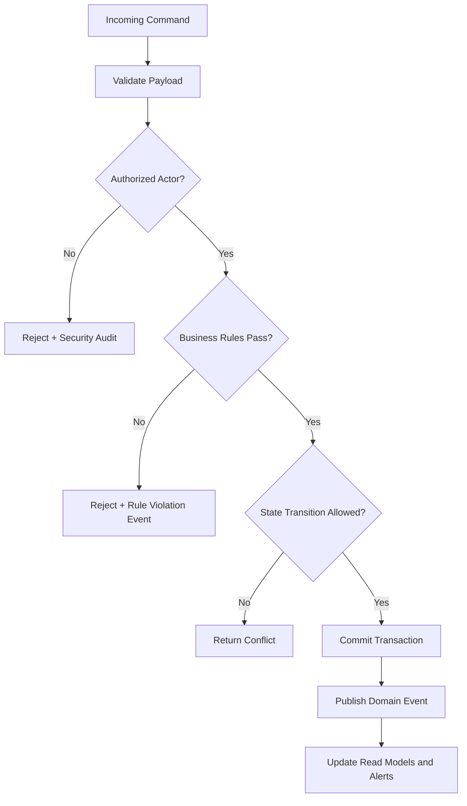

# Business Rules

This document defines enforceable policy rules for **Customer Relationship Management Platform** so command processing, asynchronous jobs, and operational actions behave consistently under normal and exceptional conditions.

## Context
- Domain focus: customer relationship management workflows.
- Rule categories: lifecycle transitions, authorization, compliance, and resilience.
- Enforcement points: APIs, workflow/state engines, background processors, and administrative consoles.

## Enforceable Rules
1. Every state-changing command must pass authentication, authorization, and schema validation before processing.
2. Lifecycle transitions must follow the configured state graph; invalid transitions are rejected with explicit reason codes.
3. High-impact operations (financial, security, or regulated data actions) require additional approval evidence.
4. Manual overrides must include approver identity, rationale, and expiration timestamp.
5. Retries and compensations must be idempotent and must not create duplicate business effects.

## Rule Evaluation Pipeline

## Exception and Override Handling
- Overrides are restricted to approved exception classes and require dual logging (business + security audit).
- Override windows automatically expire and trigger follow-up verification tasks.
- Repeated override patterns are reviewed for policy redesign and automation improvements.

## Domain Glossary
- **Rule Predicate**: File-specific term used to anchor decisions in **Business Rules**.
- **Lead**: Prospect record entering qualification and ownership workflows.
- **Opportunity**: Revenue record tracked through pipeline stages and forecast rollups.
- **Correlation ID**: Trace identifier propagated across APIs, queues, and audits for this workflow.

## Entity Lifecycles
- Lifecycle for this document: `Proposed -> Reviewed -> Approved -> Enforced -> Audited`.
- Each transition must capture actor, timestamp, source state, target state, and justification note.

## Integration Boundaries
- Rules are enforced at API gateway, domain service, and async worker boundaries.
- Data ownership and write authority must be explicit at each handoff boundary.
- Interface changes require schema/version review and downstream impact acknowledgement.

## Error and Retry Behavior
- Violations are non-retryable; callers must correct payload or permissions.
- Retries must preserve idempotency token and correlation ID context.
- Exhausted retries route to an operational queue with triage metadata.

## Measurable Acceptance Criteria
- Critical rules have automated tests with 95% branch coverage on rule engine.
- Observability must publish latency, success rate, and failure-class metrics for this document's scope.
- Quarterly review confirms definitions and diagrams still match production behavior.
