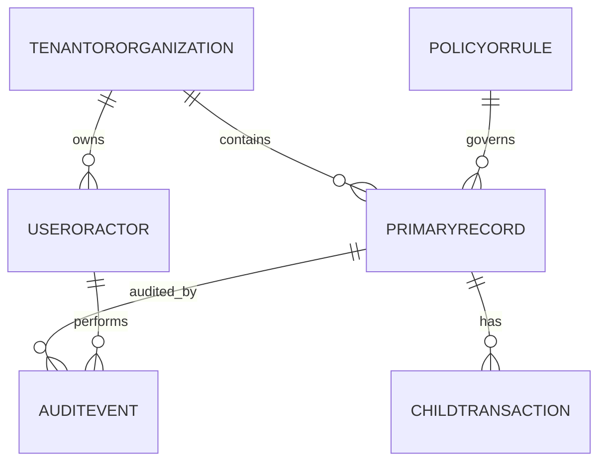
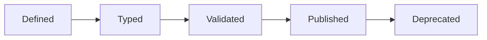

# Data Dictionary

This data dictionary is the canonical reference for **Customer Relationship Management Platform**. It defines shared terminology, entity semantics, and governance controls required to keep customer relationship management workflows consistent across teams and services.

## Scope and Goals
- Establish a stable vocabulary for architecture, API, analytics, and operations teams.
- Define minimum required fields for core entities and expected relationship boundaries.
- Document data quality and retention controls needed for production readiness.

## Core Entities
| Entity | Description | Required Attributes |
|---|---|---|
| TenantOrOrganization | Top-level ownership boundary for data segregation | `org_id, name, status, region, created_at` |
| UserOrActor | Human/system principal that performs actions | `actor_id, org_id, role, status, last_active_at` |
| PrimaryRecord | Main lifecycle object handled by the platform | `record_id, org_id, state, owner_id, created_at, updated_at` |
| ChildTransaction | Operational transaction or sub-step linked to primary record | `txn_id, record_id, txn_type, amount_or_value, occurred_at` |
| PolicyOrRule | Versioned policy configuration that influences decisions | `policy_id, scope, version, effective_from, effective_to` |
| AuditEvent | Append-only evidence for state changes and controls | `audit_id, record_id, actor_id, action, reason_code, occurred_at` |

## Canonical Relationship Diagram

## Data Quality Controls
1. All write paths enforce required-field validation and referential integrity for mandatory foreign keys.
2. External imports must include provenance metadata (`source_system`, `source_ref`, `ingested_at`).
3. Status/state fields use controlled vocabularies and reject unknown values.
4. Duplicate detection runs on natural keys where business identity collisions are likely.
5. Sensitive fields carry classification tags to drive masking, encryption, and export behavior.

## Retention and Audit
- Operational records remain online for active workflow windows and support forensic queries.
- Historical records move to archive tiers by policy without breaking traceability.
- Audit events are immutable and linked through correlation ids for incident analysis.

## Domain Glossary
- **Canonical Attribute**: File-specific term used to anchor decisions in **Data Dictionary**.
- **Lead**: Prospect record entering qualification and ownership workflows.
- **Opportunity**: Revenue record tracked through pipeline stages and forecast rollups.
- **Correlation ID**: Trace identifier propagated across APIs, queues, and audits for this workflow.

## Entity Lifecycles
- Lifecycle for this document: `Defined -> Typed -> Validated -> Published -> Deprecated`.
- Each transition must capture actor, timestamp, source state, target state, and justification note.

## Integration Boundaries
- Dictionary feeds API schemas, DB migrations, and BI semantic models.
- Data ownership and write authority must be explicit at each handoff boundary.
- Interface changes require schema/version review and downstream impact acknowledgement.

## Error and Retry Behavior
- Schema publish retries on registry downtime; conflicting field types require manual adjudication.
- Retries must preserve idempotency token and correlation ID context.
- Exhausted retries route to an operational queue with triage metadata.

## Measurable Acceptance Criteria
- No field ships without owner, datatype, nullability, and PII classification.
- Observability must publish latency, success rate, and failure-class metrics for this document's scope.
- Quarterly review confirms definitions and diagrams still match production behavior.
