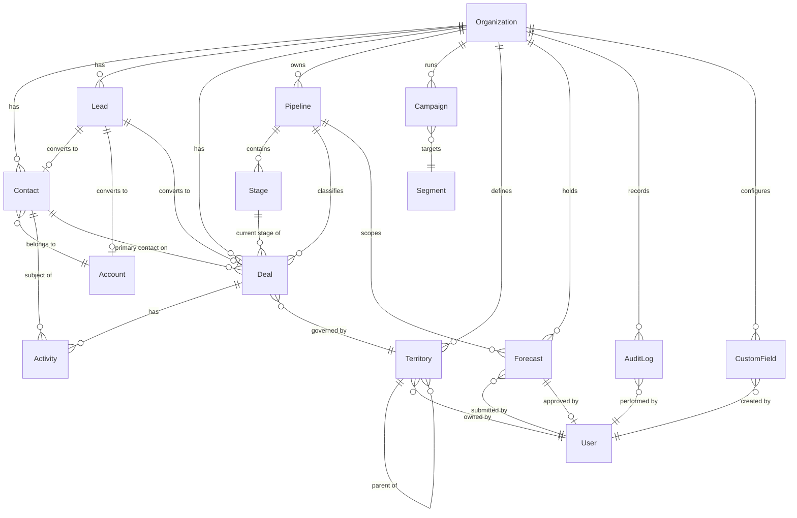

# Data Dictionary

**Version:** 1.0 | **Status:** Approved | **Last Updated:** 2025-07-15

---

## Table of Contents

1. [Core Entities](#core-entities)
2. [Canonical Relationship Diagram](#canonical-relationship-diagram)
3. [Data Quality Controls](#data-quality-controls)

---

## Core Entities

This section defines the canonical schema for every first-class entity persisted by the CRM Platform. Each attribute table documents type constraints, nullability, and validation rules enforced at the database and application layers.

---

### 1. Organization

The top-level tenant record. Every other entity is scoped to an Organization via `org_id`. An Organization maps to a single billing subscription and enforces row-level security boundaries across all services.

| Attribute    | Type             | Nullable | Description                                       | Validation                                           |
|--------------|------------------|----------|---------------------------------------------------|------------------------------------------------------|
| id           | UUID             | No       | Primary key, system-generated                     | RFC 4122 v4                                          |
| name         | VARCHAR(255)     | No       | Display name of the organisation                  | 1–255 characters, trimmed                            |
| domain       | VARCHAR(255)     | Yes      | Primary email domain (e.g. `acme.com`)            | Unique per platform; valid FQDN format               |
| industry     | ENUM             | Yes      | SIC-aligned industry classification               | Values: Technology/Finance/Healthcare/Retail/Manufacturing/Other |
| size         | ENUM             | Yes      | Employee headcount band                           | Values: 1-10 / 11-50 / 51-200 / 201-1000 / 1000+   |
| tier         | ENUM             | No       | Subscription tier                                 | Values: Free / Growth / Enterprise                   |
| owner_id     | UUID             | No       | FK → User; the primary account admin              | Must reference an active User record                 |
| created_at   | TIMESTAMPTZ      | No       | Row creation timestamp                            | Set by database default; immutable after insert      |
| updated_at   | TIMESTAMPTZ      | No       | Last modification timestamp                       | Updated via trigger on every UPDATE                  |
| deleted_at   | TIMESTAMPTZ      | Yes      | Soft-delete timestamp                             | NULL = active; non-NULL = logically deleted          |

---

### 2. Contact

An individual person associated with an Account within an Organisation. Contacts are the primary recipients of Activities and Campaign communications. A Contact record is distinct from a Lead; Contacts are created either directly or via Lead conversion.

| Attribute    | Type             | Nullable | Description                                       | Validation                                           |
|--------------|------------------|----------|---------------------------------------------------|------------------------------------------------------|
| id           | UUID             | No       | Primary key                                       | RFC 4122 v4                                          |
| org_id       | UUID             | No       | FK → Organization                                 | Must reference an active Organization                |
| first_name   | VARCHAR(100)     | No       | Given name                                        | 1–100 characters                                     |
| last_name    | VARCHAR(100)     | No       | Family name                                       | 1–100 characters                                     |
| email        | VARCHAR(320)     | Yes      | Primary email address                             | RFC 5322 format; unique within org_id                |
| phone        | VARCHAR(30)      | Yes      | Primary phone number                              | E.164 format (e.g. +14155552671)                     |
| title        | VARCHAR(150)     | Yes      | Job title                                         | Max 150 characters                                   |
| status       | ENUM             | No       | Contact reachability status                       | Values: Active / Inactive / Bounced                  |
| owner_id     | UUID             | No       | FK → User; assigned sales rep                     | Must reference an active User in the same org        |
| account_id   | UUID             | Yes      | FK → Account                                      | Must reference an active Account in the same org     |
| created_at   | TIMESTAMPTZ      | No       | Row creation timestamp                            | Immutable after insert                               |
| updated_at   | TIMESTAMPTZ      | No       | Last modification timestamp                       | Trigger-maintained                                   |
| deleted_at   | TIMESTAMPTZ      | Yes      | Soft-delete timestamp                             | NULL = active                                        |

---

### 3. Lead

An unqualified prospect prior to sales qualification and conversion. Leads are the entry point for top-of-funnel demand. Upon qualification, a Lead is converted to a Contact, Account, and optionally a Deal. The original Lead record is retained with `status = Converted`.

| Attribute              | Type             | Nullable | Description                                       | Validation                                           |
|------------------------|------------------|----------|---------------------------------------------------|------------------------------------------------------|
| id                     | UUID             | No       | Primary key                                       | RFC 4122 v4                                          |
| org_id                 | UUID             | No       | FK → Organization                                 | Must reference an active Organization                |
| first_name             | VARCHAR(100)     | No       | Given name                                        | 1–100 characters                                     |
| last_name              | VARCHAR(100)     | No       | Family name                                       | 1–100 characters                                     |
| email                  | VARCHAR(320)     | Yes      | Email address                                     | RFC 5322 format                                      |
| phone                  | VARCHAR(30)      | Yes      | Phone number                                      | E.164 format                                         |
| company_name           | VARCHAR(255)     | Yes      | Self-reported company name                        | Max 255 characters                                   |
| source                 | ENUM             | No       | Acquisition channel                               | Values: Web / Import / API / Referral / Event / Social |
| status                 | ENUM             | No       | Qualification lifecycle stage                     | Values: New / Working / Qualified / Disqualified / Converted |
| score                  | INTEGER          | Yes      | Computed lead quality score                       | Range 0–100 inclusive                                |
| owner_id               | UUID             | Yes      | FK → User; assigned SDR/AE                        | Must reference an active User in the same org        |
| converted_at           | TIMESTAMPTZ      | Yes      | Timestamp of lead conversion                      | Non-NULL only when status = Converted                |
| converted_contact_id   | UUID             | Yes      | FK → Contact created on conversion                | Non-NULL only when status = Converted                |
| converted_account_id   | UUID             | Yes      | FK → Account created or matched on conversion     | Non-NULL only when status = Converted                |
| converted_deal_id      | UUID             | Yes      | FK → Deal created on conversion (optional)        | May be NULL if no deal was created at conversion     |
| created_at             | TIMESTAMPTZ      | No       | Row creation timestamp                            | Immutable after insert                               |
| updated_at             | TIMESTAMPTZ      | No       | Last modification timestamp                       | Trigger-maintained                                   |
| deleted_at             | TIMESTAMPTZ      | Yes      | Soft-delete timestamp                             | NULL = active                                        |

---

### 4. Deal

A revenue opportunity actively being pursued by a sales representative. Deals progress through Pipeline Stages and carry a monetary value and close date used in Forecast calculations.

| Attribute    | Type             | Nullable | Description                                       | Validation                                           |
|--------------|------------------|----------|---------------------------------------------------|------------------------------------------------------|
| id           | UUID             | No       | Primary key                                       | RFC 4122 v4                                          |
| org_id       | UUID             | No       | FK → Organization                                 | Must reference an active Organization                |
| contact_id   | UUID             | Yes      | FK → Contact (primary contact)                    | Must reference an active Contact in the same org     |
| account_id   | UUID             | Yes      | FK → Account                                      | Must reference an active Account in the same org     |
| pipeline_id  | UUID             | No       | FK → Pipeline                                     | Must reference an active Pipeline in the same org    |
| stage_id     | UUID             | No       | FK → Stage                                        | Stage must belong to the referenced Pipeline         |
| title        | VARCHAR(255)     | No       | Deal name / opportunity title                     | 1–255 characters                                     |
| value        | DECIMAL(15,2)    | Yes      | Expected deal value                               | ≥ 0.00; non-negative                                 |
| currency     | CHAR(3)          | No       | ISO 4217 currency code                            | e.g. USD, EUR, GBP                                   |
| close_date   | DATE             | Yes      | Target close date                                 | Must be ≥ created_at date when set                   |
| probability  | INTEGER          | No       | Win probability percentage                        | Range 0–100; defaults from stage.probability         |
| owner_id     | UUID             | No       | FK → User; deal owner                             | Must reference an active User in the same org        |
| status       | ENUM             | No       | Deal outcome status                               | Values: Open / Won / Lost / Abandoned                |
| loss_reason  | VARCHAR(500)     | Yes      | Reason for loss                                   | Required when status = Lost                          |
| created_at   | TIMESTAMPTZ      | No       | Row creation timestamp                            | Immutable after insert                               |
| updated_at   | TIMESTAMPTZ      | No       | Last modification timestamp                       | Trigger-maintained                                   |
| closed_at    | TIMESTAMPTZ      | Yes      | Timestamp of terminal status transition           | Non-NULL when status ∈ {Won, Lost, Abandoned}        |

---

### 5. Pipeline

An ordered sequence of Stages through which Deals progress. An Organisation may have multiple Pipelines for different sales motions (e.g. New Business, Renewal, Partner). One Pipeline per org is flagged `is_default = true`.

| Attribute    | Type             | Nullable | Description                                       | Validation                                           |
|--------------|------------------|----------|---------------------------------------------------|------------------------------------------------------|
| id           | UUID             | No       | Primary key                                       | RFC 4122 v4                                          |
| org_id       | UUID             | No       | FK → Organization                                 | Must reference an active Organization                |
| name         | VARCHAR(100)     | No       | Pipeline display name                             | Unique within org_id; 1–100 characters               |
| type         | ENUM             | No       | Sales motion type                                 | Values: Sales / Renewal / Partner                    |
| is_default   | BOOLEAN          | No       | Marks the default pipeline for new deals          | Exactly one Pipeline per org must be true            |
| created_by   | UUID             | No       | FK → User; pipeline creator                       | Must reference an active User in the same org        |
| created_at   | TIMESTAMPTZ      | No       | Row creation timestamp                            | Immutable after insert                               |
| updated_at   | TIMESTAMPTZ      | No       | Last modification timestamp                       | Trigger-maintained                                   |
| deleted_at   | TIMESTAMPTZ      | Yes      | Soft-delete timestamp                             | NULL = active; deals cannot be moved to deleted pipeline |

---

### 6. Stage

A single discrete step within a Pipeline. Stages carry entry criteria (configurable gate conditions) and SLA thresholds. Terminal stages represent deal outcomes; non-terminal stages represent in-progress states.

| Attribute        | Type             | Nullable | Description                                       | Validation                                           |
|------------------|------------------|----------|---------------------------------------------------|------------------------------------------------------|
| id               | UUID             | No       | Primary key                                       | RFC 4122 v4                                          |
| pipeline_id      | UUID             | No       | FK → Pipeline                                     | Must reference an active Pipeline                    |
| name             | VARCHAR(100)     | No       | Stage display name                                | Unique within pipeline_id                            |
| position         | INTEGER          | No       | Ordinal position within pipeline                  | ≥ 1; unique within pipeline_id                       |
| probability      | INTEGER          | No       | Default win probability for deals in this stage   | Range 0–100                                          |
| sla_days         | INTEGER          | Yes      | Maximum days allowed before SLA breach alert      | ≥ 1 when set                                         |
| entry_criteria   | JSONB            | Yes      | Gate conditions required to enter this stage      | Valid JSON array of criterion objects                |
| is_terminal      | BOOLEAN          | No       | Marks stage as a deal-closing stage               | If true, deal status must be Won, Lost, or Abandoned |
| is_won           | BOOLEAN          | No       | Distinguishes Won terminal stages                 | Only valid when is_terminal = true                   |
| created_at       | TIMESTAMPTZ      | No       | Row creation timestamp                            | Immutable after insert                               |
| updated_at       | TIMESTAMPTZ      | No       | Last modification timestamp                       | Trigger-maintained                                   |

---

### 7. Activity

Any logged interaction or scheduled task associated with a CRM record. Activities capture calls, emails, meetings, notes, tasks, and SMS messages. They are polymorphically associated with Leads, Contacts, Deals, or Accounts via `related_record_type` and `related_record_id`.

| Attribute            | Type             | Nullable | Description                                       | Validation                                                     |
|----------------------|------------------|----------|---------------------------------------------------|----------------------------------------------------------------|
| id                   | UUID             | No       | Primary key                                       | RFC 4122 v4                                                    |
| org_id               | UUID             | No       | FK → Organization                                 | Must reference an active Organization                          |
| type                 | ENUM             | No       | Activity classification                           | Values: Call / Email / Meeting / Task / Note / SMS             |
| subject              | VARCHAR(255)     | No       | Brief activity title                              | 1–255 characters                                               |
| body                 | TEXT             | Yes      | Full activity content or call notes               | Max 65,535 characters                                          |
| direction            | ENUM             | Yes      | Communication direction                           | Values: Inbound / Outbound; NULL for Task and Note             |
| status               | ENUM             | No       | Completion status                                 | Values: Planned / Completed / Cancelled                        |
| due_at               | TIMESTAMPTZ      | Yes      | Scheduled due date/time                           | Required when type = Task                                      |
| completed_at         | TIMESTAMPTZ      | Yes      | Actual completion timestamp                       | Non-NULL only when status = Completed                          |
| owner_id             | UUID             | No       | FK → User; assigned owner                         | Must reference an active User in the same org                  |
| related_record_id    | UUID             | No       | Polymorphic FK to associated record               | Must reference a record of type related_record_type            |
| related_record_type  | ENUM             | No       | Type of the associated record                     | Values: Lead / Contact / Deal / Account                        |
| created_at           | TIMESTAMPTZ      | No       | Row creation timestamp                            | Immutable after insert                                         |
| updated_at           | TIMESTAMPTZ      | No       | Last modification timestamp                       | Trigger-maintained                                             |

---

### 8. Campaign

A marketing campaign targeting a defined audience Segment. Campaigns orchestrate multi-channel outreach and track budget, spend, and engagement metrics. Campaign execution is delegated to channel-specific integration services.

| Attribute       | Type             | Nullable | Description                                       | Validation                                           |
|-----------------|------------------|----------|---------------------------------------------------|------------------------------------------------------|
| id              | UUID             | No       | Primary key                                       | RFC 4122 v4                                          |
| org_id          | UUID             | No       | FK → Organization                                 | Must reference an active Organization                |
| name            | VARCHAR(255)     | No       | Campaign display name                             | Unique within org_id; 1–255 characters               |
| type            | ENUM             | No       | Campaign channel type                             | Values: Email / SMS / Event / Webinar / LinkedIn     |
| status          | ENUM             | No       | Campaign lifecycle status                         | Values: Draft / Scheduled / Running / Paused / Completed / Cancelled |
| channel         | VARCHAR(100)     | Yes      | Sub-channel or provider identifier                | e.g. SendGrid, Twilio                                |
| budget          | DECIMAL(12,2)    | Yes      | Approved campaign budget                          | ≥ 0.00                                               |
| actual_spend    | DECIMAL(12,2)    | Yes      | Recorded actual expenditure                       | ≥ 0.00; updated post-campaign                        |
| start_date      | DATE             | Yes      | Planned campaign start date                       | Must be ≤ end_date when both are set                 |
| end_date        | DATE             | Yes      | Planned campaign end date                         | Must be ≥ start_date when both are set               |
| owner_id        | UUID             | No       | FK → User; campaign owner                         | Must reference an active User in the same org        |
| segment_id      | UUID             | No       | FK → Segment                                      | Must reference an active Segment in the same org     |
| created_at      | TIMESTAMPTZ      | No       | Row creation timestamp                            | Immutable after insert                               |
| updated_at      | TIMESTAMPTZ      | No       | Last modification timestamp                       | Trigger-maintained                                   |

---

### 9. Territory

A named boundary for sales coverage, defined by geographic or firmographic criteria. Territories are hierarchical (parent → child) and drive automatic deal ownership assignment per BR-09.

| Attribute       | Type             | Nullable | Description                                       | Validation                                           |
|-----------------|------------------|----------|---------------------------------------------------|------------------------------------------------------|
| id              | UUID             | No       | Primary key                                       | RFC 4122 v4                                          |
| org_id          | UUID             | No       | FK → Organization                                 | Must reference an active Organization                |
| name            | VARCHAR(150)     | No       | Territory display name                            | Unique within org_id; 1–150 characters               |
| criteria        | JSONB            | No       | Rule set defining territory membership            | Valid JSON array; e.g. `[{"field":"country","op":"eq","value":"US"}]` |
| parent_id       | UUID             | Yes      | FK → Territory (self-referential)                 | Must reference a Territory within the same org       |
| owner_id        | UUID             | No       | FK → User; territory owner/rep                    | Must reference an active User in the same org        |
| is_active       | BOOLEAN          | No       | Whether this territory is currently enforced      | Default true                                         |
| effective_from  | DATE             | No       | Date territory becomes active                     | Must be ≤ effective_to when both are set             |
| effective_to    | DATE             | Yes      | Date territory expires                            | Must be ≥ effective_from when set                    |
| created_at      | TIMESTAMPTZ      | No       | Row creation timestamp                            | Immutable after insert                               |
| updated_at      | TIMESTAMPTZ      | No       | Last modification timestamp                       | Trigger-maintained                                   |

---

### 10. Forecast

A period-based revenue forecast snapshot submitted by a sales representative or manager. Forecasts are immutable once Approved (BR-11). The `weighted_amount` is a computed column derived from open deals in the period.

| Attribute            | Type             | Nullable | Description                                       | Validation                                           |
|----------------------|------------------|----------|---------------------------------------------------|------------------------------------------------------|
| id                   | UUID             | No       | Primary key                                       | RFC 4122 v4                                          |
| org_id               | UUID             | No       | FK → Organization                                 | Must reference an active Organization                |
| period               | VARCHAR(7)       | No       | Fiscal period identifier                          | Format: YYYY-QN (e.g. 2025-Q3) or YYYY-MM (e.g. 2025-07) |
| pipeline_id          | UUID             | No       | FK → Pipeline scoped to this forecast             | Must reference an active Pipeline in the same org    |
| owner_id             | UUID             | No       | FK → User; the rep or manager submitting          | Must reference an active User in the same org        |
| status               | ENUM             | No       | Forecast review lifecycle                         | Values: Draft / Submitted / Approved / Rejected      |
| committed_amount     | DECIMAL(15,2)    | Yes      | Rep's committed (high-confidence) number          | ≥ 0.00                                               |
| best_case_amount     | DECIMAL(15,2)    | Yes      | Optimistic total including upside deals           | ≥ committed_amount when both are set                 |
| pipeline_amount      | DECIMAL(15,2)    | Yes      | Total open pipeline value in period               | ≥ 0.00; system-computed                              |
| weighted_amount      | DECIMAL(15,2)    | Yes      | Probability-weighted pipeline value               | Computed: SUM(value × probability / 100) for open deals |
| submitted_at         | TIMESTAMPTZ      | Yes      | Timestamp of Submitted status transition          | Non-NULL when status ≠ Draft                         |
| approved_at          | TIMESTAMPTZ      | Yes      | Timestamp of Approved status transition           | Non-NULL when status = Approved                      |
| approved_by          | UUID             | Yes      | FK → User who approved the forecast               | Non-NULL when status = Approved                      |
| created_at           | TIMESTAMPTZ      | No       | Row creation timestamp                            | Immutable after insert                               |
| updated_at           | TIMESTAMPTZ      | No       | Last modification timestamp                       | Trigger-maintained                                   |

---

### 11. AuditLog

An immutable record of every state-changing operation performed on the platform. AuditLog entries are written by the AuditService in response to domain events. No UPDATE or DELETE operations are permitted on this table by any application role (BR-13).

| Attribute    | Type             | Nullable | Description                                       | Validation                                           |
|--------------|------------------|----------|---------------------------------------------------|------------------------------------------------------|
| id           | UUID             | No       | Primary key                                       | RFC 4122 v4                                          |
| org_id       | UUID             | No       | FK → Organization                                 | Must reference an Organization (not soft-deleted)    |
| actor_id     | UUID             | No       | FK → User performing the action                   | References User; may be a service account            |
| action       | ENUM             | No       | Type of operation performed                       | Values: CREATE / UPDATE / DELETE / LOGIN / EXPORT / GDPR_ERASE |
| entity_type  | VARCHAR(50)      | No       | Type of entity affected                           | e.g. Lead, Deal, Contact                             |
| entity_id    | UUID             | No       | ID of the affected entity                         | References the entity at time of action              |
| old_value    | JSONB            | Yes      | Entity state before the operation                 | NULL for CREATE actions                              |
| new_value    | JSONB            | Yes      | Entity state after the operation                  | NULL for DELETE/GDPR_ERASE actions                   |
| occurred_at  | TIMESTAMPTZ      | No       | Wall-clock time of the operation                  | Set by database default; immutable                   |
| ip_address   | INET             | Yes      | Source IP address of the request                  | Valid IPv4 or IPv6 address                           |
| user_agent   | TEXT             | Yes      | HTTP User-Agent header from the request           | Max 512 characters                                   |

---

### 12. CustomField

A tenant-defined extension field that augments a standard entity with organisation-specific attributes. Custom fields are applied at runtime via a dynamic form renderer. Field definitions drive both UI rendering and API validation.

| Attribute    | Type             | Nullable | Description                                       | Validation                                                          |
|--------------|------------------|----------|---------------------------------------------------|---------------------------------------------------------------------|
| id           | UUID             | No       | Primary key                                       | RFC 4122 v4                                                         |
| org_id       | UUID             | No       | FK → Organization                                 | Must reference an active Organization                               |
| entity_type  | ENUM             | No       | Entity this field extends                         | Values: Lead / Contact / Deal / Account / Activity                  |
| field_name   | VARCHAR(64)      | No       | Internal programmatic key                         | snake_case; unique per (org_id, entity_type); immutable after creation |
| field_label  | VARCHAR(150)     | No       | Human-readable label shown in UI                  | 1–150 characters                                                    |
| field_type   | ENUM             | No       | Data type of the field                            | Values: Text / Number / Date / Dropdown / MultiSelect / Boolean / URL |
| is_required  | BOOLEAN          | No       | Whether a value is required on create             | Default false                                                       |
| options      | JSONB            | Yes      | Allowed option values                             | Required for Dropdown/MultiSelect; array of strings; min 1 item     |
| created_by   | UUID             | No       | FK → User who created the field definition        | Must reference an active User in the same org                       |
| created_at   | TIMESTAMPTZ      | No       | Row creation timestamp                            | Immutable after insert                                              |
| updated_at   | TIMESTAMPTZ      | No       | Last modification timestamp                       | Trigger-maintained                                                  |

---

## Canonical Relationship Diagram

The following entity-relationship diagram shows all twelve core entities and their primary relationships. Cardinality follows the standard Crow's Foot notation used by Mermaid's `erDiagram`.

---

## Data Quality Controls

The following constraints are enforced across application, API, and database layers. Constraint types are: DB = database check/unique constraint; APP = application-layer validation; API = API request validation; TRIGGER = database trigger.

| Rule                            | Entity       | Constraint Type | Detail                                                                                                   |
|---------------------------------|--------------|-----------------|----------------------------------------------------------------------------------------------------------|
| Email format validation         | Contact, Lead | API + DB        | Email must match RFC 5322 pattern; enforced via regex check constraint and API request validator          |
| Phone E.164 format              | Contact, Lead | API + DB        | Phone number must match `^\+[1-9]\d{7,14}$`; stored in E.164 format; invalid numbers rejected at API boundary |
| Deal value non-negative         | Deal         | DB              | `CHECK (value >= 0.00)` database constraint; enforced on INSERT and UPDATE                               |
| Stage probability range         | Stage        | DB              | `CHECK (probability BETWEEN 0 AND 100)` database constraint                                              |
| Deal probability range          | Deal         | DB              | `CHECK (probability BETWEEN 0 AND 100)` database constraint                                              |
| Lead score range                | Lead         | DB              | `CHECK (score BETWEEN 0 AND 100 OR score IS NULL)` database constraint                                   |
| Territory date range integrity  | Territory    | DB              | `CHECK (effective_to IS NULL OR effective_to >= effective_from)` database constraint                     |
| Forecast weighted amount formula | Forecast    | TRIGGER         | `weighted_amount` is a generated column computed as `SUM(deal.value * deal.probability / 100)` for all open deals in the period; recalculated on deal update via database trigger |
| Audit log append-only           | AuditLog     | DB              | REVOKE UPDATE, DELETE ON audit_logs FROM crm_app_role; only INSERT permitted; enforced at PostgreSQL role level |
| Custom field option uniqueness  | CustomField  | DB + APP        | Options array elements must be unique within a field definition; enforced by APP validation and JSONB schema check trigger |
| Organisation domain uniqueness  | Organization | DB              | UNIQUE INDEX on `domain` (partial: WHERE domain IS NOT NULL AND deleted_at IS NULL); enforced by PostgreSQL unique index |
| Stage position uniqueness       | Stage        | DB              | UNIQUE(pipeline_id, position) prevents duplicate stage positions within a pipeline                        |
| Single default pipeline per org | Pipeline     | DB              | Partial unique index: UNIQUE(org_id) WHERE is_default = true; prevents multiple default pipelines         |
| Loss reason required on loss    | Deal         | APP + TRIGGER   | Application validates `loss_reason IS NOT NULL` when `status = Lost`; database trigger enforces constraint |
| Campaign date order             | Campaign     | DB              | `CHECK (end_date IS NULL OR start_date IS NULL OR end_date >= start_date)` database constraint            |
