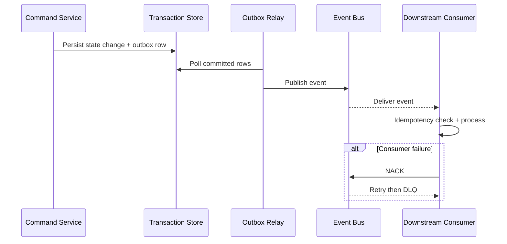
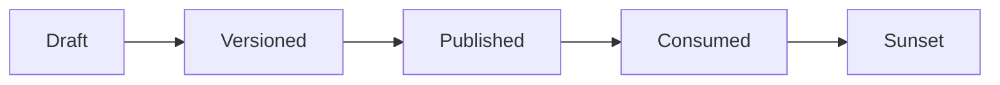

# Event Catalog

This catalog defines stable event contracts for **Customer Relationship Management Platform** to support event-driven integrations, auditability, and analytics across customer relationship management workflows.

## Contract Conventions
- Event naming: `<domain>.<aggregate>.<action>.v1`.
- Required metadata: `event_id`, `occurred_at`, `correlation_id`, `producer`, `schema_version`, `tenant_context`.
- Delivery mode: at-least-once with mandatory consumer idempotency.
- Ordering guarantee: per aggregate key; no global ordering assumption.

## Domain Events
| Event Name | Payload Highlights | Typical Consumers |
|---|---|---|
| `domain.record.created.v1` | record_id, actor_id, initial_state, occurred_at | orchestration, analytics |
| `domain.record.state_changed.v1` | record_id, old_state, new_state, reason_code | notifications, reporting |
| `domain.record.validation_failed.v1` | record_id, violated_rules, correlation_id | operations, quality dashboards |
| `domain.record.override_applied.v1` | record_id, override_type, approver_id, expires_at | compliance, audit |
| `domain.record.closed.v1` | record_id, terminal_state, closed_at | billing/settlement, archives |

## Publish and Consumption Sequence

## Operational SLOs
- P95 commit-to-publish latency below 5 seconds for tier-1 events.
- DLQ triage acknowledgement within 15 minutes for production incidents.
- Schema changes remain backward compatible within the same major version.

## Domain Glossary
- **Event Contract**: File-specific term used to anchor decisions in **Event Catalog**.
- **Lead**: Prospect record entering qualification and ownership workflows.
- **Opportunity**: Revenue record tracked through pipeline stages and forecast rollups.
- **Correlation ID**: Trace identifier propagated across APIs, queues, and audits for this workflow.

## Entity Lifecycles
- Lifecycle for this document: `Draft -> Versioned -> Published -> Consumed -> Sunset`.
- Each transition must capture actor, timestamp, source state, target state, and justification note.

## Integration Boundaries
- Events cross boundaries between CRM core, integrations, and warehouse pipelines.
- Data ownership and write authority must be explicit at each handoff boundary.
- Interface changes require schema/version review and downstream impact acknowledgement.

## Error and Retry Behavior
- Consumer retry follows at-least-once semantics with dedupe by event_id.
- Retries must preserve idempotency token and correlation ID context.
- Exhausted retries route to an operational queue with triage metadata.

## Measurable Acceptance Criteria
- Each event defines producer SLA, ordering guarantees, and replay strategy.
- Observability must publish latency, success rate, and failure-class metrics for this document's scope.
- Quarterly review confirms definitions and diagrams still match production behavior.

## CRM Lifecycle Event Taxonomy (Lead → Qualified → Opportunity → Closed)

| Lifecycle Stage | Event | Required Business Keys | Notes |
|---|---|---|---|
| Lead Created | `crm.lead.lifecycle.created.v1` | `lead_id`, `tenant_id`, `source_channel` | Initial capture event |
| Lead Qualified | `crm.lead.lifecycle.qualified.v1` | `lead_id`, `qualification_reason`, `qualified_by` | Must include score snapshot |
| Lead Converted | `crm.lead.lifecycle.converted.v1` | `lead_id`, `contact_id`, `account_id`, `opportunity_id?` | Conversion lineage anchor |
| Opportunity Opened | `crm.opportunity.lifecycle.opened.v1` | `opportunity_id`, `pipeline_id`, `stage_id` | Start of revenue lifecycle |
| Opportunity Stage Changed | `crm.opportunity.lifecycle.stage_changed.v1` | `opportunity_id`, `from_stage`, `to_stage`, `probability` | Includes stage gate evidence refs |
| Opportunity Closed | `crm.opportunity.lifecycle.closed.v1` | `opportunity_id`, `closed_state`, `close_reason`, `amount` | Terminal state event |

## Integration and Reconciliation Events

| Event | Producer | Consumer | Contract Intent |
|---|---|---|---|
| `crm.integration.connector.outage_detected.v1` | connector monitor | incident automation | Signals provider outage and starts degraded-mode flow |
| `crm.integration.webhook.accepted.v1` | webhook gateway | activity sync workers | Records acceptance with dedupe fingerprint |
| `crm.integration.webhook.replayed.v1` | replay manager | audit/compliance | Evidence of controlled replay execution |
| `crm.sync.corrected.v1` | reconciliation worker | analytics + audit | Deterministic auto-correction applied |
| `crm.sync.manual_review_required.v1` | reconciliation worker | operations queue | Human decision required for conflict |

## Event Contract Additions for Auditability
- `causation_id`: upstream command/event that triggered this event.
- `lineage_ref`: immutable pointer to source payload snapshot (provider/api input).
- `policy_evaluations`: list of policy checks and outcomes used before mutation.
- `consent_context`: channel + lawful basis when event includes communication data.
