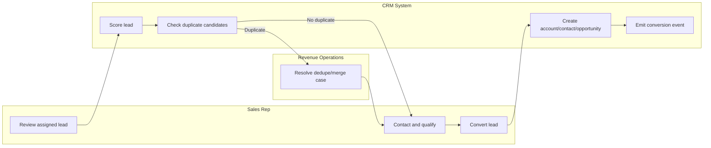
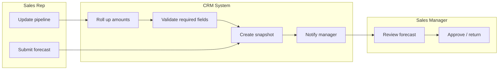
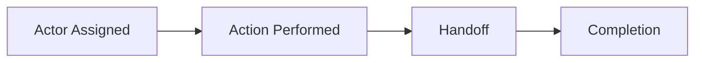

# Swimlane Diagrams

## Lead-to-Opportunity Swimlane

## Forecast Submission Swimlane

## Domain Glossary
- **Lane Responsibility**: File-specific term used to anchor decisions in **Swimlane Diagrams**.
- **Lead**: Prospect record entering qualification and ownership workflows.
- **Opportunity**: Revenue record tracked through pipeline stages and forecast rollups.
- **Correlation ID**: Trace identifier propagated across APIs, queues, and audits for this workflow.

## Entity Lifecycles
- Lifecycle for this document: `Actor Assigned -> Action Performed -> Handoff -> Completion`.
- Each transition must capture actor, timestamp, source state, target state, and justification note.

## Integration Boundaries
- Lanes include human roles and systems with explicit ownership handoffs.
- Data ownership and write authority must be explicit at each handoff boundary.
- Interface changes require schema/version review and downstream impact acknowledgement.

## Error and Retry Behavior
- Failed handoff retries once automatically, then escalates to queue supervisor.
- Retries must preserve idempotency token and correlation ID context.
- Exhausted retries route to an operational queue with triage metadata.

## Measurable Acceptance Criteria
- Every lane handoff specifies input artifact and acceptance condition.
- Observability must publish latency, success rate, and failure-class metrics for this document's scope.
- Quarterly review confirms definitions and diagrams still match production behavior.
