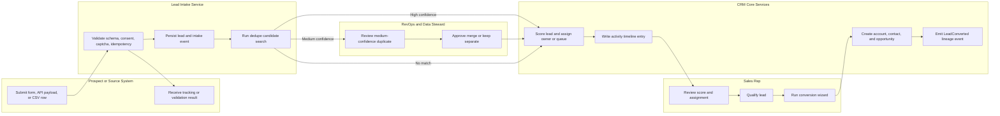
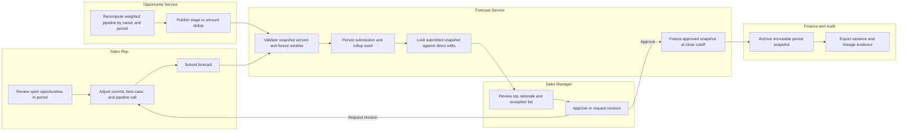
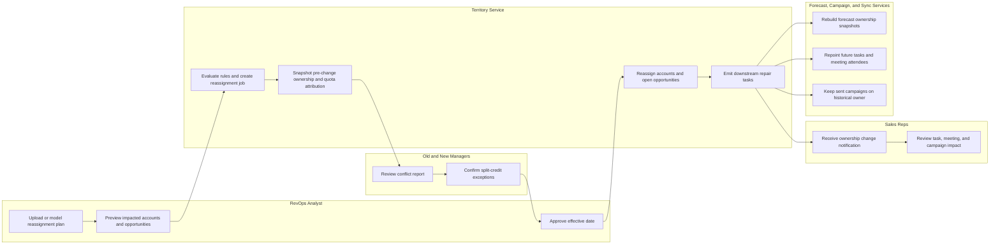

# Swimlane Diagrams — Customer Relationship Management Platform

## Purpose

The following swimlane diagrams model the highest-risk business workflows that cross user roles and service boundaries: lead intake and conversion, forecast submission and freeze, and territory reassignment during an active quarter.

---

## Swimlane 1 — Lead Intake, Qualification, and Conversion

### Lane Notes

- **Prospect or Source System** owns the original payload, consent checkbox values, and source attribution.
- **Lead Intake Service** performs synchronous validation only; scoring, assignment, and fuzzy dedupe may continue asynchronously but must complete within the SLA defined in FR-004 and FR-005.
- **RevOps** only intervenes when confidence falls into the manual-review band or when merge policy detects conflicting restricted fields.
- **CRM Core Services** must preserve lead-to-contact/account/opportunity lineage to support attribution, dedupe audit, and GDPR investigation.

---

## Swimlane 2 — Forecast Submission, Approval, and Period Freeze

### Lane Notes

- Forecast calculations must reference a specific opportunity version set; manager approval cannot silently pick up later stage changes.
- Freeze rules differ by tenant fiscal policy, but once a snapshot is frozen only approved override workflows may reopen it.
- Audit exports must include who submitted, who approved, which opportunities were included, and any manual adjustment reason codes.

---

## Swimlane 3 — Mid-Cycle Territory Reassignment

### Lane Notes

- Territory jobs are staged: preview, approval, execution, and reconciliation.
- Forecast ownership for already-frozen periods must remain historical, while open periods can be recalculated according to tenant policy.
- Reassignment must distinguish open future work from historical activity so the timeline remains truthful and auditable.

## Acceptance Criteria

- Each swimlane names the human decision points, automated services, and downstream side effects required for implementation.
- Handoffs include enough detail to derive job orchestration, notification rules, and rollback strategy.
- The diagrams cover the CRM-specific themes of lead conversion, forecast lock/freeze, and territory reassignment impacts.
