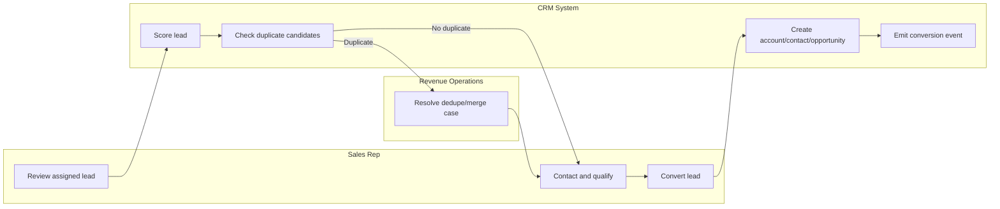
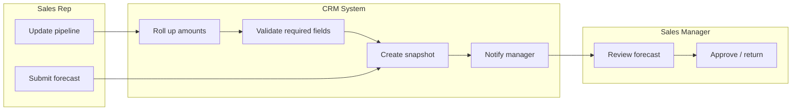

# Swimlane Diagrams

## Lead-to-Opportunity Swimlane

```mermaid
flowchart LR
    subgraph SalesRep[Sales Rep]
      A[Review assigned lead]
      B[Contact and qualify]
      C[Convert lead]
    end

    subgraph CRM[CRM System]
      D[Score lead]
      E[Check duplicate candidates]
      F[Create account/contact/opportunity]
      G[Emit conversion event]
    end

    subgraph RevOps[Revenue Operations]
      H[Resolve dedupe/merge case]
    end

    A --> D
    D --> E
    E -->|Duplicate| H
    H --> B
    E -->|No duplicate| B
    B --> C
    C --> F
    F --> G
```

## Forecast Submission Swimlane

```mermaid
flowchart LR
    subgraph Rep[Sales Rep]
      A[Update pipeline]
      B[Submit forecast]
    end

    subgraph CRM[CRM System]
      C[Roll up amounts]
      D[Validate required fields]
      E[Create snapshot]
      F[Notify manager]
    end

    subgraph Manager[Sales Manager]
      G[Review forecast]
      H[Approve / return]
    end

    A --> C --> D --> E
    B --> E
    E --> F --> G --> H
```
