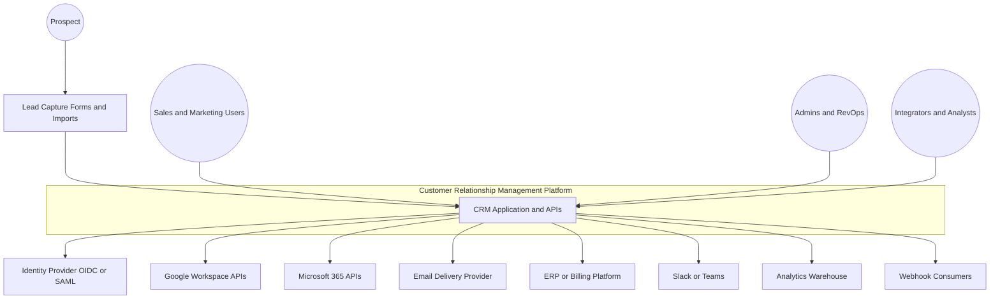
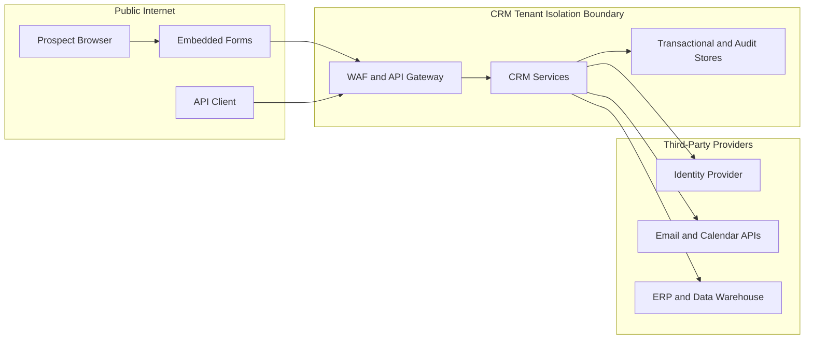

# System Context Diagram — Customer Relationship Management Platform

## Purpose

This document defines the CRM platform boundary, external actors, upstream and downstream systems, trust boundaries, and operational responsibilities required to implement a multi-tenant SaaS CRM that handles lead lifecycle, opportunity management, campaigns, sync integrations, forecasting, and compliance workflows.

## Context Diagram

## Trust Boundaries

## External Interaction Matrix

| External Actor or System | Direction | Interface | Business Purpose | Failure Handling |
|---|---|---|---|---|
| Prospect via website form | Inbound | Public HTTPS form endpoint | Create or upsert leads with spam checks and consent capture. | Reject invalid submissions with tracking ID and enqueue retry-safe webhook if ESP confirmation fails. |
| Sales reps, managers, marketers | Bidirectional | Web UI + REST API | Execute day-to-day CRM workflows under RBAC and field-level permissions. | UI must surface correlation ID, optimistic-lock conflicts, and degraded sync banners. |
| CRM administrators and RevOps | Bidirectional | Admin UI + REST API | Configure pipelines, territories, scoring, dedupe rules, and exports/erasure jobs. | All config writes require audit, role check, and reversible version history. |
| Identity provider | Bidirectional | OIDC or SAML plus SCIM | Authenticate users and optionally provision/deprovision accounts. | Fail closed for auth; queue SCIM retries without deleting tenant data prematurely. |
| Google Workspace | Bidirectional | Gmail API, Calendar API, Pub/Sub | Sync emails, meetings, OAuth grants, and recurrence updates. | Persist provider cursor, detect replayed webhook payloads, and fall back to polling. |
| Microsoft 365 | Bidirectional | Graph API and webhook subscriptions | Sync Outlook mailboxes and calendars for sales activity. | Refresh tokens proactively and quarantine tenant connector on repeated 401 or 429 responses. |
| Email delivery provider | Outbound plus webhook | SMTP/API and event webhooks | Send campaigns and transactional mail; ingest bounce and unsubscribe events. | Sending must skip suppressed recipients and webhook replay must remain idempotent. |
| ERP or billing platform | Bidirectional | REST/webhook or file drop | Enrich accounts, push closed-won opportunities, reconcile revenue data. | Use outbox-driven delivery and manual replay queue for contract mismatches. |
| Slack or Teams | Outbound | Webhook/Bot API | Push alerts for lead assignment, forecast approvals, and sync failures. | Non-blocking notifications only; delivery failures never roll back core CRM writes. |
| Analytics warehouse | Outbound | CDC/export pipeline | Supply reporting, forecast trend analysis, and compliance evidence extracts. | Exports are eventually consistent and must never expose cross-tenant data. |
| Webhook consumers | Outbound | Signed HTTPS callbacks | Notify third-party systems of lead, opportunity, activity, campaign, or compliance events. | Retry with exponential backoff and suspend subscriptions after repeated failures. |

## Context-Level Constraints

- Tenant isolation is mandatory: every external interaction resolves to a single tenant context before any domain lookup occurs.
- PII leaving the CRM boundary must be minimized; analytics feeds use hashed or tokenized identifiers where raw values are unnecessary.
- CRM remains the system of record for ownership, canonical customer profile, forecast submission state, and consent ledgers.
- Email/calendar providers remain the system of record for transport metadata such as provider message IDs, recurrence series IDs, and token revocation status.
- ERP remains the source of truth for booked revenue after order handoff; CRM owns pre-booking opportunity state.

## Operational Acceptance Criteria

- The context view identifies every third-party integration in the README scope.
- Each boundary specifies whether the CRM is authoritative, derived, or merely event-producing for the data exchanged.
- Failure behavior is explicit enough to derive runbooks for token expiry, webhook replay, data export, and provider outage scenarios.
