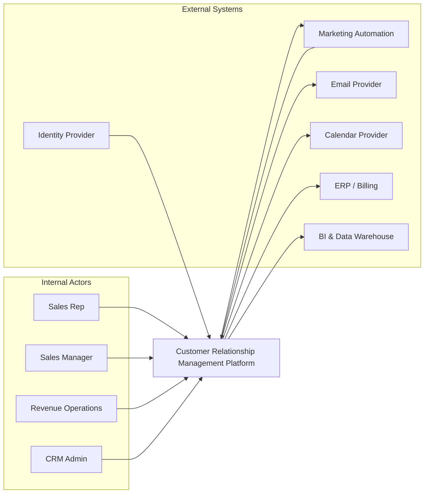
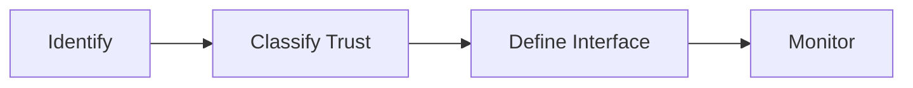

# System Context Diagram

This diagram shows the CRM system boundary, primary users, and external systems.

## Notes
- CRM is the source of truth for lead, account, contact, and opportunity lifecycle state.
- Identity and access are delegated to enterprise SSO/IdP.
- Downstream analytics consume event/data exports from CRM.

## Domain Glossary
- **External Context Node**: File-specific term used to anchor decisions in **System Context Diagram**.
- **Lead**: Prospect record entering qualification and ownership workflows.
- **Opportunity**: Revenue record tracked through pipeline stages and forecast rollups.
- **Correlation ID**: Trace identifier propagated across APIs, queues, and audits for this workflow.

## Entity Lifecycles
- Lifecycle for this document: `Identify -> Classify Trust -> Define Interface -> Monitor`.
- Each transition must capture actor, timestamp, source state, target state, and justification note.

## Integration Boundaries
- Context includes IdP, email provider, ERP, BI, and customer portals.
- Data ownership and write authority must be explicit at each handoff boundary.
- Interface changes require schema/version review and downstream impact acknowledgement.

## Error and Retry Behavior
- Interface outages trigger fallback mode and degraded capability matrix.
- Retries must preserve idempotency token and correlation ID context.
- Exhausted retries route to an operational queue with triage metadata.

## Measurable Acceptance Criteria
- All external nodes have auth method, rate limit, and data residency noted.
- Observability must publish latency, success rate, and failure-class metrics for this document's scope.
- Quarterly review confirms definitions and diagrams still match production behavior.
