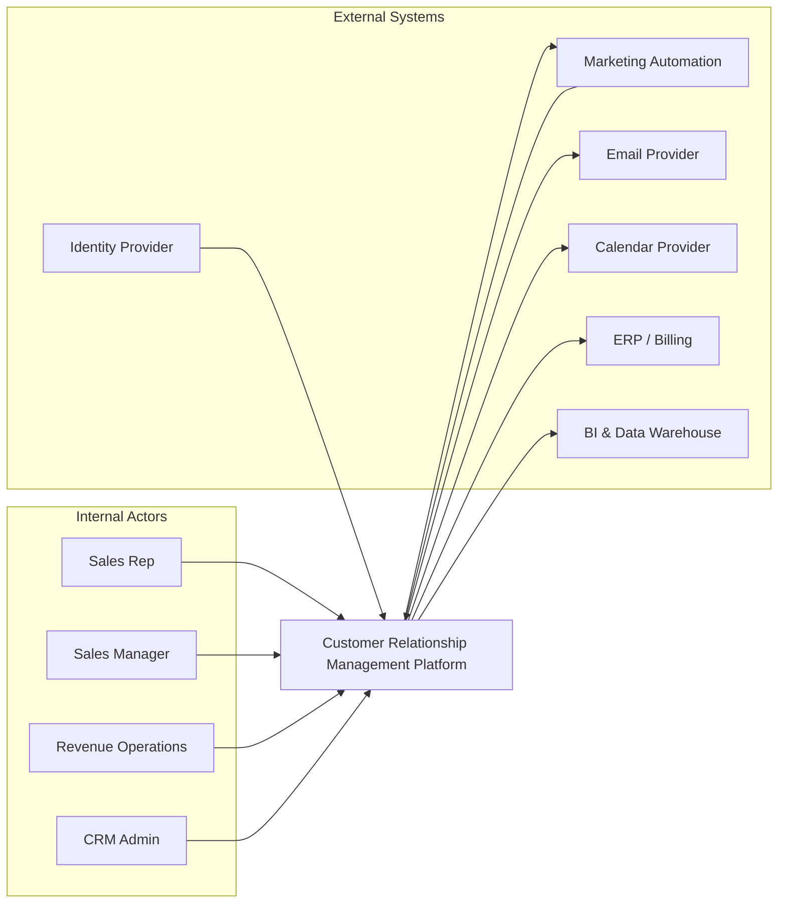

# System Context Diagram

This diagram shows the CRM system boundary, primary users, and external systems.

## Notes
- CRM is the source of truth for lead, account, contact, and opportunity lifecycle state.
- Identity and access are delegated to enterprise SSO/IdP.
- Downstream analytics consume event/data exports from CRM.
