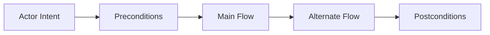

# Use Case Descriptions

## Purpose
Define the use case descriptions artifacts for the **Customer Relationship Management Platform** with implementation-ready detail.

## Domain Context
- Domain: CRM
- Core entities: Lead, Contact, Account, Opportunity, Activity, Forecast Snapshot, Territory
- Primary workflows: lead capture and qualification, deduplication and merge review, opportunity stage progression, territory assignment and reassignment, forecast rollup and approval

## Key Design Decisions
- Enforce idempotency and correlation IDs for all mutating operations.
- Persist immutable audit events for critical lifecycle transitions.
- Separate online transaction paths from async reconciliation/repair paths.

## Reliability and Compliance
- Define SLOs and error budgets for user-facing operations.
- Include RBAC, least-privilege service identities, and full audit trails.
- Provide runbooks for degraded mode, replay, and backfill operations.

## Analysis Notes
- Capture alternate/error flows for: lead capture and qualification, deduplication and merge review, opportunity stage progression.
- Distinguish synchronous decision points vs asynchronous compensation.
- Track external dependencies through channels: web, email, calendar, mobile.

## Domain Glossary
- **Main Success Scenario**: File-specific term used to anchor decisions in **Use Case Descriptions**.
- **Lead**: Prospect record entering qualification and ownership workflows.
- **Opportunity**: Revenue record tracked through pipeline stages and forecast rollups.
- **Correlation ID**: Trace identifier propagated across APIs, queues, and audits for this workflow.

## Entity Lifecycles
- Lifecycle for this document: `Actor Intent -> Preconditions -> Main Flow -> Alternate Flow -> Postconditions`.
- Each transition must capture actor, timestamp, source state, target state, and justification note.

## Integration Boundaries
- Descriptions align with UX flow docs and API endpoint coverage.
- Data ownership and write authority must be explicit at each handoff boundary.
- Interface changes require schema/version review and downstream impact acknowledgement.

## Error and Retry Behavior
- Alternate flows define user-facing recovery instructions for failed steps.
- Retries must preserve idempotency token and correlation ID context.
- Exhausted retries route to an operational queue with triage metadata.

## Measurable Acceptance Criteria
- Each use case has preconditions, triggers, and at least 2 failure alternatives.
- Observability must publish latency, success rate, and failure-class metrics for this document's scope.
- Quarterly review confirms definitions and diagrams still match production behavior.
