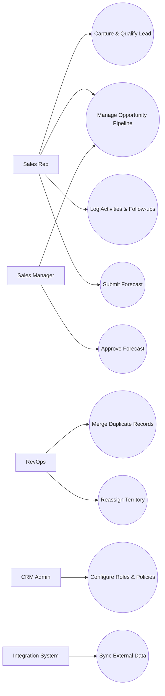
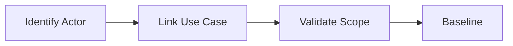

# Use Case Diagram

This diagram captures key user goals and supporting CRM capabilities.

## Notes
- Forecast and territory actions are managerial/operations controlled.
- Deduplication is explicit to prevent accidental irreversible merges.

## Domain Glossary
- **Actor Association**: File-specific term used to anchor decisions in **Use Case Diagram**.
- **Lead**: Prospect record entering qualification and ownership workflows.
- **Opportunity**: Revenue record tracked through pipeline stages and forecast rollups.
- **Correlation ID**: Trace identifier propagated across APIs, queues, and audits for this workflow.

## Entity Lifecycles
- Lifecycle for this document: `Identify Actor -> Link Use Case -> Validate Scope -> Baseline`.
- Each transition must capture actor, timestamp, source state, target state, and justification note.

## Integration Boundaries
- Associations map to RBAC roles and service authorization scopes.
- Data ownership and write authority must be explicit at each handoff boundary.
- Interface changes require schema/version review and downstream impact acknowledgement.

## Error and Retry Behavior
- Unauthorized actor links are rejected during model review.
- Retries must preserve idempotency token and correlation ID context.
- Exhausted retries route to an operational queue with triage metadata.

## Measurable Acceptance Criteria
- Diagram covers 100% of tier-1 capabilities listed in requirements.
- Observability must publish latency, success rate, and failure-class metrics for this document's scope.
- Quarterly review confirms definitions and diagrams still match production behavior.
