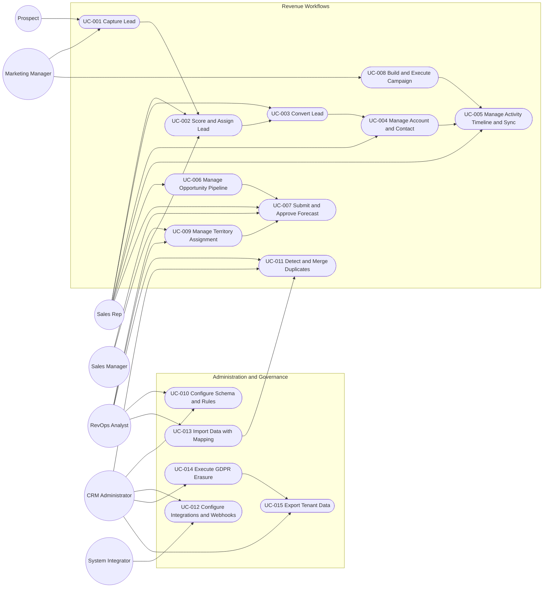

# Use Case Diagram — Customer Relationship Management Platform

## Overview

This diagram covers the end-to-end CRM use cases required to implement lead capture, qualification, selling workflows, forecasting, campaign execution, territory management, integrations, and compliance operations for a multi-tenant SaaS deployment.

## Actor Responsibilities

| Actor | Primary Responsibilities in Scope |
|---|---|
| Prospect | Submit inbound lead data and respond to campaigns or meeting invites. |
| Sales Rep | Qualify leads, convert records, manage opportunities, log activities, sync inbox/calendar, and submit forecast commits. |
| Sales Manager | Approve or reject forecast submissions, oversee territory transitions, and monitor pipeline hygiene. |
| Marketing Manager | Own form capture, segmentation, campaign execution, opt-out handling, and marketing-to-sales handoff. |
| RevOps Analyst | Maintain scoring rules, assignment rules, territories, dedupe queues, import jobs, and pipeline policies. |
| CRM Administrator | Manage RBAC, tenant settings, field-level security, integrations, exports, and erasure workflows. |
| System Integrator | Configure API clients, webhooks, ERP, IdP, warehouse, and communication platform connectors. |

## Use Case Inventory and Traceability

| Use Case | Purpose | Related Requirements |
|---|---|---|
| UC-001 | Capture leads from forms, API, and imports with idempotent ingestion. | FR-001, FR-002, FR-003 |
| UC-002 | Score, dedupe-check, and assign inbound leads to the right owner or queue. | FR-004, FR-005 |
| UC-003 | Convert a qualified lead into account, contact, and optional opportunity records. | FR-006 |
| UC-004 | Maintain canonical account/contact profiles with ownership, hierarchy, and audit trail. | FR-007, FR-008 |
| UC-005 | Maintain a 360 timeline across activities, emails, meetings, and tasks. | FR-009, FR-014, FR-015, FR-016 |
| UC-006 | Configure pipelines, create opportunities, and enforce stage gate progression. | FR-010, FR-011, FR-012 |
| UC-007 | Submit forecast categories, roll up approvals, and freeze period snapshots. | FR-013, FR-021 |
| UC-008 | Build segments, execute campaigns, and enforce unsubscribe compliance. | FR-017, FR-018, FR-019 |
| UC-009 | Assign and reassign accounts/opportunities by territory rules and effective dates. | FR-020 |
| UC-010 | Configure custom fields, pipelines, scoring rules, and field visibility. | FR-022, FR-027 |
| UC-011 | Identify duplicate contacts/accounts/leads and execute controlled merges. | FR-023 |
| UC-012 | Register OAuth integrations, webhooks, and external system connections. | FR-024, FR-025 |
| UC-013 | Import contacts, accounts, leads, and opportunities with mapping and validation. | FR-026 |
| UC-014 | Run GDPR erasure while preserving lawful audit and financial retention. | FR-029 |
| UC-015 | Export tenant data with RBAC-aware scoping and expiry controls. | FR-030 |

## Implementation Notes

- All write paths require `tenant_id`, `correlation_id`, and `idempotency_key` propagation.
- Use cases UC-001, UC-003, UC-007, UC-011, UC-014, and UC-015 must write immutable audit entries and outbox events in the same transaction as the state change.
- UC-005, UC-008, UC-012, and UC-014 cross trust boundaries and must degrade safely when third-party providers are unavailable.
- UC-007 and UC-009 must preserve historical ownership snapshots so forecast attribution remains reproducible after reassignment.

## Acceptance Criteria for Diagram Completeness

- Every actor in the README actor model maps to at least one use case.
- Every priority P0/P1 requirement in the CRM scope maps to a documented use case.
- Dependencies between lead capture, conversion, opportunity management, forecasting, territory management, and compliance are explicit enough to derive service boundaries and test plans.
