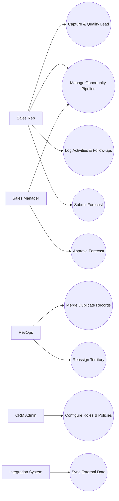

# Use Case Diagram

This diagram captures key user goals and supporting CRM capabilities.

## Notes
- Forecast and territory actions are managerial/operations controlled.
- Deduplication is explicit to prevent accidental irreversible merges.
