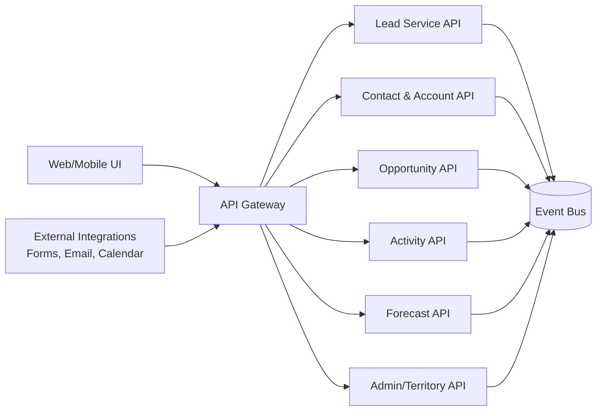
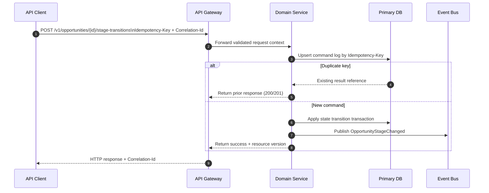

# API Design

This document defines implementation-ready API contracts for the **Customer Relationship Management Platform**.

## API Surface Map


## Core REST Endpoints (Representative)
```mermaid
classDiagram
    class LeadAPI {
      +POST /v1/leads
      +GET /v1/leads/{leadId}
      +PATCH /v1/leads/{leadId}
      +POST /v1/leads/{leadId}/qualify
      +POST /v1/leads/{leadId}/merge-candidates:search
    }

    class OpportunityAPI {
      +POST /v1/opportunities
      +GET /v1/opportunities/{opportunityId}
      +PATCH /v1/opportunities/{opportunityId}
      +POST /v1/opportunities/{opportunityId}/stage-transitions
      +POST /v1/opportunities/{opportunityId}/close
    }

    class ForecastAPI {
      +POST /v1/forecasts/snapshots
      +GET /v1/forecasts/snapshots/{snapshotId}
      +POST /v1/forecasts/snapshots/{snapshotId}/submit
      +POST /v1/forecasts/snapshots/{snapshotId}/approve
    }

    class TerritoryAPI {
      +POST /v1/territories/reassignments
      +GET /v1/territories/reassignments/{jobId}
    }
```

## Write Request Contract Pattern


## Reliability and Compliance Constraints
- All mutating endpoints require `Idempotency-Key` and `Correlation-Id` headers.
- Resource updates use optimistic concurrency via version/ETag fields.
- Sensitive reads and writes are RBAC-gated and mirrored into immutable audit logs.
- Async operations (merge, reassignment, backfill) return job resources and are pollable.

## Domain Glossary
- **Endpoint Contract**: File-specific term used to anchor decisions in **Api Design**.
- **Lead**: Prospect record entering qualification and ownership workflows.
- **Opportunity**: Revenue record tracked through pipeline stages and forecast rollups.
- **Correlation ID**: Trace identifier propagated across APIs, queues, and audits for this workflow.

## Entity Lifecycles
- Lifecycle for this document: `Draft Spec -> Mock -> Contract Test -> Implement -> Version`.
- Each transition must capture actor, timestamp, source state, target state, and justification note.


## Integration Boundaries
- Boundaries include API gateway, auth token service, and downstream domain services.
- Data ownership and write authority must be explicit at each handoff boundary.
- Interface changes require schema/version review and downstream impact acknowledgement.

## Error and Retry Behavior
- POST/PATCH retries require same idempotency key; stale ETags fail with 412.
- Retries must preserve idempotency token and correlation ID context.
- Exhausted retries route to an operational queue with triage metadata.

## Measurable Acceptance Criteria
- OpenAPI contains example payloads and error codes for 2xx/4xx/5xx for each endpoint.
- Observability must publish latency, success rate, and failure-class metrics for this document's scope.
- Quarterly review confirms definitions and diagrams still match production behavior.
