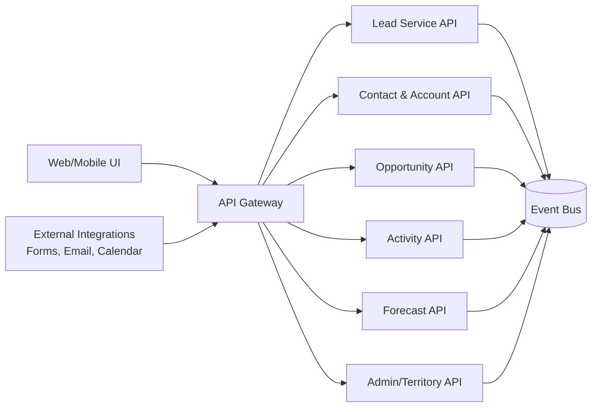
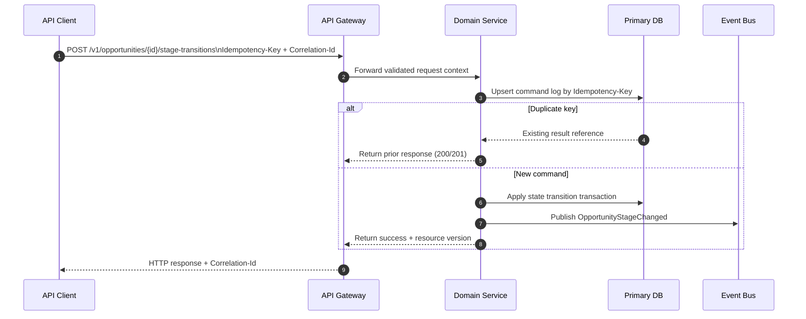

# API Design

This document defines implementation-ready API contracts for the **Customer Relationship Management Platform**.

## API Surface Map


## Core REST Endpoints (Representative)
```mermaid
classDiagram
    class LeadAPI {
      +POST /v1/leads
      +GET /v1/leads/{leadId}
      +PATCH /v1/leads/{leadId}
      +POST /v1/leads/{leadId}/qualify
      +POST /v1/leads/{leadId}/merge-candidates:search
    }

    class OpportunityAPI {
      +POST /v1/opportunities
      +GET /v1/opportunities/{opportunityId}
      +PATCH /v1/opportunities/{opportunityId}
      +POST /v1/opportunities/{opportunityId}/stage-transitions
      +POST /v1/opportunities/{opportunityId}/close
    }

    class ForecastAPI {
      +POST /v1/forecasts/snapshots
      +GET /v1/forecasts/snapshots/{snapshotId}
      +POST /v1/forecasts/snapshots/{snapshotId}/submit
      +POST /v1/forecasts/snapshots/{snapshotId}/approve
    }

    class TerritoryAPI {
      +POST /v1/territories/reassignments
      +GET /v1/territories/reassignments/{jobId}
    }
```

## Write Request Contract Pattern


## Reliability and Compliance Constraints
- All mutating endpoints require `Idempotency-Key` and `Correlation-Id` headers.
- Resource updates use optimistic concurrency via version/ETag fields.
- Sensitive reads and writes are RBAC-gated and mirrored into immutable audit logs.
- Async operations (merge, reassignment, backfill) return job resources and are pollable.
