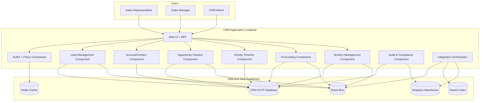

# C4 Component Diagram

This document provides a C4 level-3 component view for the CRM application container.

## CRM Application Container – Components

## Component Responsibilities
- **UI + BFF**: session-aware API facade for web/mobile channels.
- **Lead/Account/Opportunity/Activity components**: transactional domain execution.
- **Forecast + Territory components**: managerial controls, rollups, and reassignment workflows.
- **AuthZ + Policy**: central authorization checks and policy decisioning.
- **Audit & Compliance**: immutable event journaling for sensitive actions.
- **Integration Orchestrator**: async sync/replay between CRM and external systems.
