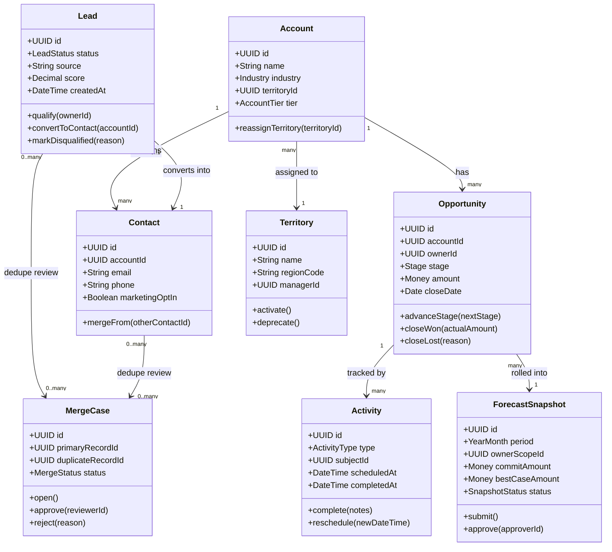
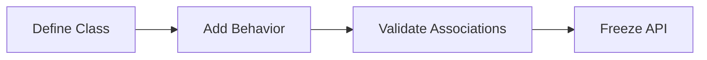

# Class Diagrams

This document models key domain classes for the CRM bounded context.

## Core Domain Class Model

## Modeling Notes
- Aggregate boundaries are centered on `Lead`, `Account`, `Opportunity`, and `ForecastSnapshot`.
- `MergeCase` supports human-in-the-loop deduplication before irreversible merge operations.
- `Territory` changes are designed to be explicit operations to simplify auditability.

## Domain Glossary
- **Class Responsibility**: File-specific term used to anchor decisions in **Class Diagrams**.
- **Lead**: Prospect record entering qualification and ownership workflows.
- **Opportunity**: Revenue record tracked through pipeline stages and forecast rollups.
- **Correlation ID**: Trace identifier propagated across APIs, queues, and audits for this workflow.

## Entity Lifecycles
- Lifecycle for this document: `Define Class -> Add Behavior -> Validate Associations -> Freeze API`.
- Each transition must capture actor, timestamp, source state, target state, and justification note.

## Integration Boundaries
- Class boundaries map to domain packages and persistence adapters.
- Data ownership and write authority must be explicit at each handoff boundary.
- Interface changes require schema/version review and downstream impact acknowledgement.

## Error and Retry Behavior
- Serialization failures are non-retryable and logged with schema version.
- Retries must preserve idempotency token and correlation ID context.
- Exhausted retries route to an operational queue with triage metadata.

## Measurable Acceptance Criteria
- Classes expose invariants and cardinality for all associations.
- Observability must publish latency, success rate, and failure-class metrics for this document's scope.
- Quarterly review confirms definitions and diagrams still match production behavior.
