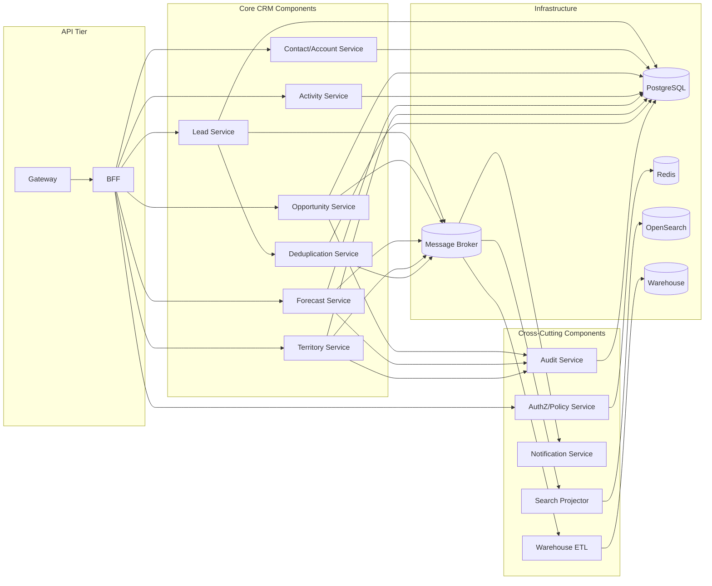
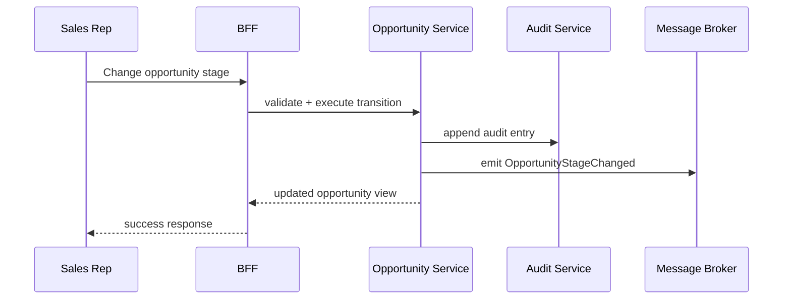
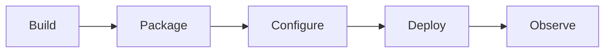

# Component Diagrams

This document details runtime components and key internal interactions for CRM services.

## Service-Level Component Topology

## Critical Interaction Path: Stage Change

## Domain Glossary
- **Runtime Component**: File-specific term used to anchor decisions in **Component Diagrams**.
- **Lead**: Prospect record entering qualification and ownership workflows.
- **Opportunity**: Revenue record tracked through pipeline stages and forecast rollups.
- **Correlation ID**: Trace identifier propagated across APIs, queues, and audits for this workflow.

## Entity Lifecycles
- Lifecycle for this document: `Build -> Package -> Configure -> Deploy -> Observe`.
- Each transition must capture actor, timestamp, source state, target state, and justification note.

## Integration Boundaries
- Components integrate through REST, events, and scheduled jobs.
- Data ownership and write authority must be explicit at each handoff boundary.
- Interface changes require schema/version review and downstream impact acknowledgement.

## Error and Retry Behavior
- Component restart policy retries 3 times before alerting on-call.
- Retries must preserve idempotency token and correlation ID context.
- Exhausted retries route to an operational queue with triage metadata.

## Measurable Acceptance Criteria
- Diagram includes startup dependencies and health probe endpoints.
- Observability must publish latency, success rate, and failure-class metrics for this document's scope.
- Quarterly review confirms definitions and diagrams still match production behavior.
