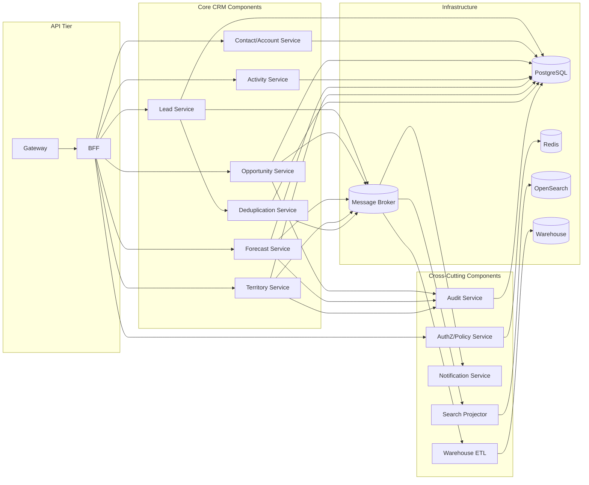
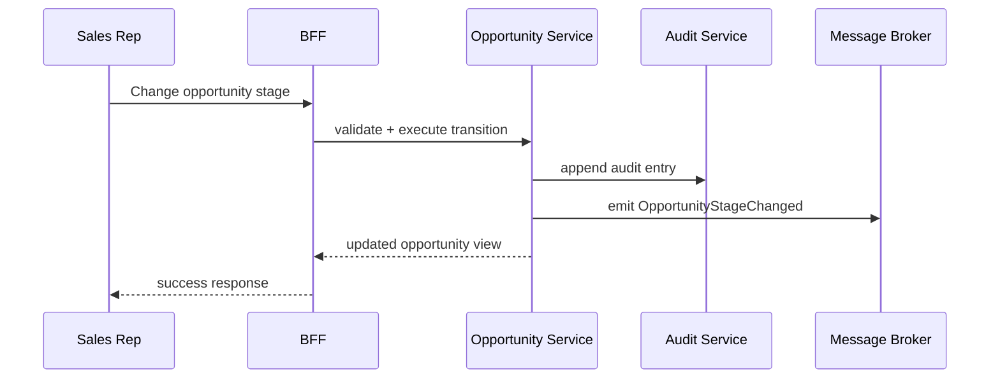

# Component Diagrams

This document details runtime components and key internal interactions for CRM services.

## Service-Level Component Topology

```mermaid
flowchart LR
    subgraph API[API Tier]
      GW[Gateway]
      BFF[BFF]
    end

    subgraph Core[Core CRM Components]
      LeadSvc[Lead Service]
      ContactSvc[Contact/Account Service]
      OppSvc[Opportunity Service]
      ActSvc[Activity Service]
      ForecastSvc[Forecast Service]
      TerritorySvc[Territory Service]
      DedupeSvc[Deduplication Service]
    end

    subgraph CrossCutting[Cross-Cutting Components]
      AuthSvc[AuthZ/Policy Service]
      AuditSvc[Audit Service]
      NotifySvc[Notification Service]
      SearchProj[Search Projector]
      ETL[Warehouse ETL]
    end

    subgraph Infra[Infrastructure]
      DB[(PostgreSQL)]
      MQ[(Message Broker)]
      Cache[(Redis)]
      Search[(OpenSearch)]
      WH[(Warehouse)]
    end

    GW --> BFF
    BFF --> AuthSvc
    BFF --> LeadSvc
    BFF --> ContactSvc
    BFF --> OppSvc
    BFF --> ActSvc
    BFF --> ForecastSvc
    BFF --> TerritorySvc

    LeadSvc --> DedupeSvc

    LeadSvc --> DB
    ContactSvc --> DB
    OppSvc --> DB
    ActSvc --> DB
    ForecastSvc --> DB
    TerritorySvc --> DB
    DedupeSvc --> DB

    LeadSvc --> MQ
    OppSvc --> MQ
    ForecastSvc --> MQ
    TerritorySvc --> MQ
    DedupeSvc --> MQ

    MQ --> NotifySvc
    MQ --> SearchProj
    MQ --> ETL

    SearchProj --> Search
    ETL --> WH

    AuthSvc --> Cache
    AuditSvc --> DB
    OppSvc --> AuditSvc
    ForecastSvc --> AuditSvc
    TerritorySvc --> AuditSvc
```

## Critical Interaction Path: Stage Change

```mermaid
sequenceDiagram
    participant U as Sales Rep
    participant B as BFF
    participant O as Opportunity Service
    participant A as Audit Service
    participant M as Message Broker

    U->>B: Change opportunity stage
    B->>O: validate + execute transition
    O->>A: append audit entry
    O->>M: emit OpportunityStageChanged
    O-->>B: updated opportunity view
    B-->>U: success response
```
