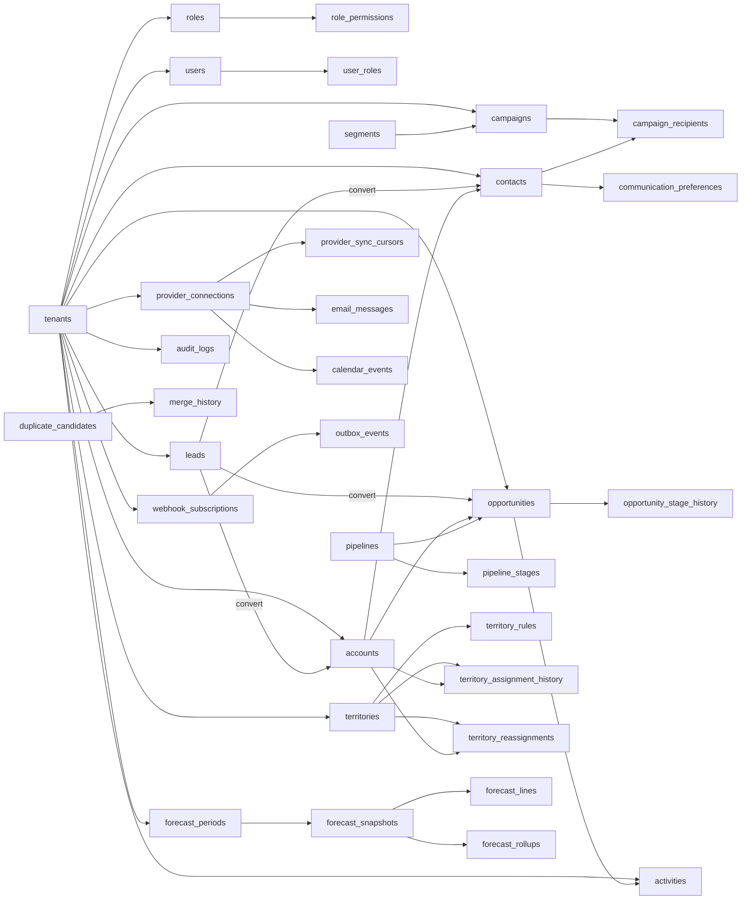

# ERD & Database Schema — Customer Relationship Management Platform

## Overview

This document defines the PostgreSQL 15+ relational schema for the CRM platform. `tenant_id` is the concrete implementation key used for multi-tenant isolation and maps to the logical organization concept used elsewhere in the documentation. All mutable business tables are tenant-scoped, versioned where concurrency matters, and compatible with row-level security.

### Schema Principles
- UUID primary keys generated with `gen_random_uuid()`.
- `tenant_id` on every tenant-owned table, indexed and covered by row-level security policy.
- `version` column on concurrently edited aggregates.
- `custom_values JSONB` on extensible aggregates plus metadata in `custom_field_definitions`.
- Outbox, audit, merge, and privacy tables are first-class schema elements, not afterthoughts.

---

## Entity Relationship Diagram



---

## Foundational DDL

```sql
CREATE EXTENSION IF NOT EXISTS pgcrypto;
CREATE EXTENSION IF NOT EXISTS citext;

CREATE TABLE tenants (
    tenant_id            UUID PRIMARY KEY DEFAULT gen_random_uuid(),
    name                 VARCHAR(255) NOT NULL,
    slug                 VARCHAR(100) NOT NULL UNIQUE,
    status               VARCHAR(20) NOT NULL DEFAULT 'ACTIVE'
                         CHECK (status IN ('ACTIVE', 'SUSPENDED', 'DEPROVISIONING')),
    primary_domain       CITEXT,
    subscription_tier    VARCHAR(30) NOT NULL DEFAULT 'ENTERPRISE',
    default_timezone     VARCHAR(64) NOT NULL DEFAULT 'UTC',
    fiscal_calendar_type VARCHAR(20) NOT NULL DEFAULT 'MONTHLY'
                         CHECK (fiscal_calendar_type IN ('MONTHLY', 'QUARTERLY')),
    created_at           TIMESTAMPTZ NOT NULL DEFAULT NOW(),
    updated_at           TIMESTAMPTZ NOT NULL DEFAULT NOW()
);

CREATE TABLE users (
    user_id              UUID PRIMARY KEY DEFAULT gen_random_uuid(),
    tenant_id            UUID NOT NULL REFERENCES tenants (tenant_id) ON DELETE RESTRICT,
    manager_user_id      UUID REFERENCES users (user_id) ON DELETE SET NULL,
    email                CITEXT NOT NULL,
    display_name         VARCHAR(200) NOT NULL,
    user_type            VARCHAR(20) NOT NULL DEFAULT 'HUMAN'
                         CHECK (user_type IN ('HUMAN', 'SERVICE')),
    status               VARCHAR(20) NOT NULL DEFAULT 'ACTIVE'
                         CHECK (status IN ('INVITED', 'ACTIVE', 'SUSPENDED', 'DEACTIVATED')),
    locale               VARCHAR(10) NOT NULL DEFAULT 'en-US',
    timezone             VARCHAR(64) NOT NULL DEFAULT 'UTC',
    created_at           TIMESTAMPTZ NOT NULL DEFAULT NOW(),
    updated_at           TIMESTAMPTZ NOT NULL DEFAULT NOW(),
    UNIQUE (tenant_id, email)
);
CREATE INDEX idx_users_tenant_manager ON users (tenant_id, manager_user_id);

CREATE TABLE roles (
    role_id              UUID PRIMARY KEY DEFAULT gen_random_uuid(),
    tenant_id            UUID NOT NULL REFERENCES tenants (tenant_id) ON DELETE CASCADE,
    role_name            VARCHAR(100) NOT NULL,
    is_system_role       BOOLEAN NOT NULL DEFAULT FALSE,
    created_at           TIMESTAMPTZ NOT NULL DEFAULT NOW(),
    UNIQUE (tenant_id, role_name)
);

CREATE TABLE user_roles (
    tenant_id            UUID NOT NULL REFERENCES tenants (tenant_id) ON DELETE CASCADE,
    user_id              UUID NOT NULL REFERENCES users (user_id) ON DELETE CASCADE,
    role_id              UUID NOT NULL REFERENCES roles (role_id) ON DELETE CASCADE,
    granted_at           TIMESTAMPTZ NOT NULL DEFAULT NOW(),
    granted_by           UUID REFERENCES users (user_id) ON DELETE SET NULL,
    PRIMARY KEY (tenant_id, user_id, role_id)
);

CREATE TABLE role_permissions (
    tenant_id            UUID NOT NULL REFERENCES tenants (tenant_id) ON DELETE CASCADE,
    role_id              UUID NOT NULL REFERENCES roles (role_id) ON DELETE CASCADE,
    entity_type          VARCHAR(30) NOT NULL,
    action_name          VARCHAR(30) NOT NULL,
    scope_level          VARCHAR(20) NOT NULL
                         CHECK (scope_level IN ('OWN','TEAM','ALL')),
    field_rules          JSONB NOT NULL DEFAULT '{}'::jsonb,
    PRIMARY KEY (tenant_id, role_id, entity_type, action_name)
);

CREATE TABLE custom_field_definitions (
    custom_field_id      UUID PRIMARY KEY DEFAULT gen_random_uuid(),
    tenant_id            UUID NOT NULL REFERENCES tenants (tenant_id) ON DELETE CASCADE,
    entity_type          VARCHAR(30) NOT NULL
                         CHECK (entity_type IN ('LEAD','ACCOUNT','CONTACT','OPPORTUNITY','ACTIVITY')),
    api_name             VARCHAR(80) NOT NULL,
    label                VARCHAR(150) NOT NULL,
    field_type           VARCHAR(30) NOT NULL
                         CHECK (field_type IN ('TEXT','TEXTAREA','NUMBER','CURRENCY','DATE','PICKLIST','MULTISELECT','BOOLEAN','EMAIL','URL','LOOKUP')),
    is_required          BOOLEAN NOT NULL DEFAULT FALSE,
    is_filterable        BOOLEAN NOT NULL DEFAULT TRUE,
    is_hidden            BOOLEAN NOT NULL DEFAULT FALSE,
    field_options        JSONB NOT NULL DEFAULT '[]'::jsonb,
    field_permissions    JSONB NOT NULL DEFAULT '{}'::jsonb,
    published_version    INTEGER NOT NULL DEFAULT 1,
    created_by           UUID REFERENCES users (user_id) ON DELETE SET NULL,
    created_at           TIMESTAMPTZ NOT NULL DEFAULT NOW(),
    updated_at           TIMESTAMPTZ NOT NULL DEFAULT NOW(),
    UNIQUE (tenant_id, entity_type, api_name)
);
```

---

## Customer Master Data DDL

```sql
CREATE TABLE accounts (
    account_id                 UUID PRIMARY KEY DEFAULT gen_random_uuid(),
    tenant_id                  UUID NOT NULL REFERENCES tenants (tenant_id) ON DELETE CASCADE,
    owner_user_id              UUID REFERENCES users (user_id) ON DELETE SET NULL,
    territory_id               UUID,
    parent_account_id          UUID REFERENCES accounts (account_id) ON DELETE SET NULL,
    external_ref               VARCHAR(120),
    name                       VARCHAR(255) NOT NULL,
    normalized_domain          CITEXT,
    industry                   VARCHAR(120),
    employee_count             INTEGER CHECK (employee_count IS NULL OR employee_count >= 0),
    annual_revenue             NUMERIC(18,2) CHECK (annual_revenue IS NULL OR annual_revenue >= 0),
    billing_country            VARCHAR(2),
    billing_region             VARCHAR(120),
    billing_city               VARCHAR(120),
    billing_postal_code        VARCHAR(30),
    custom_values              JSONB NOT NULL DEFAULT '{}'::jsonb,
    consent_summary            JSONB NOT NULL DEFAULT '{}'::jsonb,
    version                    INTEGER NOT NULL DEFAULT 1,
    created_at                 TIMESTAMPTZ NOT NULL DEFAULT NOW(),
    updated_at                 TIMESTAMPTZ NOT NULL DEFAULT NOW(),
    deleted_at                 TIMESTAMPTZ
);
CREATE INDEX idx_accounts_tenant_owner ON accounts (tenant_id, owner_user_id) WHERE deleted_at IS NULL;
CREATE INDEX idx_accounts_tenant_territory ON accounts (tenant_id, territory_id) WHERE deleted_at IS NULL;
CREATE INDEX idx_accounts_custom_values ON accounts USING GIN (custom_values);
CREATE UNIQUE INDEX uq_accounts_domain_active
    ON accounts (tenant_id, normalized_domain)
    WHERE normalized_domain IS NOT NULL AND deleted_at IS NULL;

CREATE TABLE contacts (
    contact_id                 UUID PRIMARY KEY DEFAULT gen_random_uuid(),
    tenant_id                  UUID NOT NULL REFERENCES tenants (tenant_id) ON DELETE CASCADE,
    account_id                 UUID REFERENCES accounts (account_id) ON DELETE SET NULL,
    owner_user_id              UUID REFERENCES users (user_id) ON DELETE SET NULL,
    external_ref               VARCHAR(120),
    first_name                 VARCHAR(120) NOT NULL,
    last_name                  VARCHAR(120) NOT NULL,
    primary_email              CITEXT,
    normalized_email           CITEXT,
    phone_e164                 VARCHAR(30),
    title                      VARCHAR(150),
    lifecycle_status           VARCHAR(20) NOT NULL DEFAULT 'ACTIVE'
                               CHECK (lifecycle_status IN ('ACTIVE','BOUNCED','UNSUBSCRIBED','ERASURE_PENDING','ERASED')),
    lawful_basis               VARCHAR(40),
    custom_values              JSONB NOT NULL DEFAULT '{}'::jsonb,
    version                    INTEGER NOT NULL DEFAULT 1,
    created_at                 TIMESTAMPTZ NOT NULL DEFAULT NOW(),
    updated_at                 TIMESTAMPTZ NOT NULL DEFAULT NOW(),
    deleted_at                 TIMESTAMPTZ
);
CREATE INDEX idx_contacts_tenant_account ON contacts (tenant_id, account_id) WHERE deleted_at IS NULL;
CREATE INDEX idx_contacts_custom_values ON contacts USING GIN (custom_values);
CREATE UNIQUE INDEX uq_contacts_email_active
    ON contacts (tenant_id, normalized_email)
    WHERE normalized_email IS NOT NULL AND deleted_at IS NULL;

CREATE TABLE leads (
    lead_id                    UUID PRIMARY KEY DEFAULT gen_random_uuid(),
    tenant_id                  UUID NOT NULL REFERENCES tenants (tenant_id) ON DELETE CASCADE,
    owner_user_id              UUID REFERENCES users (user_id) ON DELETE SET NULL,
    source_channel             VARCHAR(30) NOT NULL
                               CHECK (source_channel IN ('WEB','API','IMPORT','REFERRAL','EVENT','PARTNER')),
    source_detail              VARCHAR(255),
    intake_payload_hash        CHAR(64) NOT NULL,
    idempotency_key            VARCHAR(255),
    first_name                 VARCHAR(120) NOT NULL,
    last_name                  VARCHAR(120) NOT NULL,
    email                      CITEXT,
    normalized_email           CITEXT,
    phone_e164                 VARCHAR(30),
    company_name               VARCHAR(255),
    normalized_company_name    VARCHAR(255),
    lifecycle_status           VARCHAR(20) NOT NULL DEFAULT 'CAPTURED'
                               CHECK (lifecycle_status IN ('CAPTURED','SCORING_PENDING','ASSIGNED','WORKING','QUALIFIED','DISQUALIFIED','CONVERTED','MERGED')),
    current_score              INTEGER CHECK (current_score IS NULL OR current_score BETWEEN 0 AND 100),
    assignment_reason          VARCHAR(255),
    consent_context            JSONB NOT NULL DEFAULT '{}'::jsonb,
    custom_values              JSONB NOT NULL DEFAULT '{}'::jsonb,
    converted_account_id       UUID REFERENCES accounts (account_id) ON DELETE SET NULL,
    converted_contact_id       UUID REFERENCES contacts (contact_id) ON DELETE SET NULL,
    converted_opportunity_id   UUID,
    merged_into_lead_id        UUID REFERENCES leads (lead_id) ON DELETE SET NULL,
    created_at                 TIMESTAMPTZ NOT NULL DEFAULT NOW(),
    updated_at                 TIMESTAMPTZ NOT NULL DEFAULT NOW(),
    UNIQUE (tenant_id, idempotency_key),
    UNIQUE (tenant_id, intake_payload_hash)
);
CREATE INDEX idx_leads_tenant_status ON leads (tenant_id, lifecycle_status, owner_user_id);
CREATE INDEX idx_leads_custom_values ON leads USING GIN (custom_values);

CREATE TABLE lead_score_history (
    lead_score_history_id      UUID PRIMARY KEY DEFAULT gen_random_uuid(),
    tenant_id                  UUID NOT NULL REFERENCES tenants (tenant_id) ON DELETE CASCADE,
    lead_id                    UUID NOT NULL REFERENCES leads (lead_id) ON DELETE CASCADE,
    score                      INTEGER NOT NULL CHECK (score BETWEEN 0 AND 100),
    score_breakdown            JSONB NOT NULL,
    score_reason               VARCHAR(255) NOT NULL,
    calculated_at              TIMESTAMPTZ NOT NULL DEFAULT NOW()
);
CREATE INDEX idx_lead_score_history_lead ON lead_score_history (tenant_id, lead_id, calculated_at DESC);

CREATE TABLE duplicate_candidates (
    duplicate_candidate_id     UUID PRIMARY KEY DEFAULT gen_random_uuid(),
    tenant_id                  UUID NOT NULL REFERENCES tenants (tenant_id) ON DELETE CASCADE,
    entity_type                VARCHAR(20) NOT NULL CHECK (entity_type IN ('LEAD','CONTACT','ACCOUNT')),
    left_record_id             UUID NOT NULL,
    right_record_id            UUID NOT NULL,
    confidence_score           NUMERIC(5,2) NOT NULL CHECK (confidence_score >= 0 AND confidence_score <= 100),
    match_explanation          JSONB NOT NULL,
    review_status              VARCHAR(20) NOT NULL DEFAULT 'PENDING'
                               CHECK (review_status IN ('PENDING','APPROVED','REJECTED','AUTO_MERGED')),
    suppression_until          TIMESTAMPTZ,
    created_at                 TIMESTAMPTZ NOT NULL DEFAULT NOW(),
    resolved_at                TIMESTAMPTZ,
    UNIQUE (tenant_id, entity_type, left_record_id, right_record_id)
);

CREATE TABLE merge_history (
    merge_history_id           UUID PRIMARY KEY DEFAULT gen_random_uuid(),
    tenant_id                  UUID NOT NULL REFERENCES tenants (tenant_id) ON DELETE CASCADE,
    entity_type                VARCHAR(20) NOT NULL CHECK (entity_type IN ('LEAD','CONTACT','ACCOUNT')),
    survivor_record_id         UUID NOT NULL,
    source_record_id           UUID NOT NULL,
    merge_mode                 VARCHAR(20) NOT NULL CHECK (merge_mode IN ('AUTO','MANUAL','UNMERGE')),
    decided_by                 UUID REFERENCES users (user_id) ON DELETE SET NULL,
    field_winners              JSONB NOT NULL DEFAULT '{}'::jsonb,
    source_snapshot            JSONB NOT NULL,
    merged_at                  TIMESTAMPTZ NOT NULL DEFAULT NOW()
);
```

---

## Revenue, Activity, and Marketing DDL

```sql
CREATE TABLE pipelines (
    pipeline_id                UUID PRIMARY KEY DEFAULT gen_random_uuid(),
    tenant_id                  UUID NOT NULL REFERENCES tenants (tenant_id) ON DELETE CASCADE,
    name                       VARCHAR(120) NOT NULL,
    is_default                 BOOLEAN NOT NULL DEFAULT FALSE,
    stage_policy_version       INTEGER NOT NULL DEFAULT 1,
    created_by                 UUID REFERENCES users (user_id) ON DELETE SET NULL,
    created_at                 TIMESTAMPTZ NOT NULL DEFAULT NOW(),
    updated_at                 TIMESTAMPTZ NOT NULL DEFAULT NOW(),
    UNIQUE (tenant_id, name)
);
CREATE UNIQUE INDEX uq_pipelines_default ON pipelines (tenant_id) WHERE is_default = TRUE;

CREATE TABLE pipeline_stages (
    stage_id                   UUID PRIMARY KEY DEFAULT gen_random_uuid(),
    tenant_id                  UUID NOT NULL REFERENCES tenants (tenant_id) ON DELETE CASCADE,
    pipeline_id                UUID NOT NULL REFERENCES pipelines (pipeline_id) ON DELETE CASCADE,
    name                       VARCHAR(120) NOT NULL,
    position_index             INTEGER NOT NULL CHECK (position_index > 0),
    default_probability        INTEGER NOT NULL CHECK (default_probability BETWEEN 0 AND 100),
    stage_type                 VARCHAR(20) NOT NULL DEFAULT 'OPEN'
                               CHECK (stage_type IN ('OPEN','CLOSED_WON','CLOSED_LOST')),
    gate_criteria              JSONB NOT NULL DEFAULT '[]'::jsonb,
    created_at                 TIMESTAMPTZ NOT NULL DEFAULT NOW(),
    UNIQUE (tenant_id, pipeline_id, name),
    UNIQUE (tenant_id, pipeline_id, position_index)
);

CREATE TABLE opportunities (
    opportunity_id             UUID PRIMARY KEY DEFAULT gen_random_uuid(),
    tenant_id                  UUID NOT NULL REFERENCES tenants (tenant_id) ON DELETE CASCADE,
    account_id                 UUID NOT NULL REFERENCES accounts (account_id) ON DELETE RESTRICT,
    primary_contact_id         UUID REFERENCES contacts (contact_id) ON DELETE SET NULL,
    owner_user_id              UUID REFERENCES users (user_id) ON DELETE SET NULL,
    territory_id               UUID,
    pipeline_id                UUID NOT NULL REFERENCES pipelines (pipeline_id) ON DELETE RESTRICT,
    stage_id                   UUID NOT NULL REFERENCES pipeline_stages (stage_id) ON DELETE RESTRICT,
    source_lead_id             UUID REFERENCES leads (lead_id) ON DELETE SET NULL,
    name                       VARCHAR(255) NOT NULL,
    amount                     NUMERIC(18,2) NOT NULL CHECK (amount >= 0),
    currency_code              CHAR(3) NOT NULL,
    close_date                 DATE,
    probability                INTEGER NOT NULL CHECK (probability BETWEEN 0 AND 100),
    forecast_category_override VARCHAR(20)
                               CHECK (forecast_category_override IS NULL OR forecast_category_override IN ('COMMIT','BEST_CASE','PIPELINE','OMITTED')),
    lifecycle_status           VARCHAR(20) NOT NULL DEFAULT 'OPEN'
                               CHECK (lifecycle_status IN ('OPEN','CLOSED_WON','CLOSED_LOST','REOPENED','ARCHIVED')),
    loss_reason_code           VARCHAR(80),
    stage_validation_snapshot  JSONB NOT NULL DEFAULT '{}'::jsonb,
    custom_values              JSONB NOT NULL DEFAULT '{}'::jsonb,
    version                    INTEGER NOT NULL DEFAULT 1,
    created_at                 TIMESTAMPTZ NOT NULL DEFAULT NOW(),
    updated_at                 TIMESTAMPTZ NOT NULL DEFAULT NOW(),
    closed_at                  TIMESTAMPTZ
);
CREATE INDEX idx_opportunities_tenant_owner ON opportunities (tenant_id, owner_user_id, lifecycle_status);
CREATE INDEX idx_opportunities_period ON opportunities (tenant_id, close_date, lifecycle_status);

CREATE TABLE opportunity_stage_history (
    opportunity_stage_history_id UUID PRIMARY KEY DEFAULT gen_random_uuid(),
    tenant_id                    UUID NOT NULL REFERENCES tenants (tenant_id) ON DELETE CASCADE,
    opportunity_id               UUID NOT NULL REFERENCES opportunities (opportunity_id) ON DELETE CASCADE,
    from_stage_id                UUID REFERENCES pipeline_stages (stage_id) ON DELETE SET NULL,
    to_stage_id                  UUID NOT NULL REFERENCES pipeline_stages (stage_id) ON DELETE RESTRICT,
    changed_by                   UUID REFERENCES users (user_id) ON DELETE SET NULL,
    previous_probability         INTEGER,
    new_probability              INTEGER NOT NULL,
    gate_evidence                JSONB NOT NULL DEFAULT '{}'::jsonb,
    changed_at                   TIMESTAMPTZ NOT NULL DEFAULT NOW()
);
CREATE INDEX idx_stage_history_opp ON opportunity_stage_history (tenant_id, opportunity_id, changed_at DESC);

CREATE TABLE activities (
    activity_id                 UUID PRIMARY KEY DEFAULT gen_random_uuid(),
    tenant_id                   UUID NOT NULL REFERENCES tenants (tenant_id) ON DELETE CASCADE,
    owner_user_id               UUID REFERENCES users (user_id) ON DELETE SET NULL,
    linked_account_id           UUID REFERENCES accounts (account_id) ON DELETE SET NULL,
    linked_contact_id           UUID REFERENCES contacts (contact_id) ON DELETE SET NULL,
    linked_opportunity_id       UUID REFERENCES opportunities (opportunity_id) ON DELETE SET NULL,
    linked_lead_id              UUID REFERENCES leads (lead_id) ON DELETE SET NULL,
    activity_type               VARCHAR(20) NOT NULL CHECK (activity_type IN ('CALL','EMAIL','MEETING','TASK','NOTE','SYSTEM')),
    source_system               VARCHAR(20) NOT NULL DEFAULT 'CRM'
                                CHECK (source_system IN ('CRM','GOOGLE','MICROSOFT','ESP','IMPORT','SYSTEM')),
    subject                     VARCHAR(255) NOT NULL,
    body                        TEXT,
    starts_at                   TIMESTAMPTZ,
    ends_at                     TIMESTAMPTZ,
    due_at                      TIMESTAMPTZ,
    completion_status           VARCHAR(20) NOT NULL DEFAULT 'OPEN'
                                CHECK (completion_status IN ('OPEN','IN_PROGRESS','COMPLETED','CANCELLED')),
    provider_object_id          VARCHAR(255),
    custom_values               JSONB NOT NULL DEFAULT '{}'::jsonb,
    created_at                  TIMESTAMPTZ NOT NULL DEFAULT NOW(),
    updated_at                  TIMESTAMPTZ NOT NULL DEFAULT NOW()
);
CREATE INDEX idx_activities_timeline ON activities (tenant_id, COALESCE(starts_at, created_at) DESC);

CREATE TABLE segments (
    segment_id                  UUID PRIMARY KEY DEFAULT gen_random_uuid(),
    tenant_id                   UUID NOT NULL REFERENCES tenants (tenant_id) ON DELETE CASCADE,
    owner_user_id               UUID REFERENCES users (user_id) ON DELETE SET NULL,
    name                        VARCHAR(150) NOT NULL,
    segment_type                VARCHAR(20) NOT NULL CHECK (segment_type IN ('DYNAMIC','STATIC')),
    filter_definition           JSONB NOT NULL,
    snapshot_count              INTEGER,
    created_at                  TIMESTAMPTZ NOT NULL DEFAULT NOW(),
    updated_at                  TIMESTAMPTZ NOT NULL DEFAULT NOW(),
    UNIQUE (tenant_id, name)
);

CREATE TABLE campaigns (
    campaign_id                 UUID PRIMARY KEY DEFAULT gen_random_uuid(),
    tenant_id                   UUID NOT NULL REFERENCES tenants (tenant_id) ON DELETE CASCADE,
    owner_user_id               UUID REFERENCES users (user_id) ON DELETE SET NULL,
    segment_id                  UUID NOT NULL REFERENCES segments (segment_id) ON DELETE RESTRICT,
    name                        VARCHAR(200) NOT NULL,
    channel                     VARCHAR(20) NOT NULL DEFAULT 'EMAIL' CHECK (channel IN ('EMAIL')),
    lifecycle_status            VARCHAR(20) NOT NULL DEFAULT 'DRAFT'
                                CHECK (lifecycle_status IN ('DRAFT','SCHEDULED','VALIDATING','SENDING','PAUSED','PARTIAL_FAILURE','SENT','COMPLETED','CANCELLED')),
    from_name                   VARCHAR(200) NOT NULL,
    from_email                  CITEXT NOT NULL,
    subject_template            VARCHAR(500) NOT NULL,
    body_template               TEXT NOT NULL,
    scheduled_send_at           TIMESTAMPTZ,
    compliance_snapshot         JSONB NOT NULL DEFAULT '{}'::jsonb,
    created_at                  TIMESTAMPTZ NOT NULL DEFAULT NOW(),
    updated_at                  TIMESTAMPTZ NOT NULL DEFAULT NOW()
);

CREATE TABLE communication_preferences (
    communication_preference_id UUID PRIMARY KEY DEFAULT gen_random_uuid(),
    tenant_id                   UUID NOT NULL REFERENCES tenants (tenant_id) ON DELETE CASCADE,
    contact_id                  UUID NOT NULL REFERENCES contacts (contact_id) ON DELETE CASCADE,
    channel                     VARCHAR(20) NOT NULL CHECK (channel IN ('EMAIL','SMS','PHONE')),
    preference_status           VARCHAR(20) NOT NULL CHECK (preference_status IN ('OPTED_IN','OPTED_OUT','BOUNCED','LEGAL_HOLD')),
    lawful_basis                VARCHAR(40),
    source                      VARCHAR(120) NOT NULL,
    effective_at                TIMESTAMPTZ NOT NULL DEFAULT NOW(),
    UNIQUE (tenant_id, contact_id, channel)
);

CREATE TABLE campaign_recipients (
    campaign_recipient_id       UUID PRIMARY KEY DEFAULT gen_random_uuid(),
    tenant_id                   UUID NOT NULL REFERENCES tenants (tenant_id) ON DELETE CASCADE,
    campaign_id                 UUID NOT NULL REFERENCES campaigns (campaign_id) ON DELETE CASCADE,
    contact_id                  UUID NOT NULL REFERENCES contacts (contact_id) ON DELETE CASCADE,
    variant_key                 VARCHAR(20),
    provider_message_id         VARCHAR(255),
    delivery_status             VARCHAR(20) NOT NULL DEFAULT 'QUEUED'
                                CHECK (delivery_status IN ('QUEUED','SENT','DELIVERED','OPENED','CLICKED','BOUNCED','COMPLAINED','UNSUBSCRIBED','SUPPRESSED','FAILED')),
    send_attempt_count          INTEGER NOT NULL DEFAULT 0,
    last_event_at               TIMESTAMPTZ,
    metrics                     JSONB NOT NULL DEFAULT '{}'::jsonb,
    created_at                  TIMESTAMPTZ NOT NULL DEFAULT NOW(),
    UNIQUE (tenant_id, campaign_id, contact_id)
);
```

---

## Territory, Forecast, Integration, and Governance DDL

```sql
CREATE TABLE territories (
    territory_id                UUID PRIMARY KEY DEFAULT gen_random_uuid(),
    tenant_id                   UUID NOT NULL REFERENCES tenants (tenant_id) ON DELETE CASCADE,
    parent_territory_id         UUID REFERENCES territories (territory_id) ON DELETE SET NULL,
    owner_user_id               UUID REFERENCES users (user_id) ON DELETE SET NULL,
    name                        VARCHAR(150) NOT NULL,
    lifecycle_status            VARCHAR(20) NOT NULL DEFAULT 'ACTIVE'
                                CHECK (lifecycle_status IN ('ACTIVE','INACTIVE','RETIRED')),
    effective_from              DATE NOT NULL,
    effective_to                DATE,
    created_at                  TIMESTAMPTZ NOT NULL DEFAULT NOW(),
    updated_at                  TIMESTAMPTZ NOT NULL DEFAULT NOW(),
    UNIQUE (tenant_id, name),
    CHECK (effective_to IS NULL OR effective_to >= effective_from)
);

CREATE TABLE territory_rules (
    territory_rule_id           UUID PRIMARY KEY DEFAULT gen_random_uuid(),
    tenant_id                   UUID NOT NULL REFERENCES tenants (tenant_id) ON DELETE CASCADE,
    territory_id                UUID NOT NULL REFERENCES territories (territory_id) ON DELETE CASCADE,
    priority_rank               INTEGER NOT NULL CHECK (priority_rank > 0),
    rule_definition             JSONB NOT NULL,
    applies_to_open_opps        BOOLEAN NOT NULL DEFAULT TRUE,
    created_at                  TIMESTAMPTZ NOT NULL DEFAULT NOW(),
    UNIQUE (tenant_id, priority_rank)
);

CREATE TABLE territory_assignment_history (
    territory_assignment_history_id UUID PRIMARY KEY DEFAULT gen_random_uuid(),
    tenant_id                       UUID NOT NULL REFERENCES tenants (tenant_id) ON DELETE CASCADE,
    account_id                      UUID NOT NULL REFERENCES accounts (account_id) ON DELETE CASCADE,
    territory_id                    UUID NOT NULL REFERENCES territories (territory_id) ON DELETE RESTRICT,
    owner_user_id                   UUID REFERENCES users (user_id) ON DELETE SET NULL,
    assigned_reason                 VARCHAR(255) NOT NULL,
    effective_from                  TIMESTAMPTZ NOT NULL,
    effective_to                    TIMESTAMPTZ,
    CHECK (effective_to IS NULL OR effective_to > effective_from)
);

CREATE TABLE territory_reassignments (
    territory_reassignment_id  UUID PRIMARY KEY DEFAULT gen_random_uuid(),
    tenant_id                  UUID NOT NULL REFERENCES tenants (tenant_id) ON DELETE CASCADE,
    account_id                 UUID NOT NULL REFERENCES accounts (account_id) ON DELETE CASCADE,
    previous_territory_id      UUID REFERENCES territories (territory_id) ON DELETE SET NULL,
    new_territory_id           UUID REFERENCES territories (territory_id) ON DELETE SET NULL,
    previous_owner_user_id     UUID REFERENCES users (user_id) ON DELETE SET NULL,
    new_owner_user_id          UUID REFERENCES users (user_id) ON DELETE SET NULL,
    effective_at               TIMESTAMPTZ NOT NULL,
    execution_status           VARCHAR(20) NOT NULL DEFAULT 'PENDING'
                               CHECK (execution_status IN ('PENDING','EXECUTING','COMPLETED','MANUAL_REVIEW','CANCELLED')),
    impact_snapshot            JSONB NOT NULL DEFAULT '{}'::jsonb,
    created_at                 TIMESTAMPTZ NOT NULL DEFAULT NOW(),
    executed_at                TIMESTAMPTZ
);

ALTER TABLE accounts
    ADD CONSTRAINT fk_accounts_territory
    FOREIGN KEY (territory_id) REFERENCES territories (territory_id) ON DELETE SET NULL;

ALTER TABLE opportunities
    ADD CONSTRAINT fk_opportunities_territory
    FOREIGN KEY (territory_id) REFERENCES territories (territory_id) ON DELETE SET NULL;

ALTER TABLE leads
    ADD CONSTRAINT fk_leads_converted_opportunity
    FOREIGN KEY (converted_opportunity_id) REFERENCES opportunities (opportunity_id) ON DELETE SET NULL;

CREATE TABLE forecast_periods (
    forecast_period_id         UUID PRIMARY KEY DEFAULT gen_random_uuid(),
    tenant_id                  UUID NOT NULL REFERENCES tenants (tenant_id) ON DELETE CASCADE,
    period_key                 VARCHAR(20) NOT NULL,
    starts_on                  DATE NOT NULL,
    ends_on                    DATE NOT NULL,
    submission_deadline_at     TIMESTAMPTZ NOT NULL,
    freeze_at                  TIMESTAMPTZ,
    lifecycle_status           VARCHAR(20) NOT NULL DEFAULT 'OPEN'
                               CHECK (lifecycle_status IN ('OPEN','SUBMISSION_CLOSED','FROZEN','ARCHIVED')),
    UNIQUE (tenant_id, period_key),
    CHECK (ends_on >= starts_on)
);

CREATE TABLE forecast_snapshots (
    forecast_snapshot_id       UUID PRIMARY KEY DEFAULT gen_random_uuid(),
    tenant_id                  UUID NOT NULL REFERENCES tenants (tenant_id) ON DELETE CASCADE,
    forecast_period_id         UUID NOT NULL REFERENCES forecast_periods (forecast_period_id) ON DELETE CASCADE,
    owner_user_id              UUID NOT NULL REFERENCES users (user_id) ON DELETE RESTRICT,
    manager_user_id            UUID REFERENCES users (user_id) ON DELETE SET NULL,
    lifecycle_status           VARCHAR(20) NOT NULL DEFAULT 'DRAFT'
                               CHECK (lifecycle_status IN ('DRAFT','SUBMITTED','REVISION_REQUESTED','APPROVED','FROZEN','REOPENED_BY_EXCEPTION')),
    committed_amount           NUMERIC(18,2) NOT NULL DEFAULT 0,
    best_case_amount           NUMERIC(18,2) NOT NULL DEFAULT 0,
    pipeline_amount            NUMERIC(18,2) NOT NULL DEFAULT 0,
    submitted_reasoning        TEXT,
    approved_by                UUID REFERENCES users (user_id) ON DELETE SET NULL,
    approved_at                TIMESTAMPTZ,
    source_opportunity_version JSONB NOT NULL DEFAULT '{}'::jsonb,
    created_at                 TIMESTAMPTZ NOT NULL DEFAULT NOW(),
    updated_at                 TIMESTAMPTZ NOT NULL DEFAULT NOW(),
    UNIQUE (tenant_id, forecast_period_id, owner_user_id)
);

CREATE TABLE forecast_lines (
    forecast_line_id           UUID PRIMARY KEY DEFAULT gen_random_uuid(),
    tenant_id                  UUID NOT NULL REFERENCES tenants (tenant_id) ON DELETE CASCADE,
    forecast_snapshot_id       UUID NOT NULL REFERENCES forecast_snapshots (forecast_snapshot_id) ON DELETE CASCADE,
    opportunity_id             UUID NOT NULL REFERENCES opportunities (opportunity_id) ON DELETE RESTRICT,
    category                   VARCHAR(20) NOT NULL CHECK (category IN ('COMMIT','BEST_CASE','PIPELINE','OMITTED','EXCEPTION')),
    amount                     NUMERIC(18,2) NOT NULL,
    weighted_amount            NUMERIC(18,2) NOT NULL,
    source_version             INTEGER NOT NULL,
    reason_code                VARCHAR(80),
    UNIQUE (tenant_id, forecast_snapshot_id, opportunity_id)
);

CREATE TABLE forecast_rollups (
    forecast_rollup_id         UUID PRIMARY KEY DEFAULT gen_random_uuid(),
    tenant_id                  UUID NOT NULL REFERENCES tenants (tenant_id) ON DELETE CASCADE,
    forecast_period_id         UUID NOT NULL REFERENCES forecast_periods (forecast_period_id) ON DELETE CASCADE,
    manager_user_id            UUID NOT NULL REFERENCES users (user_id) ON DELETE RESTRICT,
    committed_amount           NUMERIC(18,2) NOT NULL DEFAULT 0,
    best_case_amount           NUMERIC(18,2) NOT NULL DEFAULT 0,
    pipeline_amount            NUMERIC(18,2) NOT NULL DEFAULT 0,
    exception_count            INTEGER NOT NULL DEFAULT 0,
    last_recalculated_at       TIMESTAMPTZ NOT NULL DEFAULT NOW(),
    UNIQUE (tenant_id, forecast_period_id, manager_user_id)
);

CREATE TABLE provider_connections (
    provider_connection_id     UUID PRIMARY KEY DEFAULT gen_random_uuid(),
    tenant_id                  UUID NOT NULL REFERENCES tenants (tenant_id) ON DELETE CASCADE,
    user_id                    UUID REFERENCES users (user_id) ON DELETE CASCADE,
    provider_type              VARCHAR(20) NOT NULL CHECK (provider_type IN ('GOOGLE','MICROSOFT','ESP','ERP')),
    connection_scope           VARCHAR(20) NOT NULL CHECK (connection_scope IN ('EMAIL','CALENDAR','BOTH','WEBHOOK','EXPORT')),
    lifecycle_status           VARCHAR(20) NOT NULL DEFAULT 'PENDING_AUTH'
                               CHECK (lifecycle_status IN ('PENDING_AUTH','ACTIVE','DEGRADED','REAUTH_REQUIRED','REPLAYING','DISABLED')),
    encrypted_secret_ref       VARCHAR(255) NOT NULL,
    granted_scopes             JSONB NOT NULL DEFAULT '[]'::jsonb,
    last_success_at            TIMESTAMPTZ,
    last_error_code            VARCHAR(80),
    created_at                 TIMESTAMPTZ NOT NULL DEFAULT NOW(),
    updated_at                 TIMESTAMPTZ NOT NULL DEFAULT NOW()
);

CREATE TABLE provider_sync_cursors (
    provider_sync_cursor_id    UUID PRIMARY KEY DEFAULT gen_random_uuid(),
    tenant_id                  UUID NOT NULL REFERENCES tenants (tenant_id) ON DELETE CASCADE,
    provider_connection_id     UUID NOT NULL REFERENCES provider_connections (provider_connection_id) ON DELETE CASCADE,
    object_type                VARCHAR(20) NOT NULL CHECK (object_type IN ('EMAIL','CALENDAR')),
    cursor_value               TEXT,
    replay_key                 VARCHAR(255),
    last_seen_provider_time    TIMESTAMPTZ,
    updated_at                 TIMESTAMPTZ NOT NULL DEFAULT NOW(),
    UNIQUE (tenant_id, provider_connection_id, object_type)
);

CREATE TABLE email_messages (
    email_message_id           UUID PRIMARY KEY DEFAULT gen_random_uuid(),
    tenant_id                  UUID NOT NULL REFERENCES tenants (tenant_id) ON DELETE CASCADE,
    provider_connection_id     UUID REFERENCES provider_connections (provider_connection_id) ON DELETE SET NULL,
    linked_contact_id          UUID REFERENCES contacts (contact_id) ON DELETE SET NULL,
    linked_account_id          UUID REFERENCES accounts (account_id) ON DELETE SET NULL,
    linked_opportunity_id      UUID REFERENCES opportunities (opportunity_id) ON DELETE SET NULL,
    provider_message_id        VARCHAR(255) NOT NULL,
    thread_key                 VARCHAR(255),
    direction                  VARCHAR(20) NOT NULL CHECK (direction IN ('INBOUND','OUTBOUND')),
    subject                    VARCHAR(500) NOT NULL,
    body_preview               TEXT,
    sent_at                    TIMESTAMPTZ,
    received_at                TIMESTAMPTZ,
    UNIQUE (tenant_id, provider_message_id)
);

CREATE TABLE calendar_events (
    calendar_event_id          UUID PRIMARY KEY DEFAULT gen_random_uuid(),
    tenant_id                  UUID NOT NULL REFERENCES tenants (tenant_id) ON DELETE CASCADE,
    provider_connection_id     UUID REFERENCES provider_connections (provider_connection_id) ON DELETE SET NULL,
    linked_activity_id         UUID REFERENCES activities (activity_id) ON DELETE SET NULL,
    provider_event_id          VARCHAR(255) NOT NULL,
    recurrence_instance_key    VARCHAR(255),
    title                      VARCHAR(255) NOT NULL,
    starts_at                  TIMESTAMPTZ NOT NULL,
    ends_at                    TIMESTAMPTZ NOT NULL,
    attendee_snapshot          JSONB NOT NULL DEFAULT '[]'::jsonb,
    etag                       VARCHAR(255),
    UNIQUE (tenant_id, provider_event_id, recurrence_instance_key)
);

CREATE TABLE webhook_subscriptions (
    webhook_subscription_id    UUID PRIMARY KEY DEFAULT gen_random_uuid(),
    tenant_id                  UUID NOT NULL REFERENCES tenants (tenant_id) ON DELETE CASCADE,
    owner_user_id              UUID REFERENCES users (user_id) ON DELETE SET NULL,
    target_url                 TEXT NOT NULL,
    secret_ref                 VARCHAR(255) NOT NULL,
    event_types                JSONB NOT NULL,
    lifecycle_status           VARCHAR(20) NOT NULL DEFAULT 'ACTIVE'
                               CHECK (lifecycle_status IN ('ACTIVE','PAUSED','SUSPENDED','DISABLED')),
    last_validated_at          TIMESTAMPTZ,
    failure_count              INTEGER NOT NULL DEFAULT 0,
    created_at                 TIMESTAMPTZ NOT NULL DEFAULT NOW()
);

CREATE TABLE audit_logs (
    audit_log_id               UUID PRIMARY KEY DEFAULT gen_random_uuid(),
    tenant_id                  UUID NOT NULL REFERENCES tenants (tenant_id) ON DELETE CASCADE,
    actor_user_id              UUID REFERENCES users (user_id) ON DELETE SET NULL,
    entity_type                VARCHAR(50) NOT NULL,
    entity_id                  UUID NOT NULL,
    action_type                VARCHAR(30) NOT NULL,
    correlation_id             UUID,
    old_values                 JSONB,
    new_values                 JSONB,
    request_metadata           JSONB NOT NULL DEFAULT '{}'::jsonb,
    occurred_at                TIMESTAMPTZ NOT NULL DEFAULT NOW()
);
CREATE INDEX idx_audit_logs_entity ON audit_logs (tenant_id, entity_type, entity_id, occurred_at DESC);

CREATE TABLE gdpr_erasure_requests (
    gdpr_erasure_request_id    UUID PRIMARY KEY DEFAULT gen_random_uuid(),
    tenant_id                  UUID NOT NULL REFERENCES tenants (tenant_id) ON DELETE CASCADE,
    requested_by               UUID REFERENCES users (user_id) ON DELETE SET NULL,
    subject_contact_id         UUID REFERENCES contacts (contact_id) ON DELETE SET NULL,
    lifecycle_status           VARCHAR(20) NOT NULL DEFAULT 'PENDING'
                               CHECK (lifecycle_status IN ('PENDING','APPROVED','IN_PROGRESS','COMPLETED','FAILED','ON_HOLD')),
    hold_reason                VARCHAR(255),
    impact_summary             JSONB NOT NULL DEFAULT '{}'::jsonb,
    completed_at               TIMESTAMPTZ,
    created_at                 TIMESTAMPTZ NOT NULL DEFAULT NOW()
);

CREATE TABLE data_export_jobs (
    data_export_job_id         UUID PRIMARY KEY DEFAULT gen_random_uuid(),
    tenant_id                  UUID NOT NULL REFERENCES tenants (tenant_id) ON DELETE CASCADE,
    requested_by               UUID REFERENCES users (user_id) ON DELETE SET NULL,
    object_scope               JSONB NOT NULL,
    filter_definition          JSONB NOT NULL DEFAULT '{}'::jsonb,
    file_format                VARCHAR(10) NOT NULL CHECK (file_format IN ('CSV','JSON','XLSX')),
    lifecycle_status           VARCHAR(20) NOT NULL DEFAULT 'QUEUED'
                               CHECK (lifecycle_status IN ('QUEUED','RUNNING','COMPLETED','FAILED','EXPIRED')),
    output_uri                 TEXT,
    expires_at                 TIMESTAMPTZ,
    created_at                 TIMESTAMPTZ NOT NULL DEFAULT NOW(),
    completed_at               TIMESTAMPTZ
);

CREATE TABLE outbox_events (
    outbox_event_id            UUID PRIMARY KEY DEFAULT gen_random_uuid(),
    tenant_id                  UUID NOT NULL REFERENCES tenants (tenant_id) ON DELETE CASCADE,
    aggregate_type             VARCHAR(50) NOT NULL,
    aggregate_id               UUID NOT NULL,
    event_name                 VARCHAR(120) NOT NULL,
    payload                    JSONB NOT NULL,
    correlation_id             UUID,
    published_at               TIMESTAMPTZ,
    created_at                 TIMESTAMPTZ NOT NULL DEFAULT NOW()
);
CREATE INDEX idx_outbox_unpublished ON outbox_events (created_at) WHERE published_at IS NULL;
```

---

## Tenant Isolation and Security Policies

```sql
ALTER TABLE accounts ENABLE ROW LEVEL SECURITY;
CREATE POLICY tenant_accounts_policy ON accounts
    USING (tenant_id = current_setting('app.tenant_id')::uuid)
    WITH CHECK (tenant_id = current_setting('app.tenant_id')::uuid);

ALTER TABLE contacts ENABLE ROW LEVEL SECURITY;
CREATE POLICY tenant_contacts_policy ON contacts
    USING (tenant_id = current_setting('app.tenant_id')::uuid)
    WITH CHECK (tenant_id = current_setting('app.tenant_id')::uuid);

ALTER TABLE leads ENABLE ROW LEVEL SECURITY;
CREATE POLICY tenant_leads_policy ON leads
    USING (tenant_id = current_setting('app.tenant_id')::uuid)
    WITH CHECK (tenant_id = current_setting('app.tenant_id')::uuid);
```

### Additional Enforcement Notes
- The same policy template applies to every tenant-owned table, including audit, forecast, merge, export, and integration tables.
- Audit tables are append-only for the application role; `UPDATE` and `DELETE` are revoked.
- Provider secrets are never stored directly in relational columns; only vault references are persisted.

## Derived Data and Materialized Views

| Object | Purpose | Refresh Strategy |
|---|---|---|
| `mv_contact_identity_keys` | normalized email, phone, and domain keys for dedupe | incremental refresh after account/contact/lead writes |
| `mv_open_pipeline_by_owner_period` | fast forecast and dashboard lookups | event-driven refresh from opportunity outbox |
| `mv_campaign_eligibility` | precomputed suppression and preference eligibility | refresh before scheduled send and on opt-out events |
| `mv_activity_timeline_projection` | denormalized timeline for UI | near-real-time worker consuming outbox events |

## Acceptance Criteria

- Core aggregates and governance tables together cover lead capture, dedupe/merge, opportunity pipeline, forecasting, territory management, campaigns, sync connectors, GDPR, exports, and auditability.
- Every mutable business table contains `tenant_id` and a clear concurrency or lineage strategy.
- The DDL is sufficient to generate migrations, seed reference data, and derive service-owned repositories without inventing missing tables.
