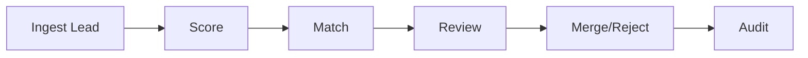

# Lead Scoring and Deduplication

## Problem Scope
This document details architecture and operational controls for **lead scoring and deduplication** in the **Customer Relationship Management Platform**.

## Core Invariants
- Critical mutations are idempotent and traceable through correlation IDs.
- Reconciliation can recompute canonical state from immutable source events.
- User-visible state transitions remain monotonic and auditable.

## Workflow Design
1. Validate request shape, policy, and actor permissions.
2. Execute transactional write(s) with optimistic concurrency protections.
3. Emit durable events for downstream projections and side effects.
4. Run compensating actions when asynchronous steps fail.

## Data and API Considerations
- Enumerate lifecycle statuses and forbidden transitions.
- Define read model projections for dashboards and operations tooling.
- Include API idempotency keys, pagination, filtering, and cursor semantics.

## Failure Handling
- Timeout handling with bounded retries and dead-letter workflows.
- Human-in-the-loop escalation path for unrecoverable conflicts.
- Post-incident replay/backfill procedure with verification checklist.

## Domain Glossary
- **Deduplication Candidate**: File-specific term used to anchor decisions in **Lead Scoring And Deduplication**.
- **Lead**: Prospect record entering qualification and ownership workflows.
- **Opportunity**: Revenue record tracked through pipeline stages and forecast rollups.
- **Correlation ID**: Trace identifier propagated across APIs, queues, and audits for this workflow.

## Entity Lifecycles
- Lifecycle for this document: `Ingest Lead -> Score -> Match -> Review -> Merge/Reject -> Audit`.
- Each transition must capture actor, timestamp, source state, target state, and justification note.

## Integration Boundaries
- Consumes enrichment providers and writes to lead + merge audit stores.
- Data ownership and write authority must be explicit at each handoff boundary.
- Interface changes require schema/version review and downstream impact acknowledgement.

## Error and Retry Behavior
- Scoring recalculation retries transient enrichment failures; merge conflicts open manual queue.
- Retries must preserve idempotency token and correlation ID context.
- Exhausted retries route to an operational queue with triage metadata.

## Measurable Acceptance Criteria
- Precision/recall targets for dedupe are defined and monitored monthly.
- Observability must publish latency, success rate, and failure-class metrics for this document's scope.
- Quarterly review confirms definitions and diagrams still match production behavior.
