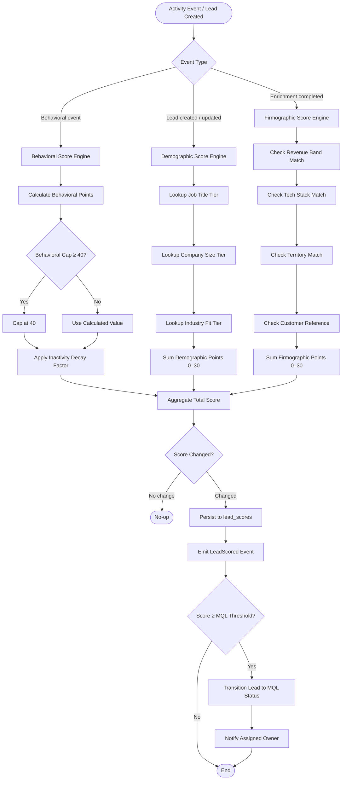

# Lead Scoring and Deduplication

**Version:** 1.0 | **Status:** Approved | **Last Updated:** 2025-07-15

## Overview

This document specifies the lead scoring algorithm and deduplication strategy for the CRM Platform. It defines scoring dimensions, weight calculations, confidence thresholds for duplicate detection, merge rules, conflict resolution procedures, and rollback mechanics. All scoring computations are deterministic and reproducible from the lead's event history.

---

## 1. Lead Scoring Algorithm

Lead score is a composite of three independent dimensions: Demographic, Behavioral, and Firmographic. The total score ranges from **0 to 100**.

```
Total Score = Demographic Score (0–30) + Behavioral Score (0–40) + Firmographic Score (0–30)
```

Scores are recalculated asynchronously by `ScoringWorker` whenever a qualifying event is ingested. The recalculated score is persisted to `lead_scores` and a `LeadScored` domain event is published to Kafka topic `crm.leads.scored`.

### 1.1 Demographic Score (0–30 points)

| Attribute | Value | Points |
|-----------|-------|--------|
| **Job Title / Seniority** | C-Level (CEO, CTO, CFO, COO, CPO) | +10 |
| | VP (Vice President) | +8 |
| | Director | +6 |
| | Manager | +4 |
| | Individual Contributor | +2 |
| | Unknown / Not Provided | 0 |
| **Company Size** | 1,000+ employees | +10 |
| | 201–1,000 employees | +8 |
| | 51–200 employees | +6 |
| | 11–50 employees | +4 |
| | 1–10 employees | +2 |
| | Unknown | 0 |
| **Industry Fit** | Perfect fit (configurable per org) | +10 |
| | Good fit | +7 |
| | Neutral | +3 |
| | Poor fit | 0 |

Industry fit tiers are configured per-organization in the `org_scoring_config` table. Administrators map SIC/NAICS codes or free-text industry labels to fit tiers. Changes to industry configuration trigger a `ScoringConfigUpdated` event and batch rescoring of all open leads within 24 hours.

### 1.2 Behavioral Score (0–40 points)

Behavioral scores are derived from tracked activities. Each event type carries a fixed point value. The behavioral score is bounded at 40; excess points from multiple events of the same type do not stack beyond the cap.

| Activity | Points | Notes |
|----------|--------|-------|
| Demo request (form submission or direct booking) | +15 | Highest-intent signal |
| Pricing page visit | +10 | Per unique session |
| Webinar attendance (live) | +8 | Replays count as +4 |
| Email click (tracked link) | +4 | Per unique campaign |
| Whitepaper / eBook download | +5 | Per unique asset |
| Blog visit (2+ pages in session) | +3 | Per session |
| Email open | +2 | Per unique campaign |

**Inactivity Decay:**

A decay job runs nightly and applies `-5 points` per 30-day period of inactivity (no behavioral events recorded). The minimum behavioral score after decay is `0`. Decay is suspended for leads in `QUALIFIED` or `CONVERTED` status.

### 1.3 Firmographic Score (0–30 points)

Firmographic scoring evaluates the lead's company profile against the ideal customer profile (ICP) configured for the owning organization.

| Attribute | Value | Points |
|-----------|-------|--------|
| **Annual Revenue Match** | Within ICP revenue band | +10 |
| | Adjacent revenue band | +5 |
| | Outside ICP band | 0 |
| **Technology Stack Match** | Uses a direct competitor product | +10 |
| | Uses complementary technology | +5 |
| | No detected technology overlap | 0 |
| **Geographic Territory Match** | Assigned territory match | +5 |
| | Unassigned territory | 0 |
| **Existing Customer Reference** | Company domain matches existing customer account | +5 |

Technology stack signals are sourced from the enrichment integration (Clearbit / ZoomInfo). The `tech_stack` array on the company record is evaluated against the organization's `competitor_domains` and `complementary_domains` configuration lists.

### 1.4 Scoring Flow



---

## 2. Deduplication Strategy

Deduplication runs in two phases: exact-match detection and fuzzy-match detection. Both phases execute whenever a lead is created via API, CSV import, or form capture.

### 2.1 Phase 1 — Exact Match Detection

Exact matching operates against pre-computed normalized indexes.

| Match Rule | Normalization | Confidence Score |
|------------|---------------|-----------------|
| Email address | Lowercase, strip whitespace, strip `+`-aliases (e.g., `user+tag@domain.com` → `user@domain.com`) | 100 |
| Phone number (E.164) | Strip non-numeric characters, apply E.164 normalization via `libphonenumber` | 95 |

A confidence score of 100 from email match or 95 from phone match triggers the auto-merge path (see Section 3).

### 2.2 Phase 2 — Fuzzy Match Detection

Fuzzy matching applies Jaro-Winkler string similarity across composite key pairs. Matching is performed against the `lead_dedup_index` materialized view, which is refreshed every 15 minutes.

| Match Rule | Algorithm | Threshold | Confidence Score |
|------------|-----------|-----------|-----------------|
| Full name + Company name | Jaro-Winkler | ≥ 0.92 | 85 |
| Full name + Email domain | Jaro-Winkler | ≥ 0.90 | 80 |
| Phone (last 7 digits) | Exact substring | — | 70 |
| LinkedIn URL exact | Exact string | — | 90 |

When multiple candidates match, the system retains the pair with the highest confidence score for further processing. All candidates exceeding the minimum threshold (70) are persisted to the `deduplication_candidates` table.

### 2.3 Confidence Thresholds and Routing

| Confidence Range | Action | Description |
|------------------|--------|-------------|
| ≥ 90 | **Auto-Merge** | Merge is executed immediately with full audit trail. No analyst intervention required. |
| 70–89 | **Analyst Review Queue** | Candidate pair is placed in `merge_review_queue` and assigned to the data quality team. SLA: 48 hours. |
| < 70 | **Flag as Potential Duplicate** | `potential_duplicate_flag` is set on the lead record. No merge action taken. Flag expires after 90 days if no manual action. |

---

## 3. Merge Rules

The merge operation designates one record as the **master** and the other as the **source**. The source record is soft-deleted after merge (status: `MERGED`), with `merged_into_id` pointing to the master record.

### 3.1 Master Record Selection

Master record is selected by evaluating candidates in this priority order:

1. **Highest activity count** — the record with more logged activities is preferred.
2. **Most recently updated** — tie-break on `updated_at DESC`.
3. **Oldest created** — final tie-break on `created_at ASC`.

### 3.2 Field-Level Merge Policy

| Field | Policy | Description |
|-------|--------|-------------|
| `email` | Keep master | Master email is retained. |
| `phone` | Keep non-null; prefer master | If both present, master value is used. If only source has a value, source value is copied. |
| `first_name` / `last_name` | Keep master | |
| `company_id` | Keep master | |
| `score` | Take maximum | The higher of the two total scores is applied to the master. |
| `owner_id` | Keep master | Lead assignment follows master ownership. |
| `status` | Keep master | |
| `source` / `source_detail` | Keep master; source's value stored in `merge_history` | |
| `activities` | Union (merge all) | All activities from both records are re-associated to the master `lead_id`. |
| `deals` | Re-associate to master | All deal associations from the source are repointed to the master record. |
| `tags` | Union | Deduplicated union of both tag sets is applied. |
| `custom_fields` | Keep master value | Source custom field values are preserved in `merge_history.source_custom_fields` JSONB. |
| `gdpr_consent` | Most restrictive | If either record has explicit opt-out, the merged record inherits the opt-out. |

### 3.3 Merge Execution Procedure

The merge is executed as an atomic database transaction:

```
BEGIN TRANSACTION
  1. SELECT master and source records FOR UPDATE
  2. Apply field-level merge rules to master record
  3. INSERT merge_history record (source snapshot, analyst_id, merge_type, confidence, timestamp)
  4. UPDATE source record: status = 'MERGED', merged_into_id = master.id
  5. UPDATE activities SET lead_id = master.id WHERE lead_id = source.id
  6. UPDATE deal_leads SET lead_id = master.id WHERE lead_id = source.id
  7. EMIT LeadMerged event (master_id, source_id, merge_type, confidence)
COMMIT
```

---

## 4. Conflict Resolution (Analyst Review)

When a candidate pair falls in the 70–89 confidence range, a merge review task is created in `merge_review_queue` with status `PENDING_REVIEW`.

### 4.1 Analyst Interface

The analyst review UI presents:

- **Side-by-side comparison** of all fields between master candidate and source candidate.
- **Conflict highlighting** — fields where values differ are visually flagged.
- **Field-level selection** — for each conflicting field, the analyst selects which record's value to retain or enters a custom value.
- **Confidence score explanation** — which matching rules contributed to the confidence score.
- **Activity timeline** — last 10 activities from each record to inform context.

### 4.2 Analyst Decision Recording

Upon submission of the analyst review:

- The analyst's field selections are applied using the same merge procedure defined in Section 3.3.
- `merge_history.analyst_id` and `merge_history.analyst_notes` are populated.
- The `merge_review_queue` entry is updated to status `REVIEWED`.
- An `AuditEvent` of type `LEAD_MERGE_ANALYST_REVIEWED` is written to the audit log.

### 4.3 Rejecting a Merge

If the analyst determines the two records are distinct individuals:

- The `merge_review_queue` entry is updated to status `REJECTED`.
- A `REJECT` flag is written to `deduplication_candidates` to suppress future matches for this pair for 180 days.
- An `AuditEvent` of type `LEAD_MERGE_REJECTED` is written.

---

## 5. Rollback Procedure

Auto-merged records may be unmerged by a data administrator within **7 calendar days** of the merge timestamp.

### 5.1 Unmerge Steps

```
BEGIN TRANSACTION
  1. Verify merge_history record exists and merge_timestamp ≤ NOW() - 7 days
  2. INSERT new lead record from merge_history.source_snapshot
  3. UPDATE activities: re-associate activities with source.original_activity_ids to new_lead.id
  4. UPDATE deal_leads: re-associate deals with source.original_deal_ids to new_lead.id
  5. UPDATE original source record: status = 'ACTIVE', merged_into_id = NULL
  6. Restore custom_fields from merge_history.source_custom_fields
  7. Recalculate score for both records
  8. EMIT ContactUnmerged event (master_id, restored_lead_id, admin_id, timestamp)
COMMIT
```

### 5.2 Audit Trail for Unmerge

The unmerge action writes:

- `AuditEvent` of type `LEAD_UNMERGED` with `actor_id`, `merge_history_id`, `reason`, and `timestamp`.
- The `merge_history` record is updated with `unmerged_at` and `unmerged_by`.

### 5.3 Post-Rollback Notifications

After a successful unmerge:

- The lead owner of both records receives an in-app notification.
- If the original merge was triggered by an analyst review, the analyst is notified.
- The restored lead record appears in the assignee's "New Leads" queue.

---

## 6. Scoring Configuration and Recalculation

### 6.1 Configuration Scope

Scoring weights are configured at the **organization level**. Default weights ship with the platform but administrators can adjust:

- Industry fit tier mappings.
- MQL threshold (default: 50 points).
- Behavioral event point values (±20% of defaults).
- Inactivity decay rate (default: 5 points per 30 days; range: 0–10).

Configuration changes are versioned in `org_scoring_config_history` and must be approved by a CRM Administrator role.

### 6.2 Batch Rescoring

When scoring configuration changes, all open leads (status not in `CONVERTED`, `DISQUALIFIED`, `MERGED`) are rescored in a background batch job:

- Job name: `BatchRescoreLeadsJob`
- Partition strategy: 1,000 leads per partition, processed in parallel workers.
- Estimated throughput: 50,000 leads per minute.
- On completion, emits `BatchRescoringCompleted` event with lead count, duration, and config_version.

### 6.3 Score History

Every score recalculation appends a row to `lead_score_history`:

| Column | Type | Description |
|--------|------|-------------|
| `id` | UUID | Primary key |
| `lead_id` | UUID | FK to leads |
| `demographic_score` | SMALLINT | 0–30 |
| `behavioral_score` | SMALLINT | 0–40 |
| `firmographic_score` | SMALLINT | 0–30 |
| `total_score` | SMALLINT | 0–100 |
| `scoring_config_version` | INTEGER | FK to org_scoring_config_history |
| `trigger_event_type` | VARCHAR(100) | Event that triggered recalculation |
| `calculated_at` | TIMESTAMPTZ | |

---

## 7. Observability

| Metric | Type | Description |
|--------|------|-------------|
| `crm_lead_scoring_duration_ms` | Histogram | Time taken to compute a full score |
| `crm_lead_scoring_events_total` | Counter | Total scoring events by trigger type |
| `crm_dedup_candidates_total` | Counter | Candidates detected by confidence bucket |
| `crm_dedup_auto_merges_total` | Counter | Auto-merges executed |
| `crm_dedup_review_queue_depth` | Gauge | Current depth of analyst review queue |
| `crm_dedup_review_sla_breaches_total` | Counter | Review tasks exceeding 48-hour SLA |
| `crm_lead_unmerges_total` | Counter | Unmerge rollbacks by initiator type |

Precision and recall for the deduplication model are evaluated monthly using a sample of 500 analyst-reviewed decisions as ground truth.

---

## 8. Domain Glossary

| Term | Definition |
|------|-----------|
| **MQL (Marketing Qualified Lead)** | A lead whose total score has crossed the organization-configured MQL threshold. |
| **ICP (Ideal Customer Profile)** | The definition of the company attributes that most closely match a target buyer. |
| **Deduplication Candidate** | A pair of lead records that have been identified as potentially referring to the same person. |
| **Master Record** | The lead record that survives a merge and retains the canonical identity. |
| **Source Record** | The lead record that is soft-deleted and folded into the master during a merge. |
| **merge_history** | Immutable JSONB snapshot of the source record at the time of merge, used for rollback. |
| **Jaro-Winkler** | A string similarity algorithm that gives extra weight to matching prefixes. |
| **Inactivity Decay** | Automatic reduction of behavioral score when no activity has been recorded for a period. |
