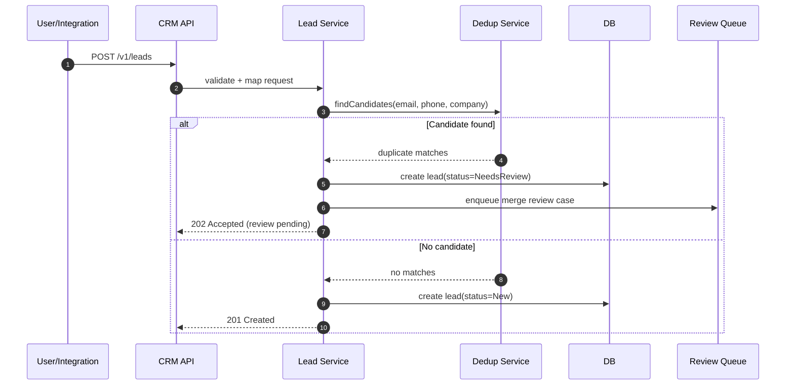
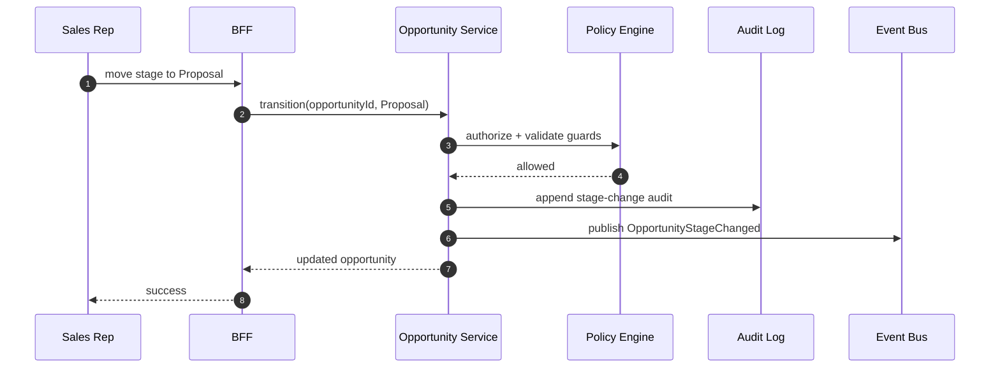

# Sequence Diagrams

## Lead Creation and Deduplication

```mermaid
sequenceDiagram
    autonumber
    participant U as User/Integration
    participant API as CRM API
    participant Lead as Lead Service
    participant Dup as Dedup Service
    participant DB as DB
    participant Q as Review Queue

    U->>API: POST /v1/leads
    API->>Lead: validate + map request
    Lead->>Dup: findCandidates(email, phone, company)
    alt Candidate found
      Dup-->>Lead: duplicate matches
      Lead->>DB: create lead(status=NeedsReview)
      Lead->>Q: enqueue merge review case
      Lead-->>API: 202 Accepted (review pending)
    else No candidate
      Dup-->>Lead: no matches
      Lead->>DB: create lead(status=New)
      Lead-->>API: 201 Created
    end
```

## Opportunity Stage Transition

```mermaid
sequenceDiagram
    autonumber
    participant Rep as Sales Rep
    participant BFF as BFF
    participant Opp as Opportunity Service
    participant Policy as Policy Engine
    participant Audit as Audit Log
    participant Bus as Event Bus

    Rep->>BFF: move stage to Proposal
    BFF->>Opp: transition(opportunityId, Proposal)
    Opp->>Policy: authorize + validate guards
    Policy-->>Opp: allowed
    Opp->>Audit: append stage-change audit
    Opp->>Bus: publish OpportunityStageChanged
    Opp-->>BFF: updated opportunity
    BFF-->>Rep: success
```
