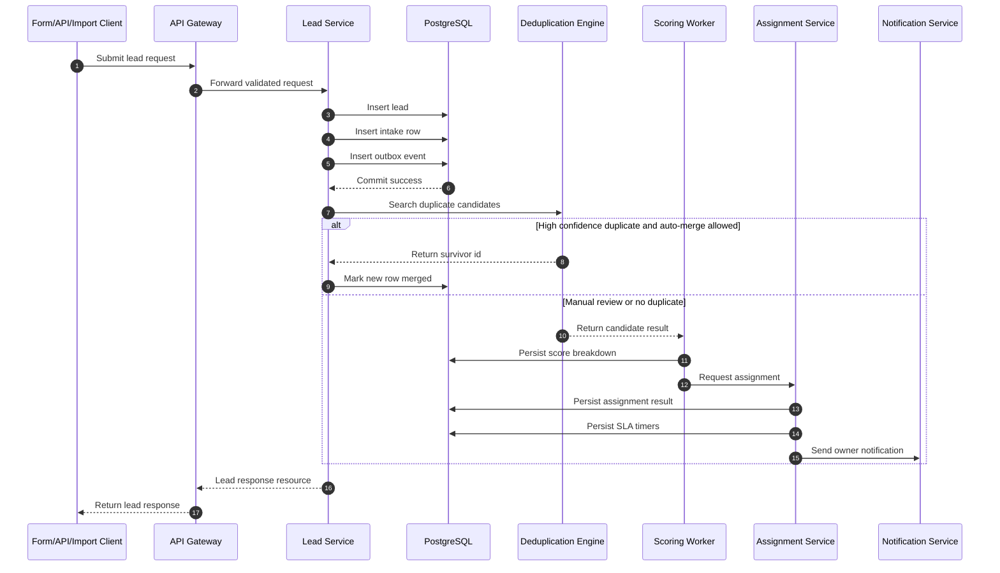
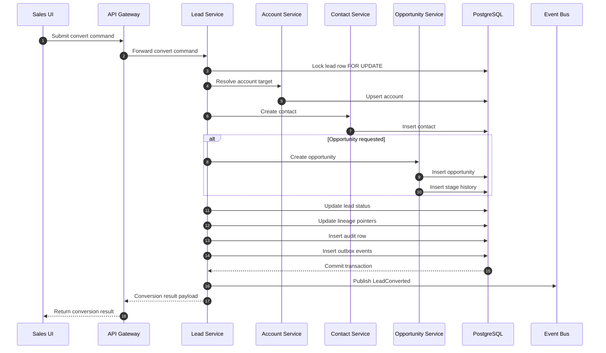
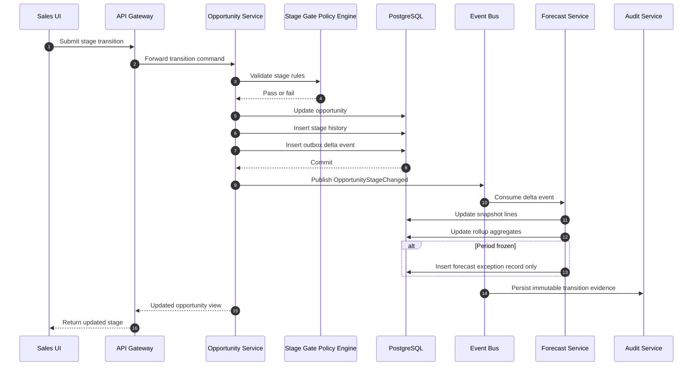
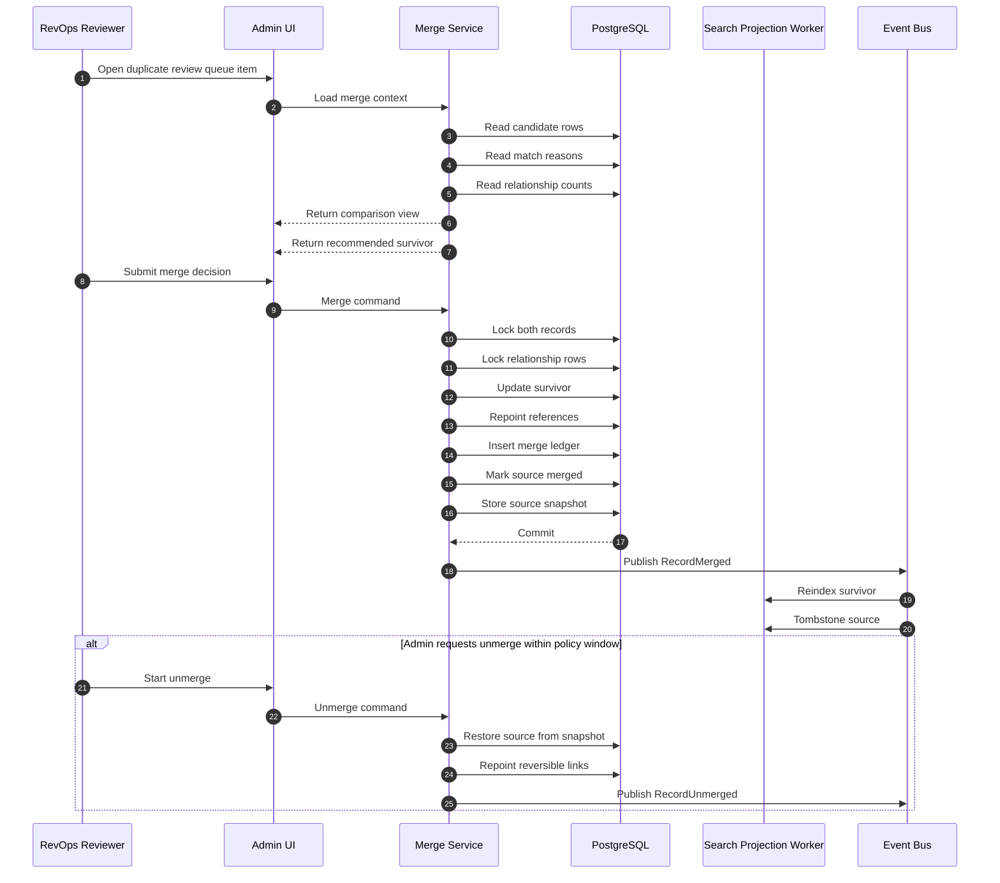
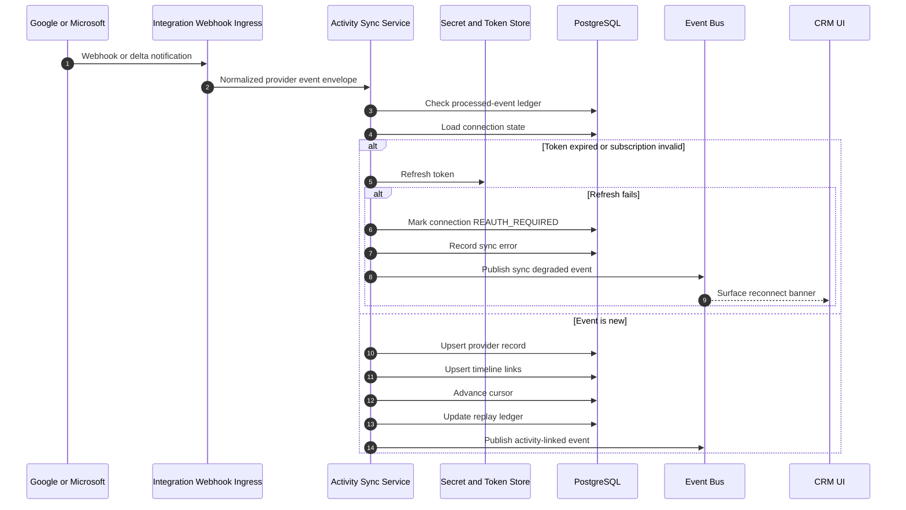
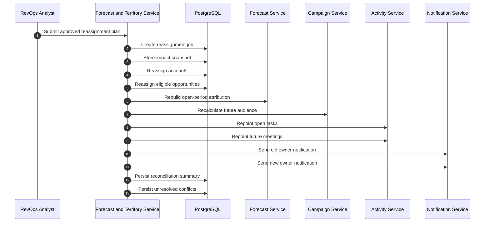

# Detailed Sequence Diagrams — Customer Relationship Management Platform

## Purpose

These diagrams describe internal service choreography, persistence boundaries, and failure handling for the CRM workflows most likely to create data integrity or cross-system consistency issues.

---

## Sequence 1 — Lead Ingestion, Scoring, and Assignment

### Implementation Notes
- The initial write is synchronous; scoring and assignment may complete asynchronously but must preserve correlation and causation IDs.
- Deduplication holds row-level locks only for merge execution, not during candidate search.
- Manual review candidates are visible in the UI before assignment if tenant policy requires human approval first.

---

## Sequence 2 — Lead Conversion with Atomic Lineage Creation

### Failure Handling
- Any failure before commit aborts the entire transaction.
- If event publication fails after commit, the outbox relay retries; the UI still receives success once the DB transaction commits.
- Duplicate conflicts found during account/contact creation return actionable candidate lists rather than partial success.

---

## Sequence 3 — Opportunity Stage Change and Forecast Recalculation

### Integrity Controls
- Forecast recalculation consumes both old and new opportunity values so rollups remain balanced.
- Manager-approved or frozen snapshots are never mutated directly; only exception records are appended.
- A stale version token returns `409 VERSION_CONFLICT` before any state change occurs.

---

## Sequence 4 — Duplicate Review, Merge, and Optional Unmerge

### Integrity Controls
- Merge execution is pair-locked by sorted record IDs so concurrent merges cannot deadlock unpredictably.
- Non-reversible actions, such as downstream provider deletes, are blocked until the unmerge window closes or tracked separately.
- Consent, legal-hold, and GDPR flags always resolve to the most restrictive effective state on the survivor.

---

## Sequence 5 — Email and Calendar Sync Reconciliation

### Integrity Controls
- Provider message IDs and recurrence-instance keys are part of the dedupe ledger.
- Cursor advancement occurs only when the corresponding activity write commits.
- Replay jobs read the same ledger, allowing safe provider reprocessing after outages.

---

## Sequence 6 — Territory Reassignment with Forecast Preservation

### Integrity Controls
- Historical activities and already-sent campaign analytics stay attached to the pre-change owner for audit truthfulness.
- Future tasks and meetings transfer only when policy says ownership should move with the account.
- Preview and execution both operate from the same normalized rule set and snapshot version.

## Acceptance Criteria

- Each sequence identifies the transaction boundary, async fan-out, and replay surface.
- Failure paths are explicit enough to implement retries, compensations, and operational alerts.
- The diagrams cover CRM-specific risks: lead conversion lineage, forecast freeze, merge auditability, sync replay, and territory reassignment.
