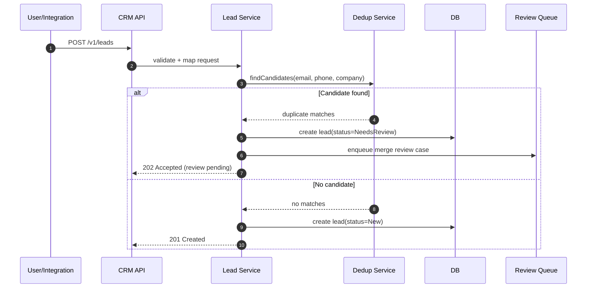
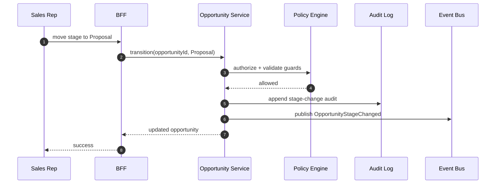
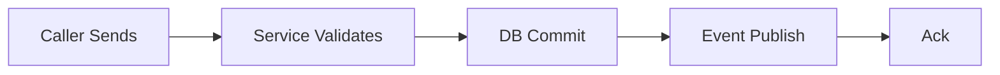

# Sequence Diagrams

## Lead Creation and Deduplication

## Opportunity Stage Transition

## Domain Glossary
- **Message Exchange**: File-specific term used to anchor decisions in **Sequence Diagrams**.
- **Lead**: Prospect record entering qualification and ownership workflows.
- **Opportunity**: Revenue record tracked through pipeline stages and forecast rollups.
- **Correlation ID**: Trace identifier propagated across APIs, queues, and audits for this workflow.

## Entity Lifecycles
- Lifecycle for this document: `Caller Sends -> Service Validates -> DB Commit -> Event Publish -> Ack`.
- Each transition must capture actor, timestamp, source state, target state, and justification note.

## Integration Boundaries
- Sequences show synchronous call edges and async fanout edges.
- Data ownership and write authority must be explicit at each handoff boundary.
- Interface changes require schema/version review and downstream impact acknowledgement.

## Error and Retry Behavior
- Each sequence shows timeout and compensating branch for failed downstream step.
- Retries must preserve idempotency token and correlation ID context.
- Exhausted retries route to an operational queue with triage metadata.

## Measurable Acceptance Criteria
- Correlation ID is present at every hop in sequence annotations.
- Observability must publish latency, success rate, and failure-class metrics for this document's scope.
- Quarterly review confirms definitions and diagrams still match production behavior.
