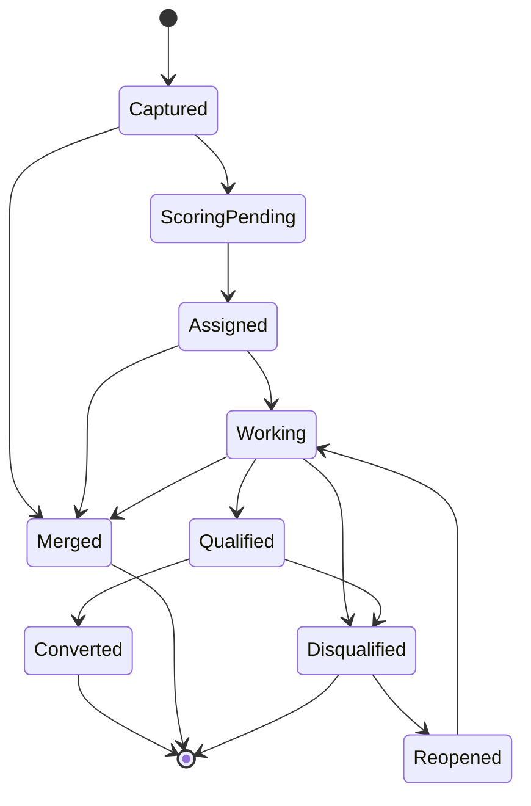
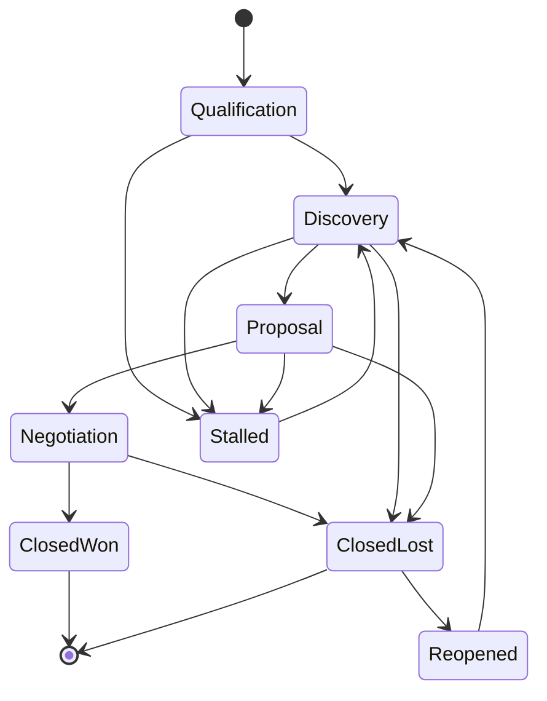
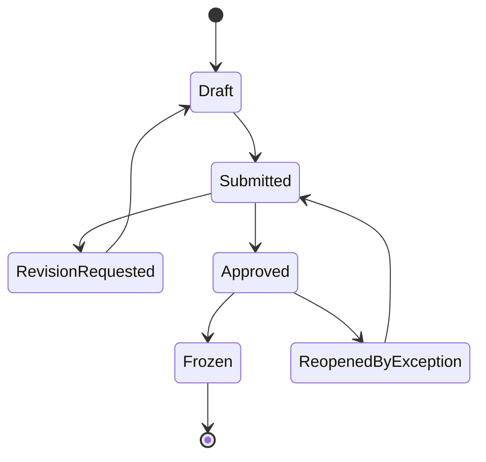
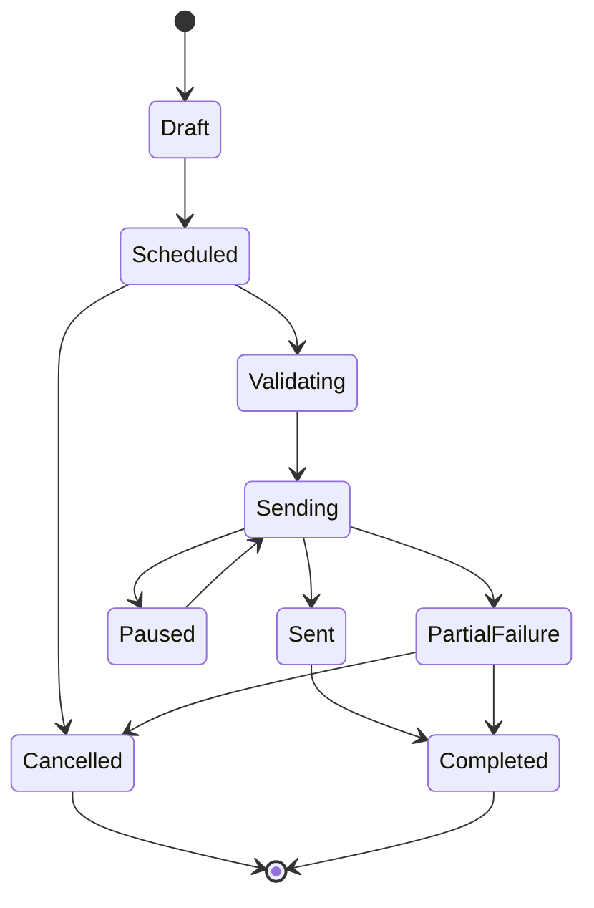
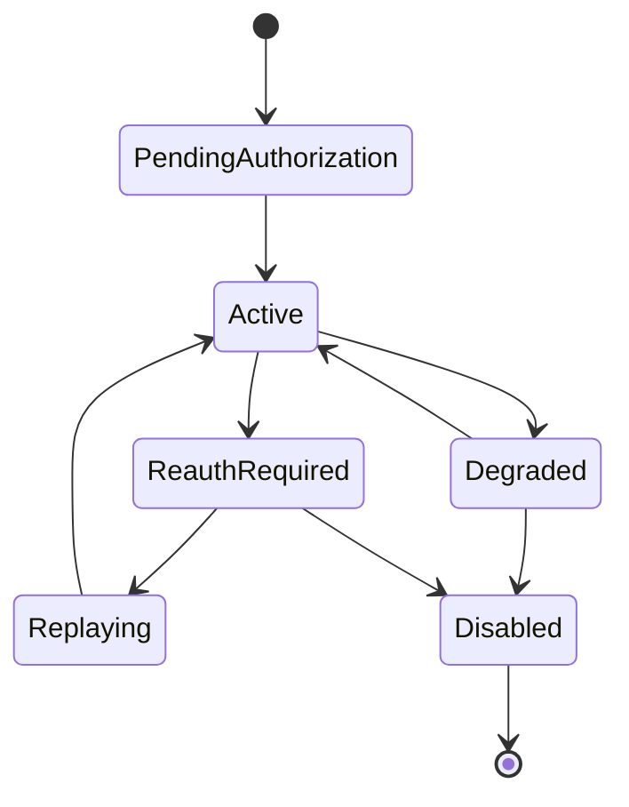
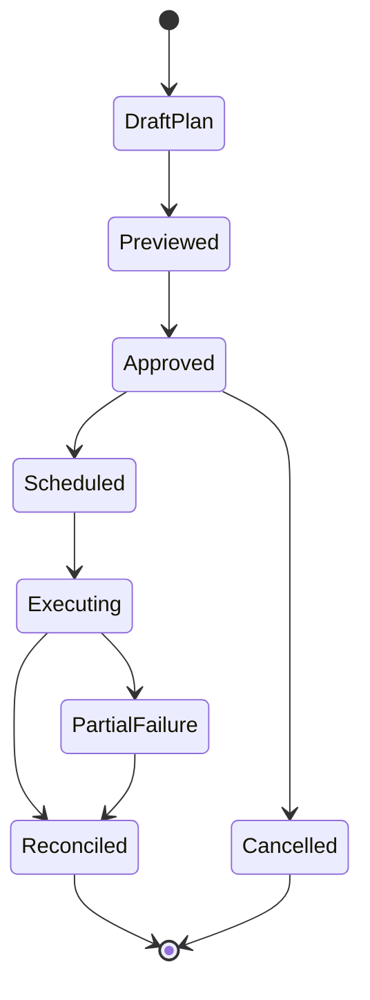

# State Machine Diagrams — Customer Relationship Management Platform

## Purpose

These state machines define the allowed lifecycle transitions for core CRM aggregates and operational jobs. Guards, side effects, and terminal states are explicit so service implementations can share the same invariants.

---

## 1. Lead Lifecycle

### Transition Rules

| From | To | Guard | Side Effects |
|---|---|---|---|
| Captured | ScoringPending | Ingestion committed successfully | enqueue scoring and dedupe jobs |
| ScoringPending | Assigned | scoring finished and assignment rule resolved | write score breakdown and owner history |
| Assigned | Working | owner accepts or edits lead | start qualification SLA timers |
| Working | Qualified | qualification checklist complete | enable conversion workflow |
| Working or Qualified | Disqualified | reason code selected | suppress future assignment nudges |
| Qualified | Converted | conversion transaction succeeds | create lineage references |
| Any active state | Merged | merge policy executed | tombstone source record |
| Disqualified | Reopened | manager override allowed | clear terminal timestamp |

---

## 2. Opportunity Lifecycle

### Transition Rules

| Transition | Guard | Side Effects |
|---|---|---|
| Any open stage to next stage | configured gate criteria satisfied | insert stage history and recalculate probability |
| Negotiation to ClosedWon | amount > 0, close date valid, win evidence present | set booked amount and trigger downstream handoff |
| Any open stage to ClosedLost | loss reason captured | exclude from active pipeline and forecast |
| Open stage to Stalled | inactivity threshold or manual action | raise stagnation alert |
| ClosedLost to Reopened | manager-approved reopen policy | append reopen reason and recalc forecast eligibility |

---

## 3. Forecast Snapshot Lifecycle

### Transition Rules

| From | To | Guard | Side Effects |
|---|---|---|---|
| Draft | Submitted | rep validation passes and period open | lock rep edits and notify manager |
| Submitted | RevisionRequested | manager requests changes | unlock rep edit surface with comment thread |
| Submitted | Approved | manager approves snapshot | update rollup hierarchy |
| Approved | Frozen | period cutoff reached or finance lock applied | copy immutable snapshot to audit store |
| Approved | ReopenedByException | finance or CRO override | record override ticket and actor |

---

## 4. Campaign Lifecycle

### Transition Rules

| From | To | Guard | Side Effects |
|---|---|---|---|
| Draft | Scheduled | content approved and sender configured | compute segment preview |
| Scheduled | Validating | scheduler reaches send window | re-evaluate eligibility and suppression |
| Validating | Sending | provider credentials and compliance checks pass | create recipient send records |
| Sending | Paused | operator pauses or provider outage threshold reached | stop queue dispatch only |
| Sending | PartialFailure | bounce, quota, or provider errors exceed threshold | flag remediation panel |
| Sent | Completed | all terminal recipient statuses recorded | finalize analytics snapshot |

---

## 5. Provider Sync Connection Lifecycle

### Transition Rules

| From | To | Guard | Side Effects |
|---|---|---|---|
| PendingAuthorization | Active | OAuth consent and subscription validation succeed | create initial cursors and webhook records |
| Active | Degraded | transient provider errors or quota limits | backoff queue and show warning badge |
| Active | ReauthRequired | refresh token revoked or scopes insufficient | stop sync writes and notify owner |
| ReauthRequired | Replaying | user reauths successfully | restart backfill from last good cursor |
| Degraded or ReauthRequired | Disabled | admin disconnects or policy revokes integration | revoke tokens and stop webhooks |

---

## 6. Territory Reassignment Job Lifecycle

### Transition Rules

| From | To | Guard | Side Effects |
|---|---|---|---|
| DraftPlan | Previewed | normalized rules and record set calculated | capture impact summary |
| Previewed | Approved | authorized approver confirms | lock preview snapshot version |
| Approved | Scheduled | future effective date requested | queue execution timer |
| Scheduled | Executing | effective date reached | snapshot current ownership and begin mutation |
| Executing | PartialFailure | some records blocked by locks or policy | create manual review tasks |
| Executing or PartialFailure | Reconciled | all retryable work resolved | publish final impact report |

## Acceptance Criteria

- Terminal and mutable states are unambiguous for every aggregate.
- Guards align with business rules for conversion, stage gates, forecast freeze, compliance, and sync health.
- State transitions are detailed enough to drive API validation, workflow orchestration, and test fixtures.
