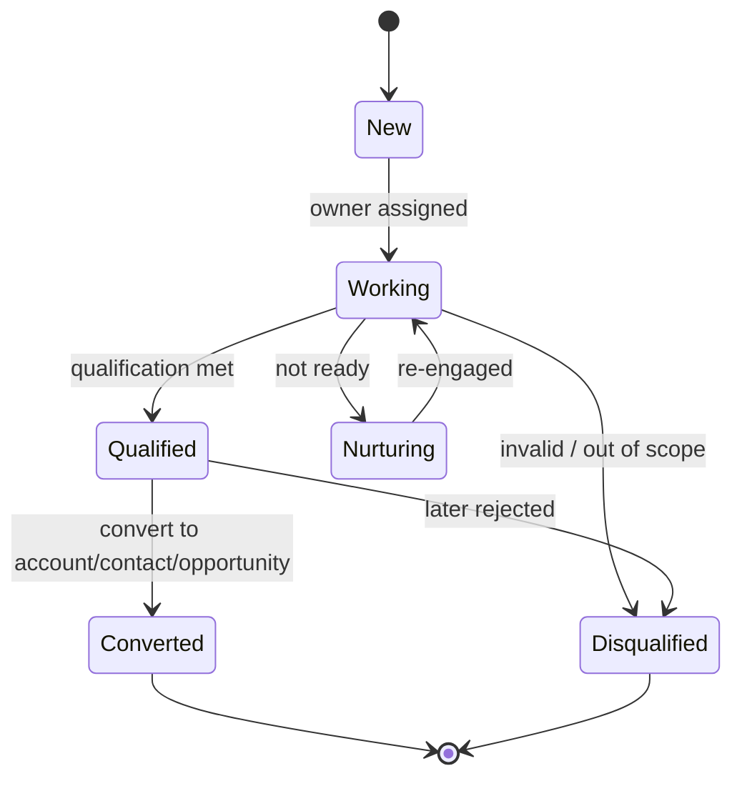
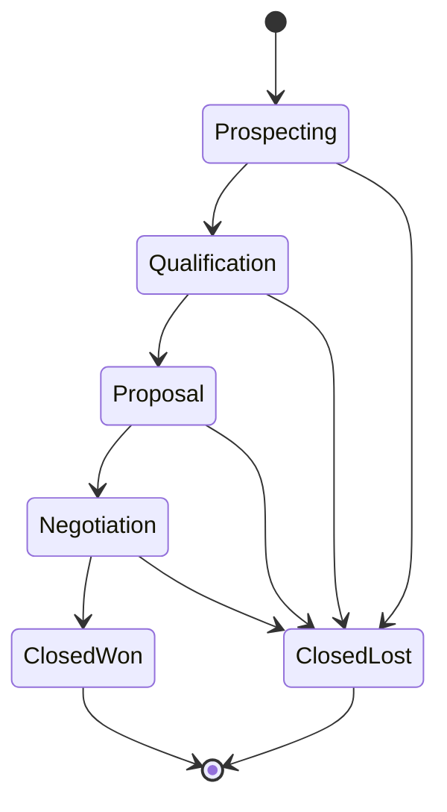
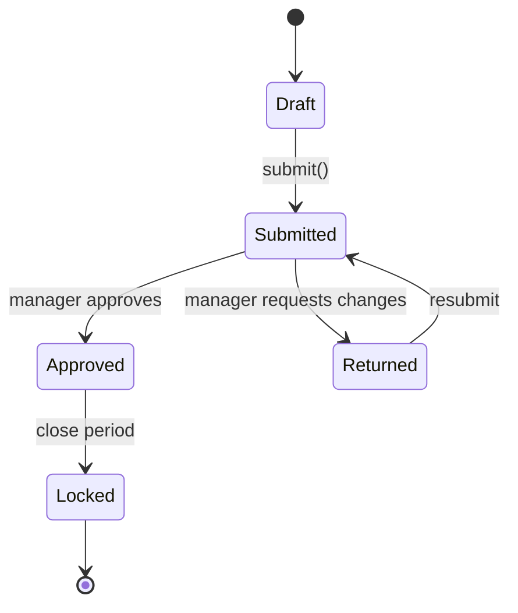

# State Machine Diagrams

## Lead Lifecycle

```mermaid
stateDiagram-v2
    [*] --> New
    New --> Working: owner assigned
    Working --> Qualified: qualification met
    Working --> Nurturing: not ready
    Working --> Disqualified: invalid / out of scope
    Nurturing --> Working: re-engaged
    Qualified --> Converted: convert to account/contact/opportunity
    Qualified --> Disqualified: later rejected
    Converted --> [*]
    Disqualified --> [*]
```

## Opportunity Lifecycle

```mermaid
stateDiagram-v2
    [*] --> Prospecting
    Prospecting --> Qualification
    Qualification --> Proposal
    Proposal --> Negotiation
    Negotiation --> ClosedWon
    Negotiation --> ClosedLost
    Prospecting --> ClosedLost
    Qualification --> ClosedLost
    Proposal --> ClosedLost
    ClosedWon --> [*]
    ClosedLost --> [*]
```

## Forecast Snapshot Lifecycle

```mermaid
stateDiagram-v2
    [*] --> Draft
    Draft --> Submitted: submit()
    Submitted --> Approved: manager approves
    Submitted --> Returned: manager requests changes
    Returned --> Submitted: resubmit
    Approved --> Locked: close period
    Locked --> [*]
```
