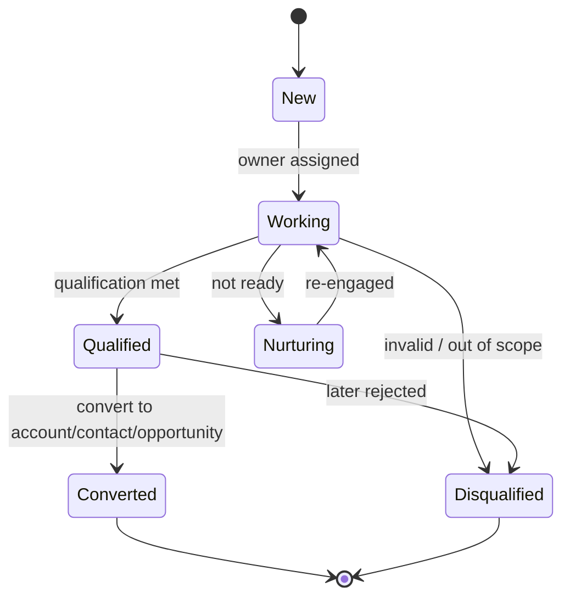
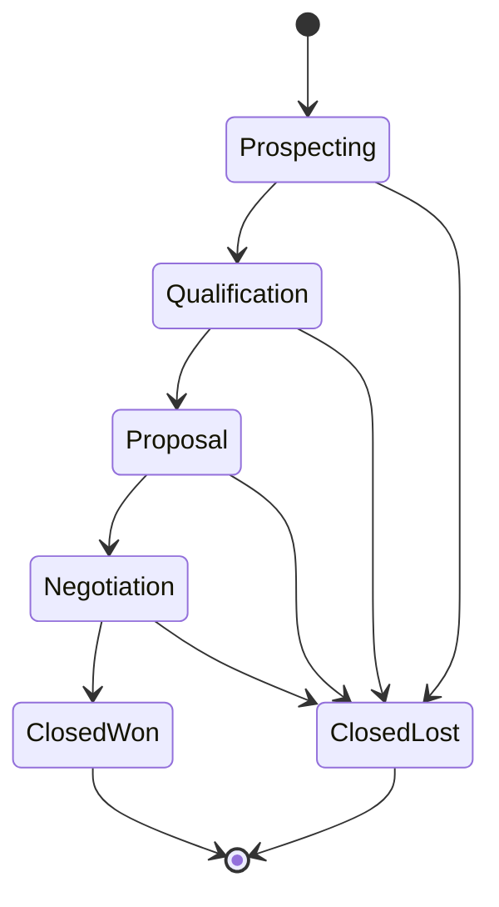
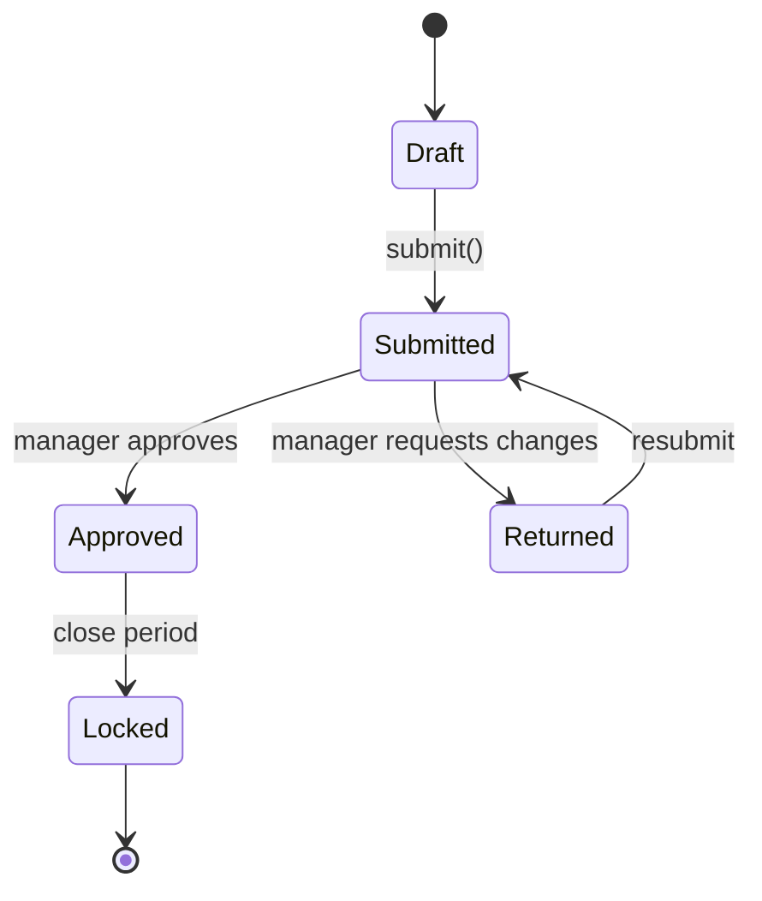
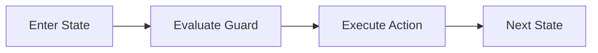

# State Machine Diagrams

## Lead Lifecycle

## Opportunity Lifecycle

## Forecast Snapshot Lifecycle

## Domain Glossary
- **Transition Guard**: File-specific term used to anchor decisions in **State Machine Diagrams**.
- **Lead**: Prospect record entering qualification and ownership workflows.
- **Opportunity**: Revenue record tracked through pipeline stages and forecast rollups.
- **Correlation ID**: Trace identifier propagated across APIs, queues, and audits for this workflow.

## Entity Lifecycles
- Lifecycle for this document: `Enter State -> Evaluate Guard -> Execute Action -> Next State`.
- Each transition must capture actor, timestamp, source state, target state, and justification note.

## Integration Boundaries
- State machines bind to lead, opportunity, and forecast entities.
- Data ownership and write authority must be explicit at each handoff boundary.
- Interface changes require schema/version review and downstream impact acknowledgement.

## Error and Retry Behavior
- Invalid transition requests are rejected with machine-readable reason codes.
- Retries must preserve idempotency token and correlation ID context.
- Exhausted retries route to an operational queue with triage metadata.

## Measurable Acceptance Criteria
- Each state has entry/exit actions and at least one negative transition test.
- Observability must publish latency, success rate, and failure-class metrics for this document's scope.
- Quarterly review confirms definitions and diagrams still match production behavior.
