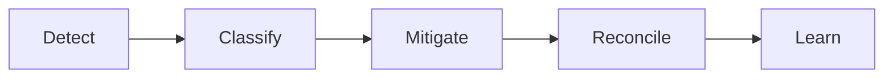

# Edge Cases - Customer Relationship Management Platform

This pack captures high-risk edge scenarios for CRM workflows.
Each document includes failure mode, detection, containment, recovery, and prevention guidance.

## Included Categories
- Domain-specific failure modes
- API/UI reliability concerns
- Security and compliance controls
- Operational incident and runbook procedures

## Domain Glossary
- **Edge Scenario**: File-specific term used to anchor decisions in **Readme**.
- **Lead**: Prospect record entering qualification and ownership workflows.
- **Opportunity**: Revenue record tracked through pipeline stages and forecast rollups.
- **Correlation ID**: Trace identifier propagated across APIs, queues, and audits for this workflow.

## Entity Lifecycles
- Lifecycle for this document: `Detect -> Classify -> Mitigate -> Reconcile -> Learn`.
- Each transition must capture actor, timestamp, source state, target state, and justification note.

## Integration Boundaries
- Indexes references into API/UI, dedupe, sync, forecast, ops, and security docs.
- Data ownership and write authority must be explicit at each handoff boundary.
- Interface changes require schema/version review and downstream impact acknowledgement.

## Error and Retry Behavior
- Unhandled scenarios create incident + backlog item for future hardening.
- Retries must preserve idempotency token and correlation ID context.
- Exhausted retries route to an operational queue with triage metadata.

## Measurable Acceptance Criteria
- Every listed edge case links to owner, SLA, and runbook.
- Observability must publish latency, success rate, and failure-class metrics for this document's scope.
- Quarterly review confirms definitions and diagrams still match production behavior.
