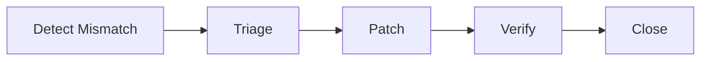

# API And Ui

## API Reliability Risks
- Duplicate client retries without stable idempotency keys.
- Pagination drift during concurrent writes.
- Partial-success composite operations lacking clear error contracts.

## UI/UX Risks
- Stale optimistic views conflicting with authoritative backend state.
- Ambiguous validation and remediation guidance for operators.

## Guardrails
- Standardized error taxonomy and retryability hints.
- ETag/version preconditions for concurrent edits.
- Correlated request IDs visible in UI and support tooling.

## Domain Glossary
- **UX/API Divergence**: File-specific term used to anchor decisions in **Api And Ui**.
- **Lead**: Prospect record entering qualification and ownership workflows.
- **Opportunity**: Revenue record tracked through pipeline stages and forecast rollups.
- **Correlation ID**: Trace identifier propagated across APIs, queues, and audits for this workflow.

## Entity Lifecycles
- Lifecycle for this document: `Detect Mismatch -> Triage -> Patch -> Verify -> Close`.
- Each transition must capture actor, timestamp, source state, target state, and justification note.

## Integration Boundaries
- Boundary is frontend validation vs backend source-of-truth responses.
- Data ownership and write authority must be explicit at each handoff boundary.
- Interface changes require schema/version review and downstream impact acknowledgement.

## Error and Retry Behavior
- Client retry only for network faults; semantic conflicts surface actionable UI errors.
- Retries must preserve idempotency token and correlation ID context.
- Exhausted retries route to an operational queue with triage metadata.

## Measurable Acceptance Criteria
- No top-20 flows may display stale status beyond 30 seconds.
- Observability must publish latency, success rate, and failure-class metrics for this document's scope.
- Quarterly review confirms definitions and diagrams still match production behavior.
