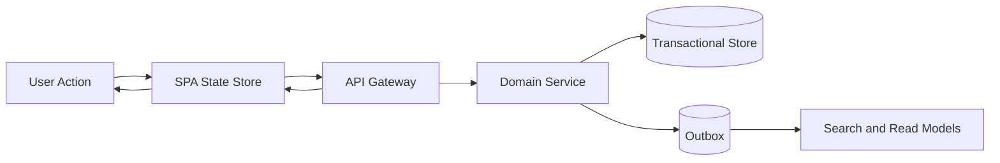

# API and UI Edge Cases — Customer Relationship Management Platform

## Purpose

This document captures failure modes and race conditions that span the CRM API surface and the browser UI. Each scenario describes the expected backend and frontend behavior so the system remains predictable under concurrency, pagination churn, rate limiting, and eventually consistent read models.

## Interaction Model

## Scenario Catalog

| Scenario | Trigger | Risk | Required System Behavior | Acceptance Criteria |
|---|---|---|---|---|
| Double-submit on create | User clicks save twice or browser retries | Duplicate lead, contact, or activity rows | Mutating endpoints require idempotency keys; UI disables primary action until server response or timeout | Same payload and key never create two records |
| Optimistic lock collision | Two users edit same account or opportunity | Silent overwrite of notes, amount, or owner | API rejects stale `version`/ETag with `409` or `412`; UI shows diff summary and refresh CTA | No stale write is committed |
| Kanban drag race | Opportunity moved across stages in two tabs | Pipeline board shows wrong stage or duplicate cards | Stage transition endpoint checks current version and target stage policy; board refetches on conflict | Final persisted stage equals last successful transition only |
| Infinite scroll with live inserts | New activities arrive while user scrolls timeline | Missing or duplicated rows in the UI | Timeline API uses stable cursor keys (`occurred_at`, `activity_id`) instead of offset-only pagination | Navigating pages never duplicates or skips committed rows |
| Search projection lag | User updates contact, then searches immediately | UI appears inconsistent with detail page | Transactional detail API remains source of truth; search result rows display “index updating” badge when projection lag exceeds threshold | Search eventually converges without showing another tenant's data |
| Bulk action partial failure | Multi-select reassign or export hits mixed permissions or locks | User assumes all selected rows succeeded | API returns per-record outcome manifest; UI renders success, skipped, and failed counts separately | Partial success never masks failures |
| Rate limit exhaustion | Import or automation floods API | UI loops on retries and worsens overload | Gateway returns `429` with retry headers; UI backs off, preserves unsaved state, and resumes only after reset window | No tight client retry loops |
| Deleted record in open tab | Another user soft-deletes account/contact | Save from stale tab resurrects data or loses audit trail | Save returns `404` or `409 DELETED`; UI switches to read-only tombstone view with restore guidance if allowed | Deleted record stays deleted unless restore workflow is used |
| Filter state against changing permissions | Admin revokes field or object access while UI is open | User sees hidden fields or broken list filters | Server omits restricted fields and returns filter validation errors; UI clears invalid filters and reloads layout | Revoked access takes effect on next request without data leakage |
| Import preview vs execute drift | Custom field config changes after preview, before import starts | Executed job maps rows incorrectly | Import service stamps preview against config version and blocks execution when version has changed | Operator must remap or republish before running |

## Backend Safeguards

- All list endpoints expose a stable cursor format and include `correlation_id` in error responses.
- Domain services return machine-readable conflict codes (`VERSION_CONFLICT`, `RECORD_DELETED`, `FILTER_FORBIDDEN`, `RATE_LIMITED`).
- Projection lag metrics are tenant-aware so UI can distinguish “temporarily stale” from “permission denied”.
- Bulk operations write an operation manifest table so retries can resume idempotently.

## UI Safeguards

- Forms keep a local dirty snapshot and compare it to server versions before applying live updates.
- Primary actions use optimistic UI only when the operation is idempotent and locally reversible.
- Background polling respects backoff hints and pauses on hidden tabs for high-cost endpoints.
- Permission changes invalidate cached layouts, quick filters, and column definitions.

## Test Acceptance Criteria

- Every mutating endpoint in the CRM UI is testable under network retry and stale-version conditions.
- Every paginated view remains stable while new records are inserted or permissions change.
- UI error states must tell the user whether to retry, refresh, or request elevated access.
